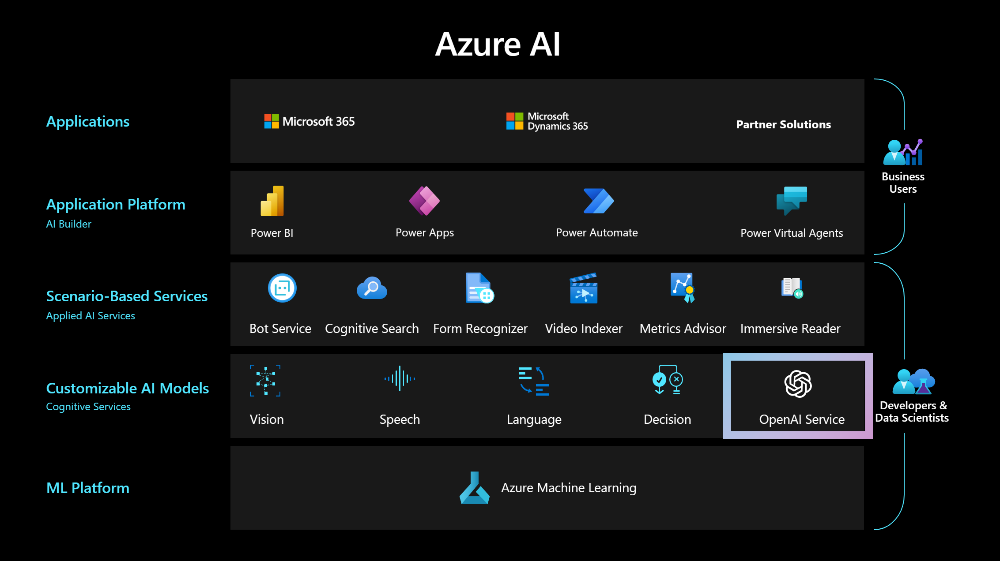
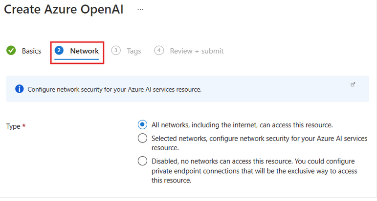

# Azure OpenAI Workshop - Microsoft US Education
[Azure OpenAI Service](https://learn.microsoft.com/en-us/azure/cognitive-services/openai/overview) provides REST API access to OpenAI's powerful language models including the GPT-3, Codex and Embeddings model series. These models can be easily adapted to your specific task including but not limited to content generation, summarization, semantic search, and natural language to code translation. Users can access the service through REST APIs, Python SDK, or our web-based interface in the Azure OpenAI Studio.

In this workshop, you will learn how to leverage the Azure OpenAI service to create AI powered solutions. You will get hands-on experience with the latest AI technologies and will also learn how to interact with the Azure OpenAI APIs.

## General Prerequisites

The following prerequisites must be completed before you start these labs

- WI-FI enabled Laptop
- A Microsoft 365 hosted mailbox
- You must be connected to the internet
- Use either Edge or Chrome when executing the labs.
- Access to an Azure Subscription with Owner or [Contributor Access](https://learn.microsoft.com/en-us/azure/role-based-access-control/role-assignments-steps)

- Approved access to Azure OpenAI service in your Azure subscription. You can request access [here](https://customervoice.microsoft.com/Pages/ResponsePage.aspx?id=v4j5cvGGr0GRqy180BHbR7en2Ais5pxKtso_Pz4b1_xUNTZBNzRKNlVQSFhZMU9aV09EVzYxWFdORCQlQCN0PWcu)

  
    **IMPORTANT**:
    - Only use your institutions/organization email. Do not use a personal email address (Example: @gmail.com, hotmail.com, etc.)
    - Authorization can take up to 10 business days.

- [Azure Open AI](https://learn.microsoft.com/en-us/azure/cognitive-services/openai/how-to/create-resource?pivots=web-portal) already provisioned and **GPT-35-turbo-16k** model deployed.

  For this lab, we recommend **North Central US or East US** region for your Azure Open AI deployment.

   **IMPORTANT**:
  - When you're deploying your model in Azure Open AI, make sure to select **Option 1: Allow all networks** for the networking options.

  

- Required Resource Providers [How to Register Azure Services](https://learn.microsoft.com/en-us/azure/azure-resource-manager/management/resource-providers-and-types)

  - Microsoft.Search
  - Microsoft.Web
  - Microsoft.Authorization
  - Microsoft.CognitiveServices
  - Microsoft.CognitiveSearch
  - Microsoft.ManagedIdentity
  - Microsoft.KeyVault
  - Microsoft.Storage
  - Microsoft.Insights
  - Microsoft.App
  - Microsoft.Logic
  - Microsoft.BotService

- [VS Code](https://code.visualstudio.com/download) installed on your computer.

## Before you begin

  [Retrieve your Azure OpenAI endpoint and keys](https://learn.microsoft.com/en-us/azure/ai-services/openai/quickstart?tabs=command-line%2Cpython-new&pivots=programming-language-powershell#retrieve-key-and-endpoint:~:text=The%20Endpoint%20and%20Keys%20can%20be%20found) and copy them to notepad for future reference as you will be using them throughout the labs.

## Agenda

| Activity | Duration |
| --- | --- |
| [Lab 1: Automate Mailbox Responses](/labs/Lab_Automate_Mailbox_Responses/README.md) | 45 min |
| [Lab 2: Azure OpenAI on your data](/labs/Lab_On_Your_Data/README.md) | 60 min |
| [Lab 3: Chat with your database](/labs/Lab_Data_Analytics/README.md) | 45 min |
| [Lab 4: Chat with your documents](/labs/Lab_chatWithDocuments/README.md) | 60 min |

## Format

- Instructor will run through an overview of solutions and steps
- Audience will then build the solution in their environment

## Audience

- Power Users
- Software Engineers
- Data Scientists
- Solution Architects

## Contributing

This project welcomes contributions and suggestions.  Most contributions require you to agree to a
Contributor License Agreement (CLA) declaring that you have the right to, and actually do, grant us
the rights to use your contribution. For details, visit https://cla.opensource.microsoft.com.

When you submit a pull request, a CLA bot will automatically determine whether you need to provide
a CLA and decorate the PR appropriately (e.g., status check, comment). Simply follow the instructions
provided by the bot. You will only need to do this once across all repos using our CLA.

This project has adopted the [Microsoft Open Source Code of Conduct](https://opensource.microsoft.com/codeofconduct/).
For more information see the [Code of Conduct FAQ](https://opensource.microsoft.com/codeofconduct/faq/) or
contact [opencode@microsoft.com](mailto:opencode@microsoft.com) with any additional questions or comments.

## Trademarks

This project may contain trademarks or logos for projects, products, or services. Authorized use of Microsoft
trademarks or logos is subject to and must follow
[Microsoft's Trademark & Brand Guidelines](https://www.microsoft.com/en-us/legal/intellectualproperty/trademarks/usage/general).
Use of Microsoft trademarks or logos in modified versions of this project must not cause confusion or imply Microsoft sponsorship.
Any use of third-party trademarks or logos are subject to those third-party's policies.
