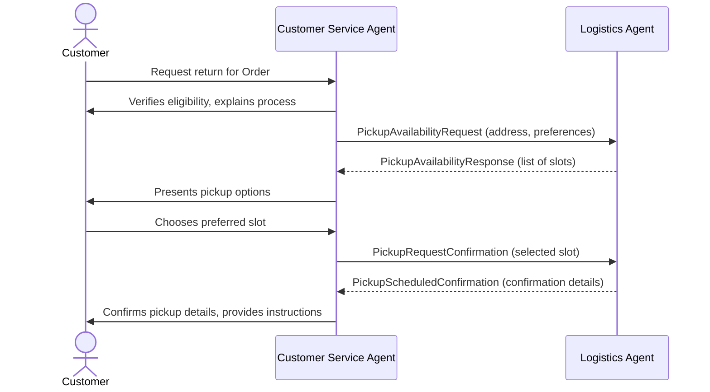

# Cross-Domain Return-Pick-up Scheduling (A2A)

This A2A implementation demonstrates inter-domain communication between agents in different domains. Unlike inter-agent communication within a single domain or application—where participating agents typically have full transparency into each other’s details—cross-domain agent communication enforces strict modularity and abstraction. In cross-domain scenarios, the logic and implementation of each agent system are hidden from one another, and only high-level structured information is exchanged. This approach aligns with Google’s Agent-to-Agent (A2A) protocol principles.  
  
### Scenario: Cross-Domain Return Pickup Scheduling  
  
In this implementation, an agent within the Contoso Customer Service AI team collaborates with a Logistics Agent to arrange a product return pickup. After verifying the return eligibility, the Customer Service Agent initiates a multi-turn negotiation with the Logistics Agent to schedule a pickup at the customer's address. The process includes:  
  
- The Customer Service Agent requesting available pickup slots from the Logistics Agent.  
- The Logistics Agent responding with a list of available date/time options.  
- The Customer Service Agent presenting these options to the customer and collecting a preferred slot.  
- The Customer Service Agent confirming the selected slot with the Logistics Agent, who in turn confirms logistics with the carrier and finalizes the arrangement.  
- Each communication is handled using high-level, schema-driven A2A messages, with neither agent exposing its internal logic, system details, or direct access to underlying services.  
  
---  
  
#### Mermaid Flow Diagram  



## Running the A2A Demo End-to-End  
  
The repo ships three Python modules:  
  
| File                      | Purpose                                                   |  
|---------------------------|-----------------------------------------------------------|  
| `logistic_mcp.py`         | Internal Logistics **MCP** service (tools & DB)           |  
| `logistic_a2a_server.py`  | Thin **A2A façade** that wraps the MCP service            |  
| `multi_agent_a2a.py`      | Contoso **multi-agent** customer-service application      |  
  
---  
  
### 1. Install Dependencies  
  
```bash  
pip install -r requirements.txt  
# or manually:  
pip install a2a-sdk semantic-kernel uvicorn httpx python-dotenv  
```
### 2. Prepare your .env	
 	
Create or edit .env in the `agentic_ai\applications` folder:	
 	
```env	
# ─── Contoso customer-service app ───────────────────────────────	
AGENT_MODULE="agents.semantic_kernel.multi_agent.a2a.multi_agent_a2a"	
 	
# ─── End-points used by the agents ──────────────────────────────	
LOGISTIC_MCP_SERVER_URI="http://localhost:8100/sse" # internal Fast-MCP	
LOGISTICS_A2A_URL="http://localhost:9100" # A2A wrapper	
```	
 	
Add your usual AZURE_OPENAI_* settings if you have not done so already.	
 	
---	
 	
### 3. Start the Back-End Services (Two Terminals)	
 	
```bash	
# Terminal ① – internal Logistics MCP	
python logistic_mcp.py # listens on :8100/sse	
 	
# Terminal ② – A2A façade	
python logistic_a2a_server.py # listens on :9100 (serves /.well-known/agent.json)	
```	
 	
---	
 	
### 4. Launch the Contoso Multi-Agent App under `agentic_ai\applications`
 	
```bash	
./run_application.sh	

```	

The CS agent will now:  
  
1. Verify product-return eligibility via the Contoso MCP tools.  
2. Talk to the Logistics agent through the **single free-text tool** exposed by the A2A server (no JSON payloads needed).  
3. Keep `taskId` and `contextId` in its session state so subsequent calls continue the same conversation on the Logistics side.  