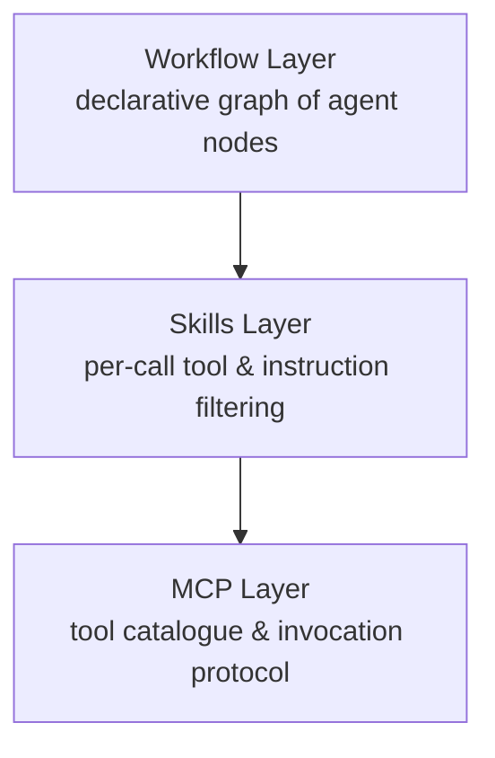
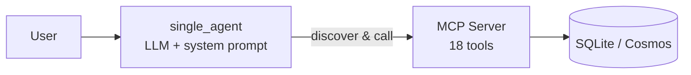
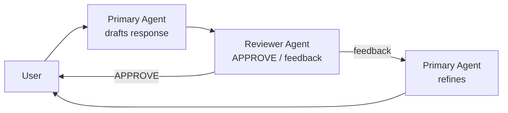
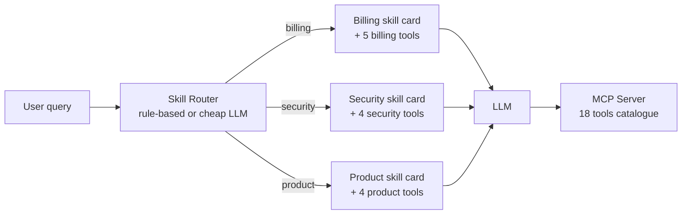
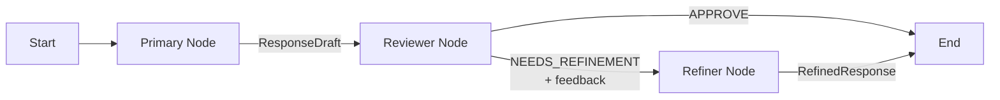

# Two taxes your MCP agent is paying (and the two patterns that fix them)

*by [Your Name] — Microsoft · Published on Dev Community · `#mcp` `#ai-agents` `#azureopenai`*

---

## TL;DR

Think of a production-grade agent in three layers, not one:

1. MCP (foundation) — a standard protocol for *tool distribution*. Any tool, any agent, one wire format.
2. Skills (discipline) — a routing layer that decides *which tools and instructions* an LLM call sees this turn.
3. Workflow (orchestration) — a graph that decides *which LLM calls run, in what order, with what shared state*.

MCP alone gets you running fast but quietly hands the LLM a 1,440-token tool catalogue on every turn and a non-deterministic loop on every reflection. We measured the bill on a 30-test telecom-support suite:

- Skills routing on top of MCP → cuts the context tax: −57% input tokens, −47% cost, 30/30 success preserved.
- Workflow orchestration wrapping skills-aware nodes → cuts the drift tax: −93% multi-turn latency variance (91 s → 6.8 s stdev), and lifts multi-turn success 4/5 → 5/5.
- They compose because they act at *different layers*. Multi-agent systems need both.
- Full eval harness, 30-case dataset, and raw JSON results are in the repo — reproduce on your own MCP server in one command.

---

## 1. Problem / Context

MCP solved *tool distribution*. You expose a catalogue of capabilities over a standard protocol and any agent can discover and call them. That part is great.

What MCP does not solve is tool discipline — *which* tools should a given turn see, and *how consistently* should the agent pick among them.

We hit both walls while iterating on a Contoso Telecom customer-support agent:

- 1 MCP server backed by SQLite/Cosmos fixtures
- 18 tools across 4 domains: billing, account/security, product, tickets
- 1 LLM (`gpt-5.4-nano` on Azure OpenAI), same temperature everywhere
- Real user queries spanning all four domains plus 5 multi-turn scenarios

The agent worked. It also quietly misbehaved in two ways that only measurement could surface.

## 1.5. MCP vs Skills vs Workflow — three layers, three jobs

These terms get conflated a lot. They shouldn't be — each one solves a different problem and lives at a different layer of the stack:

| Layer | What it standardizes | What it does not decide |
|---|---|---|
| MCP (protocol) | How a tool is *advertised, discovered, and invoked* across processes/orgs. | Which tools an agent sees on a given turn. How agents coordinate. |
| Skills (routing) | Which tools + which system instructions a single LLM call gets, based on the user's current intent. | How tools are transported. How multiple agents/nodes hand off work. |
| Workflow (orchestration) | The graph of LLM calls, the typed state passed between them, and the termination conditions. | What's inside any one node — a node can be a single LLM call, a skills-routed call, or a sub-workflow. |

The useful mental model:



- MCP without skills: every LLM call sees every tool. Cheap to wire, expensive at runtime, hard to govern.
- Skills without MCP: you've solved routing but rebuilt tool transport per project. Doesn't compose across teams.
- Skills + MCP, no workflow: great for single-agent turns. Multi-agent handoffs become ad-hoc Python (or worse, a chat-based loop with no typed state) and reproducibility suffers.
- Workflow + MCP, no skills: every node still pays the full context tax on every call.
- All three: each layer does the one job it's good at. A workflow node makes a skills-filtered call into MCP-served tools. The model sees a small, intent-relevant tool set; the orchestration is reviewable and reproducible; the tools themselves are reusable across agents and teams.

Why this matters for multi-agent designs. The moment you move past one agent, *workflow becomes the contract between agents* and *skills becomes the contract between an agent and its tools*. MCP stays underneath both as the wire protocol. Treating any of the three as a substitute for another is where most production-readiness pain comes from.

## 2. Current Architecture or Approach

The starting point — and honestly the right starting point — is the "plug everything in" baseline:



One LLM, one system prompt describing the persona, all 18 MCP tools auto-discovered at turn time. Simple, uses MCP as designed, works for narrow scope.

For higher-quality answers, many teams bolt on a reflection loop — Primary writes, Reviewer critiques, Primary refines:



These two (`single_agent` and `reflection_agent`) are our baselines. We measured them.

## 3. Challenges or Limitations

### Tax #1 — Context bloat

Every MCP tool has a JSON schema. Every schema gets serialized into the chat completion call. At ~80 tokens per schema × 18 tools = 1,440 tokens of tool tax on every turn — regardless of whether the user asked about roaming charges or a TV channel lineup.

This tax scales linearly with your catalogue. Teams adopting MCP tend to grow tool counts fast. At 40 tools you're paying ~3,200 tokens of overhead before the user says a word.

### Tax #2 — Behavioral drift

LLMs are non-deterministic, and imperative reflection loops amplify that. Feed the same multi-turn prompt through `reflection_agent` three times and wall-clock latency swings wildly — we measured 91 s standard deviation on multi-turn cases in our 30-test suite. Quality stays good on average, but:

- Evaluation harnesses go flaky (one run passes, the next times out)
- Incidents become hard to reproduce
- SLOs become unwriteable — what p95 do you promise when stdev dwarfs the mean?

### The metric trap

Worth calling out separately: `success = True` is not the same as "the agent did the right work". In our smoke tests, the baseline agent returned `success = True` on an `account_locked` case while calling zero required tools — a polite, fluent non-answer. For the published comparison we therefore report `success` strictly as a *liveness* signal (did the agent return a non-empty response without raising?) and lean on token/latency/cost deltas for the quality story. A stronger future harness would route `(query, response, success_criteria, scoring_rubric)` through an LLM judge.

## 4. Proposed Design or Pattern

Two patterns, each targeting one tax. They act at different layers, which is why they compose cleanly.

### Pattern A — Skills routing (cuts context bloat)

Add a lightweight classifier in front of the LLM call. For each turn:

1. Classify the query into a domain (`billing`, `security`, `product`, `ticket`, …)
2. Load that domain's skill card (short, role-specific system prompt)
3. Filter the MCP tool list to only the domain's tools (~5 of 18)
4. Hand the filtered tools + skill card to the LLM



The LLM physically cannot call `reset_password` during a billing turn — it isn't in the tool list.

### Pattern B — Workflow orchestration (cuts drift)

Replace the imperative Primary → Reviewer → Refine loop with a declarative workflow graph. Each role is a node; each handoff is a typed edge carrying a shared state object.



The graph enforces:
- Exactly-once transitions per node
- Typed contracts between stages (can't skip a step or lose state)
- Explicit termination conditions

Same three roles. Different orchestration substrate.

### Orthogonality

Skills act on the LLM's tool-facing surface. Workflows act on orchestration across LLM calls. You can have a workflow where every node is a skills-filtered LLM call — and you get both wins.

## 5. Why This Works (Tradeoffs)

We ran a four-agent A/B study to put numbers on both patterns.

### Experiment setup

- Dataset: 30 test cases (25 single-turn + 5 multi-turn) covering all 4 domains, with `customer_query`, `customer_id`, `expected_tools`, `required_tools`, `success_criteria`, `ground_truth_solution`, `scoring_rubric`.
- Scoring: `success` is liveness (non-empty response, no exception). Quality deltas are reported via context size, latency, latency variance, and cost — see [`blog_kpi_methodology.md`](./blog_kpi_methodology.md) for exact formulas.
- Same model, same MCP backend, same prompts across pairs — any delta is architectural.

We ran two deliberately scoped experiments, each isolating one variable:

- Experiment 1 — Single agent, with vs without skills. `single_agent` (no skills, no workflow) vs `single_agent_skills` (skills on, no workflow). 30 tests × 1 run. Isolates the value of skills routing on its own.
- Experiment 2 — Reflection, with vs without (skills + workflow). `reflection_agent` (reflection loop, no skills, no workflow) vs `reflection_workflow_agent` (same three roles, now skills-routed and orchestrated by a declarative workflow graph). 30 tests × 3 repeats so we can report latency variance honestly.

Pair B intentionally turns skills and workflow on together — that's the realistic multi-agent shape and matches how the three-layer stack is meant to compose.

### Experiment 1 results — Single agent, with vs without skills (30 tests, 1 run each)

Single-turn (25 tests):

| Metric | `single_agent` (no skills) | `single_agent_skills` | Δ |
|---|---:|---:|---:|
| Tools exposed per turn | 18 on every turn | 6 on 17/25, 9 on 6/25, 5 on 2/25 (mean 6.64) | −63.1% on mean |
| `tool_schema_tokens` (mean) | 1,440 | 531 | −63.1% |
| `instruction_size_tokens` | 500 | 194 | −61.2% |
| `input_tokens` (avg) | 523 | 217 | −58.5% |
| `response_tokens` (avg) | 161 | 188 | +16.3% |
| `cost_estimate_usd` (avg/turn) | $0.00686 | $0.00337 | −50.8% |
| `latency_ms` (avg) | 9,075 | 9,792 | +7.9% |
| `latency_stdev_ms` | 2,325 | 2,286 | −1.7% |
| `success_rate` | 25/25 | 25/25 | +0 pp |

Multi-turn (5 tests):

| Metric | `single_agent` (no skills) | `single_agent_skills` | Δ |
|---|---:|---:|---:|
| Tools exposed per turn | 18 on every turn | 6 on 3/5, 9 on 2/5 (mean 7.2) | −60.0% on mean |
| `tool_schema_tokens` (mean) | 1,440 | 576 | −60.0% |
| `instruction_size_tokens` | 500 | 223 | −55.5% |
| `input_tokens` (avg) | 574 | 297 | −48.3% |
| `cost_estimate_usd` (avg/turn) | $0.01038 | $0.00696 | −32.9% |
| `latency_ms` (avg) | 19,409 | 19,691 | +1.5% |
| `latency_stdev_ms` | 3,723 | 1,830 | −50.8% |
| `success_rate` | 5/5 | 5/5 | +0 pp |

> Why this matters: the context tax is cut more than half across the whole suite while not losing a single test (30/30 → 30/30). Single-turn latency rises ~8% (the classifier hop) and multi-turn latency is effectively flat with half the variance. Cost drops ~47% across all 30 tests combined — $0.223 → $0.119 total spend.

### Experiment 2 results — Reflection, with vs without (skills + workflow) (30 tests × 3 repeats)

Both sides run the same three roles (Primary → Reviewer → Refine). The variant adds skills routing and a declarative workflow graph on top.

Single-turn (25 tests, 75 runs per side):

| Metric | `reflection_agent` (no skills, no workflow) | `reflection_workflow_agent` (skills + workflow) | Δ |
|---|---:|---:|---:|
| Tools exposed per turn | 18 on every turn | 6 on 51/75, 9 on 18/75, 5 on 6/75 (mean 6.64) | −63.1% on mean |
| `tool_schema_tokens` (mean) | 1,440 | 531 | −63.1% |
| `input_tokens` (avg) | 523 | 217 | −58.5% |
| `cost_estimate_usd` (avg/turn) | $0.00714 | $0.00369 | −48.3% |
| `latency_ms` (avg) | 16,194 | 18,237 | +12.6% |
| `latency_stdev_ms` | 5,336 | 5,691 | +6.6% |
| `success_rate` | 25/25 | 24/25 | −4 pp |

Multi-turn (5 tests, 15 runs per side) — *the real story*:

| Metric | `reflection_agent` (no skills, no workflow) | `reflection_workflow_agent` (skills + workflow) | Δ |
|---|---:|---:|---:|
| Tools exposed per turn | 18 on every turn | 6 on 9/15, 9 on 6/15 (mean 7.2) | −60.0% on mean |
| `tool_schema_tokens` (mean) | 1,440 | 576 | −60.0% |
| `input_tokens` (avg) | 574 | 297 | −48.3% |
| `cost_estimate_usd` (avg/turn) | $0.01051 | $0.00794 | −24.4% |
| `latency_ms` (avg) | 68,707 | 44,322 | −35.5% |
| `latency_stdev_ms` | 91,017 | 6,792 | −92.5% |
| `success_rate` | 4/5 | 5/5 | +20 pp |

> Why this matters: on complex multi-turn conversations the imperative reflection loop averaged 68.7 s with a standard deviation of 91 s — essentially unpredictable. The declarative workflow variant runs the same roles in 44.3 s with 6.8 s stdev — −35% latency, −93% variance — while lifting success from 4/5 to 5/5. Same LLM, same prompts, same tools; different orchestration substrate.
>
> Single-turn shows a small latency regression (+12.6%) and one flaky test (25/25 → 24/25) — worth calling out honestly. The workflow's value shows up when work fans out across multiple nodes, not on one-shot queries where there's nothing to orchestrate.

### Honest tradeoffs

- Skills pattern adds a classifier hop (small latency, small misroute risk). Needs a fallback strategy for ambiguous queries and a plan for cross-domain turns.
- Workflow pattern adds a framework dependency and some upfront authoring cost. Debugging shifts from "read the prompt" to "read the graph + state" — different skill, not necessarily harder.
- Neither replaces the other. They attack different layers.
- Skills isn't free for every domain — it assumes reasonable category separation. For deeply cross-cutting queries, you expose a union or fall back to the full catalogue.

## 6. Observability / Security / Governance

Both patterns turn "agent behavior" into something a platform team can govern.

### Observability
- Workflow graphs produce natural OTEL span boundaries — one per node. Tracing becomes free.
- Skill routing decisions are loggable events ("this turn was classified as `billing` with confidence 0.84"). You can audit the classifier independently of the LLM.

### Security
- Defense in depth by tool exposure. A billing-skill turn literally cannot call `reset_password` because it isn't in the LLM's tool list. This reduces prompt-injection blast radius — an attacker who smuggles instructions into a billing context still can't pivot to security actions.
- Workflow nodes can enforce per-node auth scopes (Reviewer reads but doesn't write).

### Governance
- Skill cards are versionable artifacts. Your billing team owns `billing_skill.md`; your security team owns `security_skill.md`. Changes go through code review, not prompt-engineering tickets.
- Workflow graphs are reviewable diagrams. A new reflection policy is a PR against the graph, with a visual diff.
- Cost becomes an explicit line item. `tool_schema_tokens` is a budget number now, not a hidden constant that grows silently as your MCP catalogue expands.

## 7. Key Takeaway

> Three layers, three jobs.
> - MCP — the foundation. Standard protocol for tool distribution. Necessary, not sufficient.
> - Skills — the discipline layer. Cuts context bloat by filtering tools and instructions per intent.
> - Workflow — the orchestration layer. Cuts behavioral drift by replacing imperative loops with declarative graphs.
>
> The patterns compose because they live at different layers. A production multi-agent system is a workflow of skills-routed nodes calling MCP-served tools — not a choice between them.

---

## Appendix A — Reproduce the numbers in one command

Everything is in the repo ([OpenAIWorkshop](https://github.com/microsoft/OpenAIWorkshop)). The full recipe:

### Prerequisites
- Azure OpenAI deployment (any chat model; we used `gpt-5.4-nano`)
- Python 3.12 + `uv` (or `pip`)
- Either an API key or `az login` for managed-identity auth

### Step 1 — Clone & set up
```powershell
git clone https://github.com/microsoft/OpenAIWorkshop
cd OpenAIWorkshop

# MCP server deps
cd mcp
uv sync

# Agent + eval deps
cd ..\agentic_ai\applications
python -m venv .venv
.\.venv\Scripts\Activate.ps1
pip install -r requirements.txt
```

### Step 2 — Configure Azure OpenAI
Create `.env` at repo root:
```env
AZURE_OPENAI_ENDPOINT=https://<your-resource>.cognitiveservices.azure.com/
AZURE_OPENAI_DEPLOYMENT=gpt-5.4-nano
AZURE_OPENAI_API_VERSION=2024-12-01-preview
# Either:
AZURE_OPENAI_API_KEY=<key>
# Or rely on managed identity — just run `az login`
```

### Step 3 — Start the MCP server
```powershell
cd mcp
uv run python mcp_service.py
# Leave running — listens on http://localhost:8000/mcp
```

### Step 4 — Run Pair A (Skills)
```powershell
cd ..\agentic_ai
.\applications\.venv\Scripts\python.exe .\evaluations\compare_agents_skills.py `
  --baseline agents.agent_framework.single_agent `
  --variant  agents.agent_framework.single_agent_skills `
  --dataset  .\evaluations\eval_dataset.json `
  --output   .\evaluations\eval_results\comparison_single_full.json
```
Runs 30 tests × 2 agents ≈ 10–15 minutes. Output JSON has per-test snapshots and a `summary` block with all deltas.

### Step 5 — Run Pair B (Workflow determinism)
```powershell
.\applications\.venv\Scripts\python.exe .\evaluations\compare_agents_skills.py `
  --baseline agents.agent_framework.multi_agent.reflection_agent `
  --variant  agents.agent_framework.multi_agent.reflection_workflow_agent `
  --dataset  .\evaluations\eval_dataset.json `
  --repeats  3 `
  --output   .\evaluations\eval_results\comparison_reflection_determinism.json
```
Runs 30 tests × 3 repeats × 2 agents ≈ 60–90 minutes. Output JSON preserves raw per-run arrays so you can recompute any variance metric.

### Step 6 — Inspect the summaries
Each output JSON has a top-level `headline` block per section plus raw per-test snapshots. Example from our Pair B multi-turn run:
```json
{
  "multi_turn": {
    "num_tests": 5,
    "repeats": 3,
    "headline": {
      "input_token_delta_pct": -48.3,
      "cost_delta_pct": -24.4,
      "latency_delta_pct": -35.5,
      "latency_stdev_delta_pct": -92.5,
      "success_delta_pp": 20.0
    }
  }
}
```

### Step 7 — Cross-check on your own workload
Swap `eval_dataset.json` with your own queries and required-tool annotations. Same harness, your numbers.

---

## Appendix B — KPI reference

The tables above use only these nine KPIs. Full formulas, the aggregation script, and what the harness *doesn't* measure are in [`blog_kpi_methodology.md`](./blog_kpi_methodology.md).

Context (per turn)
- `instruction_size_tokens` — system prompt / skill-card footprint
- `tools_exposed_count` — tools visible to the LLM this turn
- `tool_schema_tokens` = `tools_exposed_count × 80`, the real context tax
- `input_tokens` — `instruction_size_tokens + query_tokens`
- `response_tokens` — model output size

Latency
- `latency_ms` — wall clock end-to-end
- `latency_stdev_ms` — population stdev across repeats (Pair B) or across tests (Pair A)

Cost
- `cost_estimate_usd` = `((input_tokens + tool_schema_tokens)/1000) × 0.003 + (response_tokens/1000) × 0.006`

Success
- `success` / `success_rate` — liveness signal (non-empty response without exception)
