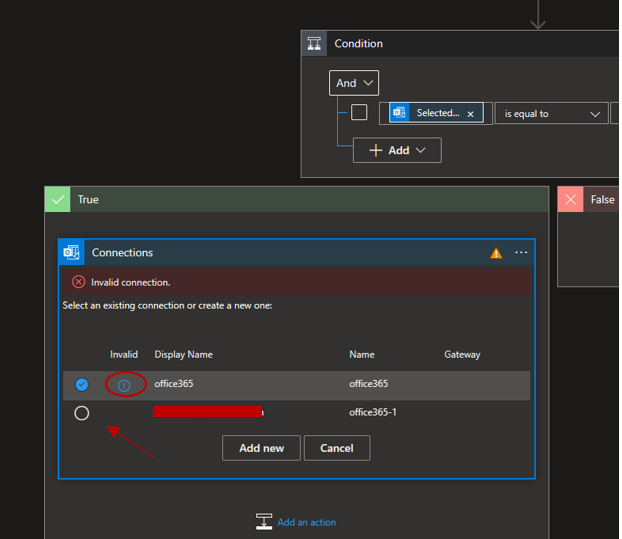

# AUTOMATE YOUR MAILBOX RESPONSES

## Objective

In this lab you will lean how to use OpenAI to help answer common IT questions sent to help desk mailboxes.

 

## Summary

You will need to deploy 2 logic apps:

Logic App 1 (read-mailbox-techsupport): reads incoming email from an Outlook mailbox and calls Logic App2

Logic App 2 (email-techsupport-integration): Calls Azure OpenAI for answers to the user support question and emails back a response. 

### Note: 

We will deploy the second logic app first because we will need its URL when provisioning the first logic app.

## Step 1. Signin to Azure Portal

Go to https://portal.azure.com and enter your credentials

## Step 2. Deploy Logic App 2 (email-techsupport-integration)

### OpenAI Prompt Overview
This logic app uses the following prompt to answer questions sent to a technical support mail box:

_________________________________________________________________________
You are a Helpdesk assistant. Extract the person's name and technical problem from the text below. Provide possible solutions including links to websites in html. If no solutions are found, respond with 'We will get back to you in 48 hrs'. 
If this is a hardware problem give them tips for troubleshooting and indicate we will create a support ticket and schedule a repair within 48 hours.

______________________________________________________________________________

In this step you are going to perform the following actions to deploy and configure the logic app:

- Deploy the logic app that sends the user question to OpenAI
- Copy the URL for this Logic App for use in the first logic app
- Enter Azure OpenAI authentication credentials
- Configure your connection to Outlook

After the deployment you should see two new items in your resource group

  

  Click on the logic app and click on the edit button

   

Expand the first box "When an HHTP is received" and copy the URL to your text editor

Scroll down to the HTTP box and enter your OpenAI api key and the OpenAI endpoint with the following format:

**"https://<YOUR_AZURE_OPENAI_RESOURCENAME>.openai.azure.com/openai/deployments/<DEPLOYMENT_NAME>/completions?api-version=2022-12-01"**

You can find the <DEPLOYMENT_NAME> in the Azure OpenAI Studio Deployments blade as shown below:

Scroll down to the action box with the outlook logo and expand it to enter new authorizaion credentials for your mailbox:

Scroll down to the condition option and expand it, then expand the true option. Select the valid connection to send the final notification in this logic app.

> IMPORTANT: **Save the logic app**

### Step 3. Deploy Logic App 1 (read-mailbox-techsupport)

This logic app scans a mail box every X minutes for new emails with the subject: **"Helpdesk Bot"**.

Note: When you click the 'Deploy to Azure' button below, you will need to provide the URL to your second logic app (email-techsupport-integration) in the 'Email_integration_url' parameter field.

In this step you are going to perform the following actions to deploy and configure the logic app:

- Deploy the logic app that reads an Outlook mailbox and calls a logic app to send the user question to Azure OpenAI
- Configure your connection to Outlook

After the deployment you should see the new logic app your resource group, open the logic app and click the edit button

  

Select the top box titled connection and select the appropiate connection to Office 365 outlook

### Step 4. Test

Send an email to the mailbox configured in your second logic app
> **Don't forget the email subject**

**"Helpdesk bot"**

You can use this test:
_______________________________________________________________

Hello,

I can't login into my account, I need to reset my password. Also my keyboard is not working.

Thank you
_______________________________________________________________