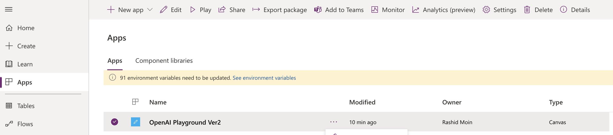
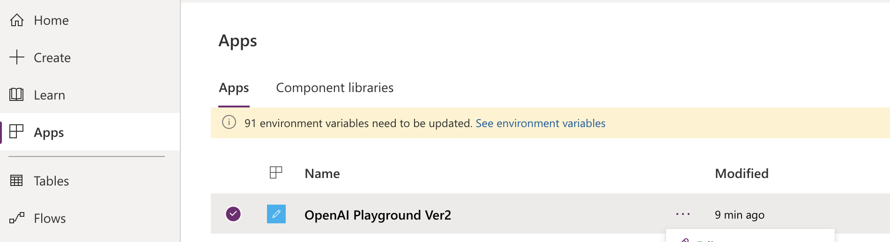

# AUTOMATE YOUR MAILBOX RESPONSES

## Objective

In this lab you will lean how to use OpenAI to help answer common IT questions

 

 

## Summary

You will need to deploy 2 logic apps. The first logic app reads incoming email of an outlook mailbox; the second logic app calls OpenAI for anwers to the questions and sends a response.

## Step 1. Signin to Azure Portal

Go to https://portal.azure.com and enter your credentials

## Step 2. Deploy Logic Apps

- click on Apps on the left navigation.

  

- From the top nav bar, click Import Canvas App and upload the power app zip file from this git repo path. 

  

  

- Click on Import to import the package into powerapps environment. 

  

- This will import the Power App canvas app and the Power Automate Flow into the workspace. 

  

- Click on the flows and edit the Power Automate Flow

  

- Edit the Power Automate Flow HTTP step with your own Azure OpenAI API [key and endpoint](https://learn.microsoft.com/en-us/azure/cognitive-services/openai/quickstart?pivots=rest-api&tabs=command-line#retrieve-key-and-endpoint)

  

- Save the flow and make sure that flow is turned on

### Step 2. Test

- run the App by clicking on the App

  
