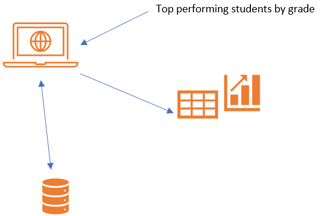

# SQL QUERY & DATA ANALYTICS ASSISTANT

## Objective

In this lab you will learn how to use Azure OpenAI to query SQL data using natural language query.

This application also demonstrates the use of Azure Open AI to help answer business questions by performing advanced data analytic tasks on a enterprise database.

Examples of questions are:

- Simple: Show me daily revenue trends in 2016  per region
- More difficult: Is that true that top 20% customers generate 80% revenue in 2016?
- Advanced: Forecast monthly revenue for next 12 months starting from June-2018

The application supports Python's built-in SQLITE (*recommended* for lab) as well as your own Microsoft SQL Server.

From a EDU perspective, think of how this solution might be applied to Student Analytics where faculty/staff can ask questions about Student performance/tuition payments etc as shown below:



## Summary

You will need [VS Code](https://code.visualstudio.com/download) to run this lab in your local computer.

You can use an existing SQL database or the default SQLlite embedded database (*recommended*) provided in the lab.

## Appplication Overview

- **SQL Query Writing Assistant**: Translates business question into SQL query language, then executes and displays the result.
  
- **Data Analysis Assistant**: A more sophisticated application to perform advanced data analytics such as statisical analysis and forecasting. Here we demonstrate the use of [Chain of Thought](https://arxiv.org/abs/2201.11903) and [ReAct](https://arxiv.org/abs/2210.03629) techniques to perform multi-step processing where the next step in the chain also depends on the observation/result from the previous step.

### SQL Query Writing Assistant:


- Use a question from the FAQ or enter your own question.
- You can select ```show code``` and/or ```show prompt``` to show SQL query and the prompt behind the scene.
- Click on submit to execute and see result.

### Data Analyst Assistant:

 

- Use a question from the FAQ or enter your own question.
- You can select ```show code``` and/or ```show prompt``` to show SQL & Python code and the prompt behind the scene.
- Click on submit to execute and see result.
- For advanced questions such as forecasting, you can use GPT-4 (if available) as the engine.


## Step 1. Clone this repository

Open VS Code and Clone this repository:

URL: https://github.com/Microsoft-USEduAzure/OpenAIWorkshop.git


From the terminal, navigate to ```cd labs/Lab_2_Data_Analytics```

## Step 2. Set up enviromental variables

 Provide settings for Open AI and Database.You can either create a file named `secrets.env` file in the root of this folder (labs/lab_3_data_analytics) as below or do it using the app's UI later on (*easier*).

    - Option 1: use built-in SQLITE (*recommended*). Then you don't need to install SQL Server.
         
        AZURE_OPENAI_API_KEY="9999999999999999999999999"
        AZURE_OPENAI_GPT4_DEPLOYMENT="NAME_OF_GPT_4_DEPLOYMENT"
        AZURE_OPENAI_CHATGPT_DEPLOYMENT="NAME_OF_CHATGPT_4_DEPLOYMENT"
        AZURE_OPENAI_ENDPOINT=https://openairesourcename.openai.azure.com/
        SQL_ENGINE = "sqlite"
       

    - Option 2: use your own SQL Server
        
        AZURE_OPENAI_API_KEY="9999999999999999999999999"
        AZURE_OPENAI_ENDPOINT="https://openairesourcename.openai.azure.com/"
        AZURE_OPENAI_GPT4_DEPLOYMENT="NAME_OF_GPT_4_DEPLOYMENT"
        AZURE_OPENAI_CHATGPT_DEPLOYMENT="NAME_OF_CHATGPT_4_DEPLOYMENT"
        SQL_USER="sqluserid"
        SQL_PASSWORD="sqlpassword"
        SQL_DATABASE="WideWorldImportersDW"
        SQL_SERVER="sqlservername.database.windows.net"
     
      

> **IMPORTANT** If you are a Mac user, please follow [this](https://learn.microsoft.com/en-us/sql/connect/odbc/linux-mac/install-microsoft-odbc-driver-sql-server-macos?view=sql-server-ver16) to install ODBC for PYODBC

## Step 3. Configure development environment

> **NOTE** all activities in this step will performed using the command line in VS Code terminal

### Step 3.1 Navigate to the root directory of this lab

Navigate to ```cd labs/Lab_2_Data_Analytics```

### Step 3.2 Create a python environment with version from 3.7 and 3.10

This step is required **ONLY if did not perform this earlier as part of the pre-requisites**

    - [Python 3+](https://www.python.org/downloads/)
        - **Important**: Python and the pip package manager must be in the path in Windows for the setup scripts to work.
        - **Important**: Ensure you can run `python --version` from console. On Ubuntu, you might need to run `sudo apt install python-is-python3` to link `python` to `python3`. 

### Step 3.3  Import the requirements.txt

run the command: `pip install -r requirements.txt`

### Step 3.4 Run the application locally

To run the application from the command line: `streamlit run app.py`

You will see the application load in your browser.