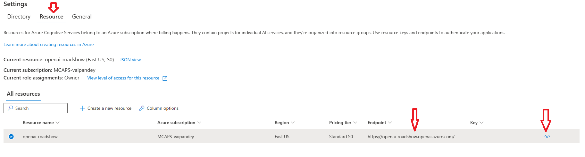
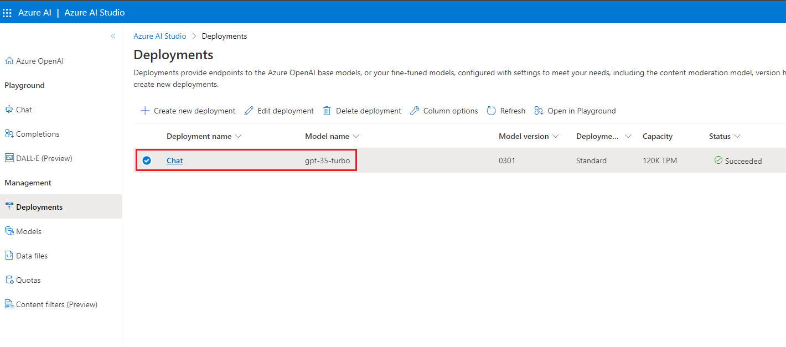
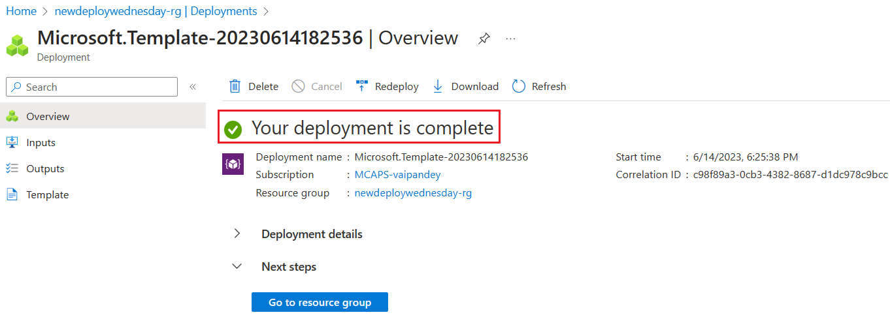
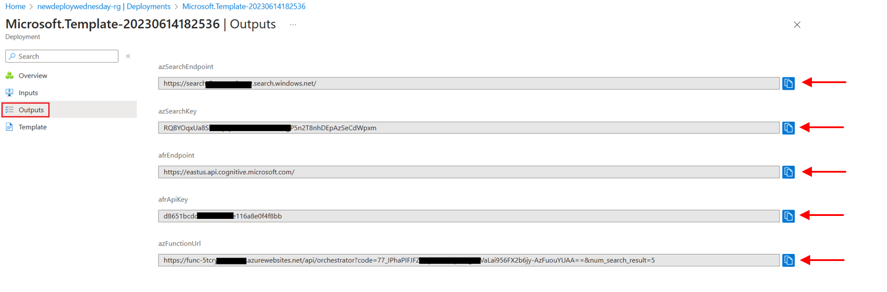
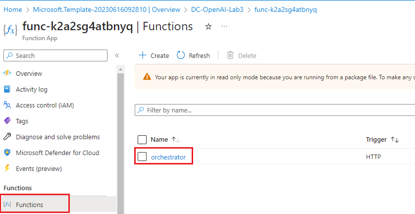
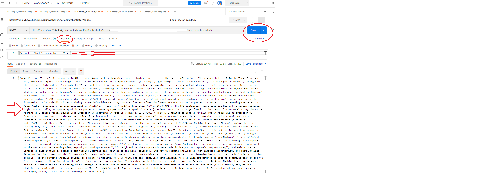
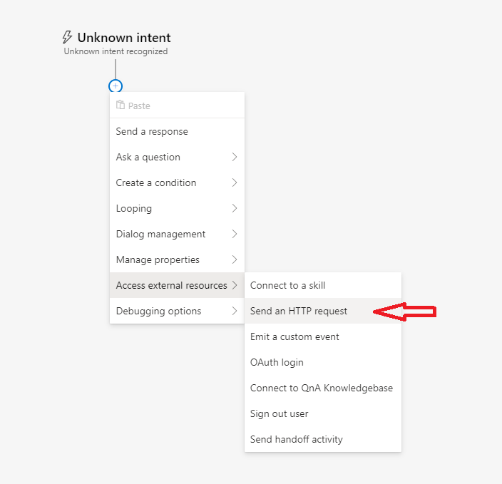

# Deployment Script

## Prerequisites

- Owner or Contributor permission is required in the Azure subscription.
- Microsoft.Search and Microsoft.BotService Resource provider needs to be registered in the Azure Subscription.
- Azure Cloud Shell is recommended as it comes with preinstalled dependencies.
- Azure Open AI already provisioned and `gpt-35-turbo` model is deployed. The model deployment name is required in the Azure Deployment step below.

- Right Click and Open ***[.Net Core 3.1](https://dotnet.microsoft.com/en-us/download/dotnet/3.1)*** in a new tab to Install .Net Core 3.1.

- Right Click and Open ***[Node.js](https://nodejs.org/en/download)*** in a new tab to Install Node.js.

- Right Click and Open ***[Azure Bot Framework Composer](https://learn.microsoft.com/en-us/composer/install-composer?tabs=windows#install-and-run-composer)*** in a new tab to Install Azure Bot Framework Composer.

Before deploying the Azure resources, you will need **_Azure OpenAI API endpoint, API key, and the model deployment name_**.

Follow the steps below to get the Azure OpenAI endpoint and API key. Save the endpoint and API key in a notepad for later use.

- Right Click and Open ***[Azure Open AI Studio](https://oai.azure.com/portal)*** in a new tab.

- Click on the the Gear icon on Top right corner.

   

- Navigate to Resource Tab and copy the endpoint and key in a notepad.

   

- To get the Azure OpenAI Model deployment name, click on the deployment under Management, and copy the model deploment name.

    

## 1. Azure Services deployment

Deploy Azure Resources: - Azure Function App to orchestrate calls to Azure OpenAI and Cognitive Search APIs - Azure Cognitive Search Service - Azure Form Recognizer

Here are the SKUs that are needed for the Azure Resources:

- Azure Function App - Consumption Plan
- Azure Cognitive Search - Standard (To support semantic search)
- Azure Forms Recognizer (AFR) - Standard (To support analyzing 500 page document)
- Azure Storage - general purpose V1 (Needed for Azure Function App and uploading sample documents)

Right Click on ***Deploy to Azure button*** and Open in a new tab.

- Wait for the deployment to complete. The deployment can take upto 10 minutes.

   

- Once deployment is successfully completed, navigate to Outputs Section as shown below and Click on `Copy to Clipboard` to copy the output values along with the output keys in a notepad file. Please copy all the output values, we will be using these values in the next steps:

   

## 2. Setup Azure Cognitive Search and prepare data

As part of the data preparation step, the documents are chunked into smaller sections (20 lines) and stored as individual documents in the search index. The chunking logic is achieved with a python script below.

- Create Search Index, Semantic Configuration and Index a few documents using automated script. The script can be run multiple times without any side effects.

- Right Click and Open ***[Azure Cloud Shell](https://portal.azure.com/#cloudshell/)*** in a new tab and select `PowerShell`. If this is first time you are starting Cloud Shell, you will be prompted to create an Azure Storage account for the Azure file share.

  Run the below commands from cloud shell to configure python environment.

      git clone https://github.com/Microsoft-USEduAzure/OpenAIWorkshop.git

      cd OpenAIWorkshop/labs/Lab_2_chatWithDocuments

      pip install -r ./orchestrator/requirements.txt

- Update Azure Search, Azure Open AI endpoints, Azure Form Recognizer Endpoint and API Keys in the secrets.env.

  Create a secrets.env file in the ingest folder that will be referenced by the search indexer (search-indexer.py):

      cd ingest

      # create secrets.env using the built-in code editor
      # When using code, you can type control+s to save the file and control+q to quit the editor

      code secrets.env

  Copy the following to the secrets.env file and replace the values of AZSEARCH_EP, AZSEARCH_KEY, AFR_ENDPOINT and AFR_API_KEY copied in the previous step to secrets.env:

      AZSEARCH_EP="https://<YOUR Search Service Name>.search.windows.net/"
      AZSEARCH_KEY="<YOUR Search Service API Key>"
      AFR_ENDPOINT="<YOUR Azure Form Recognizer Service API EndPoint>"
      AFR_API_KEY="<YOUR Azure Form Recognizer API Key>"
      INDEX_NAME="azure-ml-docs"
      FILE_URL="https://github.com/Microsoft-USEduAzure/OpenAIWorkshop/raw/main/labs/Lab_2_chatWithDocuments/Data/azure-machine-learning-2-500.pdf"
      LOCAL_FOLDER_PATH=""

*   The document processing, chunking, indexing can all be scripted using any preferred language.
    This repo uses Python. Run the below script to create search index, add semantic configuration and populate few sample documents from Azure doc.
    The search indexer chunks a sample pdf document(500 pages) and chunks each page into 20 lines. Each chunk is created as a new search doc in the index. The pdf document processing is achieved using the Azure Form Recognizer service.

        python search-indexer.py

# 3. Test Azure Function App Service deployment
Choose your preferred method to test and confirm Azure Function App before continuing to Step 4.

## Option A: Test from Azure Portal (Recommended)

  - Right Click and Open ***[Azure Portal](https://portal.azure.com/)*** in a new tab and navigate to the Resource Group deployed for Lab 3:
-
  - Select Function App:

    

  - Select `Functions` in the left navigation pane and click on `orchestrator` function:

     

  - Select `Code + Test` under Developer and click on `Test/Run`:

    

  - Add a query parameter called `num_search_result` with a value of `5` and Add the following body content: `{"prompt" : "Is GPU supported in AML"}` to the body section:

    

  - then click `Run`

  - Confirm the response was successful in the `Output` tab

    

## Option B: Visual Studio/VS Code
  > :information_source: This method requires the [REST Client extension](https://marketplace.visualstudio.com/items?itemName=humao.rest-client) when using VS Code.

  - Update [test.http](./orchestrator/test.http) with your function URL and key

  - Click `Send Request`

    

## Option C: Launch Postman
> :information_source: This method requires Postman client to be installed locally in your system. If its not installed already, Right Click and Open ***[Postman Client](https://www.postman.com/downloads/)*** in a new tab to download and install Postman.

  - Open Postman in your system and click on **New** as shown in the below screenshot and then select `HTTP`:

    

  - Select method to `POST`:

    

- Enter the URL of the Function app that you have copied in the notepad:

  

- Now, you can test the function app by providing the below prompt in the `Body` tab of postman. Make sure the `raw` option is selected. Press `Send`. The result will be displayed in the response window of Postman:

        {"prompt" : "Is GPU supported in AML"}

  

## 4. Build Chatbot

Create a bot in Azure Bot Composer:

1.  Open Bot Framework Composer in your local machine.

2.  Select Create New (+) on the homepage.

    

3.  Under C#, select Empty Bot and click next.

    

4.  Provide a name to your bot (e.g.- CustomdataOpenAI_Bot). Select Runtime Type as 'Azure Web App'. Select a location in your local machine to save the bot files. Click on Create and wait untill the bot is created..

    

5.  Click on "Unknown intent". Click on the three virtical dots (node menu) on the right corner of 'send a response' box, and then click on delete. The send a response intent will be deleted.

    

6.  Click on '+' sign under unknown intent to add an intent.

    

7.  Move the cursor to 'Access external resources' and select 'send an HTTP request'. The HTTP request is sent to make call to Azure function that has been created initially.

    

8.  Select 'HTTP Method' as 'POST'. Paste Azure Function App url that you have copied to notepad.

    

9.  Select Body box as 'object' from right corner drop down menu and copy and paste the below prompt in the body.

        {
            "prompt": "${turn.activity.text}"
        }

    

10. Select 'Response type' as 'json'.

11. Click on '+' sign under 'send an HTTP request' intent and select 'send a response'.

    

12. In the 'responses' box, type the below expression.

        ${turn.results.content.result}

Azure bot is now complete. In the next step, the bot is published on the Azure Cloud.

## 5. Publish the Chatbot

1. On the left most menu pane, select publish.

   

2. Now, a publish target is selected. For selecting the target, click on 'select a publish target' and then select manage profiles.

   

3. Click on 'Add new' to create a new publishing profile. Provide a name to the publihsing profile and select 'Publishing target' as 'Publihs bot to Azure'. Click next.

4. Select 'Create new resources' and click next. A sign in to your Azure subscription is required- provide your Azure portal credentials to sign in. Once signed in, select the subscription and resource group. Resource group that has been created at the beginning of this lab is preffered, but a new resource group can also be created.
   Select operating system as 'windows'.
   Provide a name to the host resource.
   Select region as 'East US'.
   Select LUIS region as 'West US' and click next.

5. Uncheck the optional resources and click next and then click on Create in the next window. Wait for the publishing profile to be provisioned.

6. Clik on Publish tab and select the bot to be published. Select the profile provisioned in the above step. Click on 'Publish selected bots'. Click on 'Okay' in the next window. Wait for the bot to be published on the Azure Cloud.

   

## 6. Test

1. Click on the Home button on the top left corner in the Bot Framework Composer. Select the bot that has been developed in the above steps.

2. Click on 'Start bot' button on the right left cornder of the Bot Framework Composer to start the developed bot.

3. You can now test the bot in web chat. Click on 'Open Web Chat'. Please don't click on 'Test in Emulator'.

You can now ask questions related to 'Azure Machine Learning' to get the response from Azure OpenAI.

E.g.:

    What is Azure Machine Learning?
    Is GPU supported in AML?
    How to track and monitor training runs in AML?

You can explore integrating bot to other platforms, such as Microsoft Teams, a web application, etc. to augment the response returned from Azure OpenAI.
