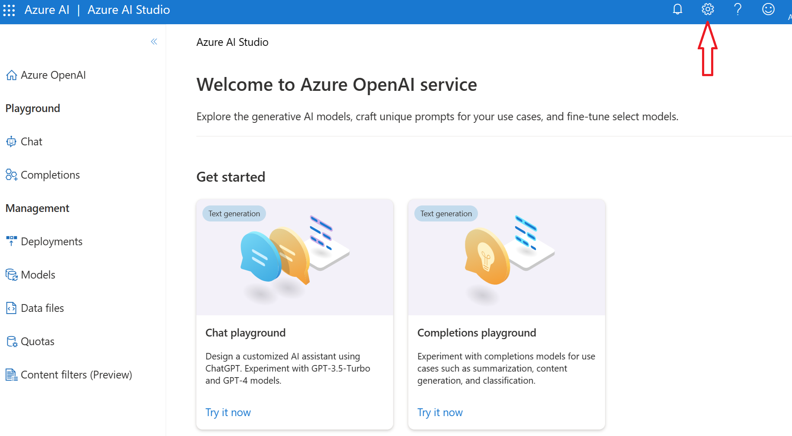
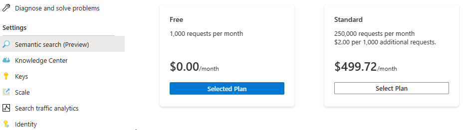
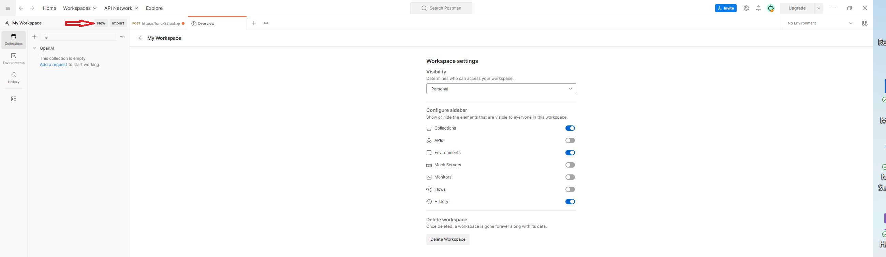
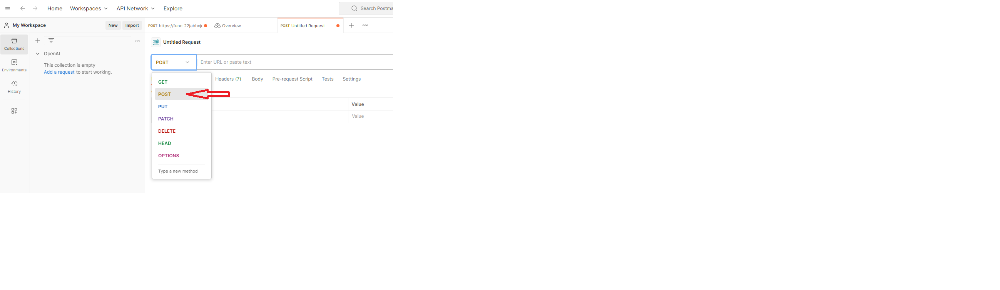
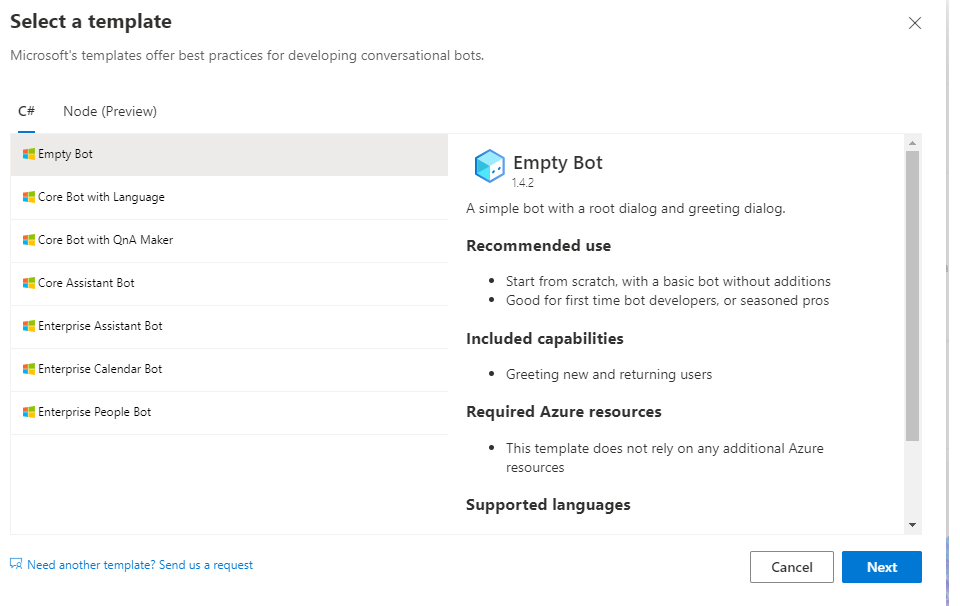
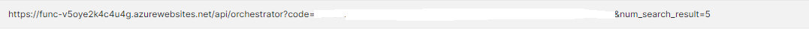
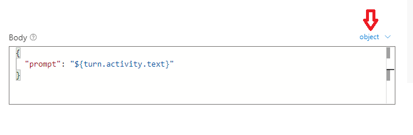
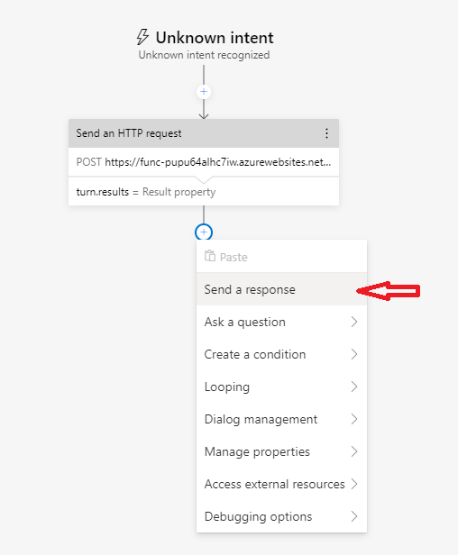
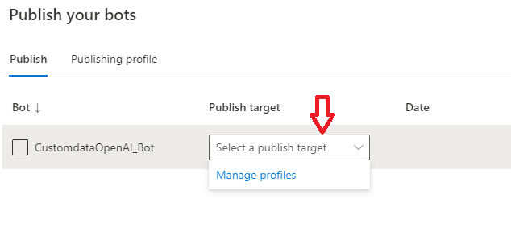
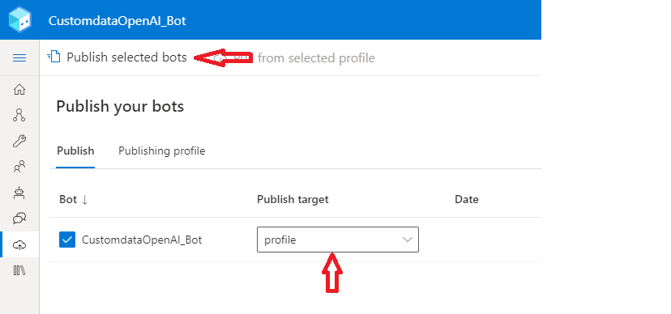

# Deployment Script

### Prerequisites

* Contributor permission is required in the Azure subscription.
* Microsoft.Search Resource provider needs to be registered in the Azure Subscription. 
* [PostMan Client Installed](https://www.postman.com/downloads/) for testing Azure Functions. Azure portal can also be used to test Azure Function App.  
* Azure Cloud Shell is recommended as it comes with preinstalled dependencies. 
* Azure Open AI already provisioned and text-davinci-003 model is deployed. The model deployment name is required in the Azure Deployment step below. 

* Install [.Net Core 3.1 or later](https://dotnet.microsoft.com/en-us/download/dotnet/3.1)

* [Azure Bot Framework Composer](https://learn.microsoft.com/en-us/composer/install-composer?tabs=windows#install-and-run-composer) is installed in local computer.
* [Bot Framework Emulator](https://github.com/Microsoft/BotFramework-Emulator/releases/tag/v4.14.1) installed in local computer. 

Before deploying the Azure resources, you will need Azure OpenAI API endpoint, API key, and the model deployment name.

Follow following steps to get the Azure API endpoint and API key. Save the endpoint and API key in a notepad for later use.

1. Navigate to [Azure Open AI Studio](https://oai.azure.com/portal)

2. Click on the the Gear icon on Top right corner.

    

3. Navigate to Resource Tab and copy the endpoint and key in a notepad.

    

To get the Azure OpenAI Model deployment name, click on the deployment under Management, and copy the model deploment name.

    

## 1. Azure services deployment

Deploy Azure Resources namely - Azure Function App to host facade for OpenAI and Search APIs, Azure Search Service and a Azure Form Recognizer resource.

Here are the SKUs that are needed for the Azure Resources:

- Azure Function App - Consumption Plan
- Azure Cognitive Search - Standard (To support semantic search)
- Azure Forms Recognizer - Standard (To support analyzing 500 page document)
- Azure Storage - general purpose V1 (Needed for Azure Function App and uploading sample documents)

The Azure Function App also deploys the function code needed for powerapps automate flow. 

(control+click) to launch in new tab.

 

## 2. Setup Azure Cognitive Search and prepare data

As part of data preparation step, to work in Open AI, the documents are chunked into smaller units(20 lines) and stored as individual documents in the search index. The chunking steps can be achieved with a python script below. 
To make it easy for the labs, the sample document has already been chunked and provided in the repo. 

* Enable Semantic Search on Azure Portal. Navigate to Semantic Search blade and select Free plan. 

    
    

*   Create Search Index, Sematic Configuration and Index a few documents using automated script. The script can be run multiple times without any side effects.
    
    Open Cloud Shell by clicking cloud shell icon on the upper right corner of the Azure portal and select PowerShell. Create a Fileshare if it prompts, to save all the files of this lab.

    
    
    Run the below commands from cloud shell to configure python environment. 

        
        git clone https://github.com/Microsoft-USEduAzure/OpenAIWorkshop.git
        
        cd OpenAIWorkshop/labs/Lab_3_chatWithDocuments 
        
        pip install -r ./orchestrator/requirements.txt

*   Update Azure Search, Open AI endpoints, AFR Endpoint and API Keys in the secrets.env. 
    
    The secrets.env should be placed in the ingest folder along side the python script file search-indexer.py.
    **The endpoints below needs to have the trailing '/' at end for the search-indexer to run correctly.**

        cd ingest
        
        # open secrets.env using code editor such as code
        # When using code, you can type control+s to save the file and control+q to quit the editor
        
        code secrets.env

    Add the below entries with correct values to secrets.env. Please refer to [this doc](ShowKeysandSecrets.md) to retrieve API Keys and Urls.

        AZSEARCH_EP="https://<YOUR Search Service Name>.search.windows.net/"
        AZSEARCH_KEY="<YOUR Search Service API Key>"
        AFR_ENDPOINT="<YOUR Azure Form Recognizer Service API EndPoint>"
        AFR_API_KEY="<YOUR Azure Form Recognizer API Key>"
        INDEX_NAME="azure-ml-docs"
        FILE_URL="https://github.com/Microsoft-USEduAzure/OpenAIWorkshop/raw/main/labs/Lab_3_chatWithDocuments/Data/azure-machine-learning-2-500.pdf"
        LOCAL_FOLDER_PATH=""

*   The document processing, chunking, indexing can all be scripted using any preferred language. 
    This repo uses Python. Run the below script to create search index, add semantic configuration and populate few sample documents from Azure doc. 
    The search indexer chunks a sample pdf document(500 pages) which is downloaded from azure docs and chunks each page into 20 lines. Each chunk is created as a new seach doc in the index. The pdf document processing is achieved using Azure Form Recognizer service. 
    
        cd OpenAIWorkshop/labs/Lab_3_chatWithDocuments/ingest
        python search-indexer.py
        

## 3. Test Azure Function App service deployment

* Launch Postman

* Click on 'New' as shown in the below screenshot and then select 'HTTP'.

    

* Select method to "POST".

    

* In The enter URL, enter the URL of the Function app that you have created. Please refer to [this doc](ShowKeysandSecrets.md) to retrieve Function App Url 

    

* Add below text just after the function app URL. The num_search_result query parameter can be altered to limit the search results. **num_search_result** is a mandatory query parameter.

        &num_search_result=5

    
    

* Now, you can test the function app by providing the below prompt in the 'Body' tab of the postman and press 'Send'. You must recieve the text result in the response window of the postman.

        {"prompt" : "Is GPU supported in AML"}

    

## 4. Build Chatbot 

Create a bot in Azure Bot Composer:

1. Open Azure Bot Composer in your local machine.

2. Select Create New (+) on the homepage.

    

3. Under C#, select Empty Bot and click next.

    

4. Provide a name to your bot (e.g.- CustomdataOpenAI_Bot). Select Runtime Type as 'Azure Web App'. Select a location in your local machine to save the bot files. Click on Create and wait untill the bot is created..

    

5. Click on "Unknown intent". Click on the three virtical dots (node menu) on the right corner of 'send a response' box, and then click on delete. The send a response intent will be deleted.

    

6. Click on '+' sign under unknown intent to add an intent. 

    

7. Move the cursor to 'Access external resources' and select 'send an HTTP request'. The HTTP request is sent to make call to Azure function that has been created initially.

    

8. Select 'HTTP Method' as 'POST'. Copy the function app url (as copied when tested through postman). Please refer to [this doc](ShowKeysandSecrets.md) to retrieve Function App Url. Put this url in under url box of the bot follwed by **num_search_result** query parameter (see below image).

    

9. Select Body box as 'object' from right corner drop down menu and copy and paste the below prompt in the body.
        
        {
            "prompt": "${turn.activity.text}"
        }

    

10. Select 'Response type' as 'json'.

11. Click on '+' sign under 'send an HTTP request' intent and select 'send a response'.

    

12. In the 'responses' box, type the below expression.  
        
        ${turn.results.content.result}
    

Azure bot is now complete. In the next step, the bot is published on the Azure Cloud.

## 5. Publish the Chatbot

1. On the left most menu pane, select publish. 

    

2. Now, a publish target is selected. For selecting the target, click on 'select a publish target' and then select manage profiles.

    

3. Click on 'Add new' to create a new publishing profile. Provide a name to the publihsing profile and select 'Publishing target' as 'Publihs bot to Azure'. Click next.

4. Select 'Create new resources' and click next. A sign in to your Azure subscription is required- provide your Azure portal credentials to sign in. Once signed in, select the subscription and resource group. Resource group that has been created at the beginning of this lab is preffered, but a new resource group can also be created. 
Select operating system as 'windows'. 
Provide a name to the host resource.
Select region as 'East US'.
Select LUIS region as 'West US' and click next.

5. Uncheck the optional resources and click next and then click on Create in the next window. Wait for the publishing profile to be provisioned.

6. Clik on Publish tab and select the bot to be published. Select the profile provisioned in the above step. Click on 'Publish selected bots'. Click on 'Okay' in the next window. Wait for the bot to be published on the Azure Cloud.

    

## 6. Test 

1. Click on the Home button on the top left corner in the Bot Framework Composer. Select the bot that has been developed in the above steps.

2. Click on 'Start bot' button on the right left cornder of the Bot Framework Composer to start the developed bot. 

3. You can now test the bot either in web chat or in emulator. Click on either 'Open Web Chat' or 'Test in Emulator'. 

You can now ask questions related to 'Azure Machine Learning' to get the response from Azure OpenAI. 

E.g.: 
    
    Is GPU supported in AML?

You can explore integrating bot to other platforms, such as Microsoft Teams, a web application, etc. to augment the response returned from Azure OpenAI.
