# AUTOMATE YOUR MAILBOX RESPONSES

## Objective

In this lab you will lean how to use OpenAI to help answer common IT questions sent to help desk mailboxes.

 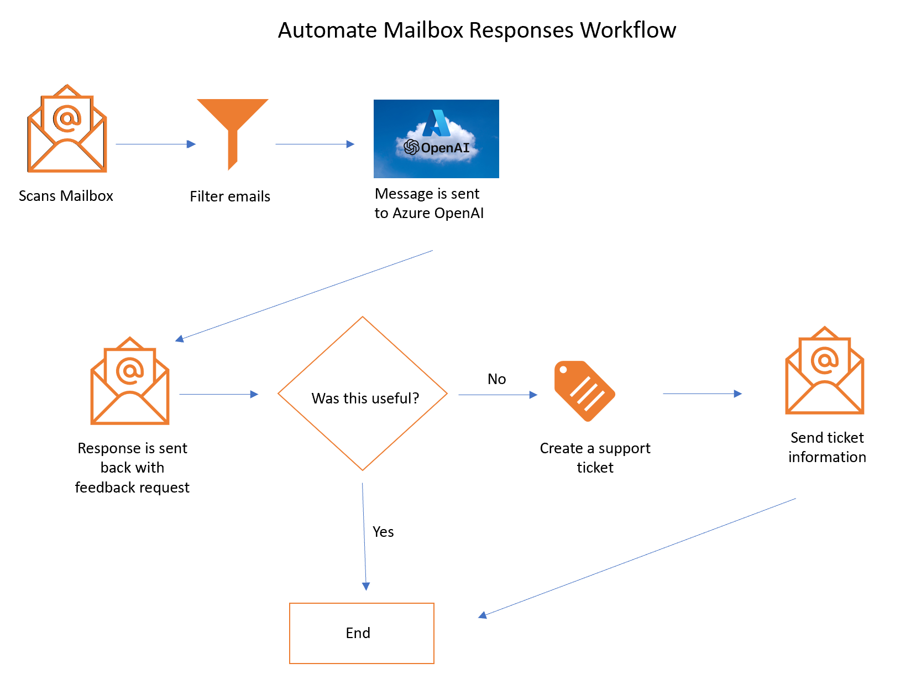

## Summary

You will need to deploy 2 logic apps:

Logic App 1 (read-mailbox-techsupport): reads incoming email from an Outlook mailbox and calls Logic App2

Logic App 2 (email-techsupport-integration): Calls Azure OpenAI for answers to the user support question and emails back a response.

> [!NOTE]
> We will deploy the second logic app (email-techsupport-integration) first, as we will need its URL when provisioning the first logic app (read-mailbox-techsupport).

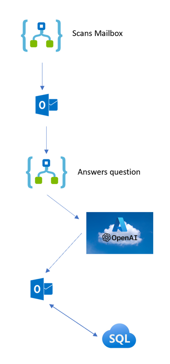

## Step 1. Signin to Azure Portal

> [!IMPORTANT]
> Use Edge or Chrome browser when making changes to the logic apps to prevent authorization issues when setting the **Connections** steps to your Microsoft 365 hosted mailbox

Go to https://portal.azure.com and enter your credentials

## Step 2. Deploy Logic App 2 (email-techsupport-integration)

### OpenAI Prompt Overview

This logic app uses the following prompt to answer questions sent to a technical support mail box:

---

You are a Helpdesk assistant. Extract the person's name and technical problem from the text below. Provide possible solutions including links to websites in html. If no solutions are found, respond with 'We will get back to you in 48 hrs'.
If this is a hardware problem give them tips for troubleshooting and indicate we will create a support ticket and schedule a repair within 48 hours.

---

In this step you are going to perform the following actions to deploy and configure the logic app:

- Deploy the logic app that sends the user question to OpenAI
- Copy the URL for this Logic App for use in the first logic app
- Enter Azure OpenAI authentication credentials
- Configure your connection to Outlook

After the deployment you should see two new items in your resource group

Click on the logic app and click on the edit button

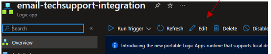

Click the first Logic App Step named **manual**, to open it.  
  
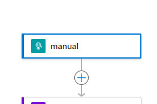
  
    
Set the **Method** field to **POST** (1) and copy the value of the HTTP URL field to your text editor (2), for later use.

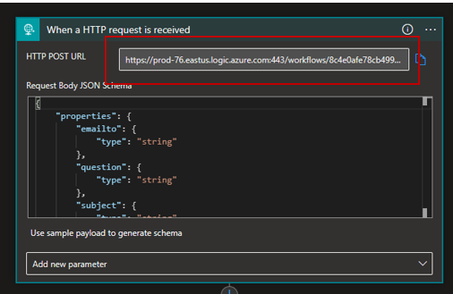

Scroll down to locate the Logic App Step named "HTTP". If the editor box is not already open, click the Title bar to open it.  
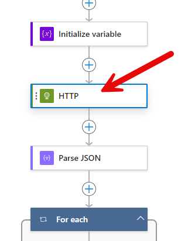  
  
In the **URI** field, enter the URI of your Azure OpenAI Deployment endpoint, it hsould look similar to the following:

**"https://<YOUR_AZURE_OPENAI_RESOURCENAME>.openai.azure.com/openai/deployments/<DEPLOYMENT_NAME>/chat/completions?api-version=2023-05-15"**

You can find the <DEPLOYMENT_NAME> in the Azure OpenAI Studio Deployments blade as shown below:

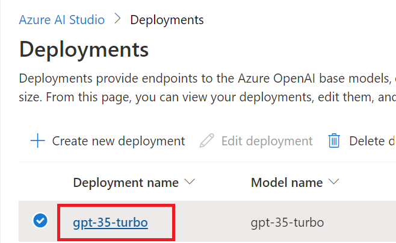

In the **api-key** field, enter your Azure OpenAI API key.

> [!NOTE]
> Ensure the ?api-version for chat completions is recent, as new updates may have caused the api schema to change. See the **Supported versions** subsection, under **Completions** in [this article](https://learn.microsoft.com/en-us/azure/ai-services/openai/reference#completions).

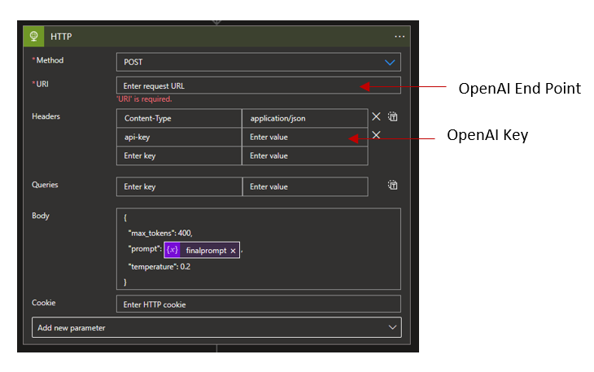

Scroll down to the Logic App Step named **"Send email with options"**, the one with the Outlook logo, and click the title to open the editor box.   
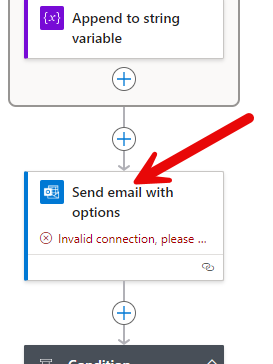
  
  To enter new authorizaion credentials for your mailbox, click **Change connection**:  
  

Click **Add new** then follow the instructions on the screen to **Sign in**. You will be prompted to authenticate with your credentials, and authorize permissins for the application.
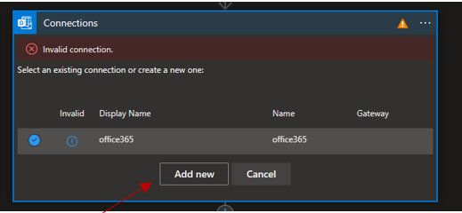

Scroll down to the Logic App Step named **"Condition"** and expand it.
Then expand the **True** box.  
Click the **Send an email (v2)** title, to open the editor box.  
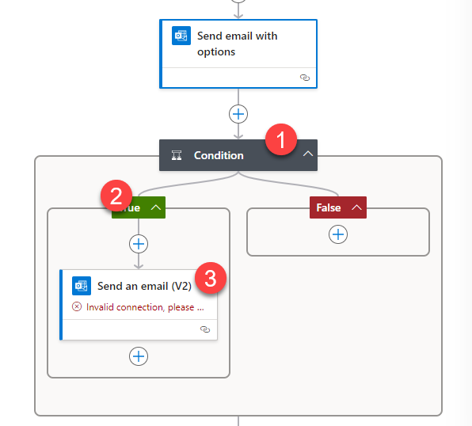  
  
  Click **Change connection**.  
  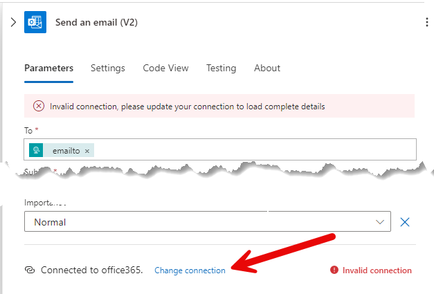

Select the valid connection to send the final notification in this logic app.

Save the logic app.

### Step 3. Deploy Logic App 1 (read-mailbox-techsupport)

This logic app scans a mail box every X minutes for new emails with the subject: **"Helpdesk Bot"**.

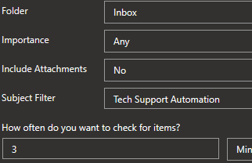

> **[!IMPORTANT]**  
> When you click the 'Deploy to Azure' button below, you will need to provide the URL to your second logic app (email-techsupport-integration) in the 'Email_integration_url' parameter field.  
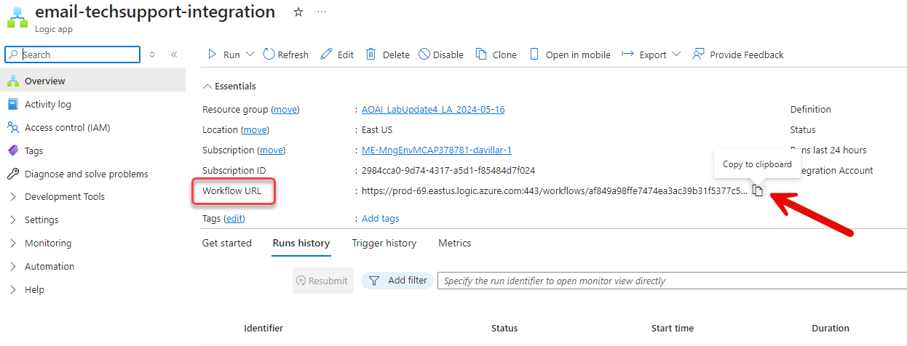

In this step you are going to perform the following actions to deploy and configure the logic app:

- Deploy the logic app that reads an Outlook mailbox and calls a logic app to send the user question to Azure OpenAI
- Configure your connection to Outlook

After the deployment you should see the new logic app in your resource group.

Click the new Logic App (**read-mailbox-techsupport**), then click the **Edit** button

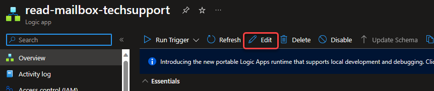

Select the top box titled **When a new email arrives (V3)**.  
Click **Change connection** (at the bottom of the editor box)  
and select the appropiate connection to Office 365 outlook

### Step 4. Test

Send an email, as follows, to the mailbox configured in your second logic app

---
**Email Subject:**
Helpdesk bot

**Email body:**
Hello,

I can't login into my account, I need to reset my password. Also my keyboard is not working.

Thank you

Your Name

---

**Monitor your Inbox for the automated email response*. As soon as you receive it, open the email and **click one of the options provided**:

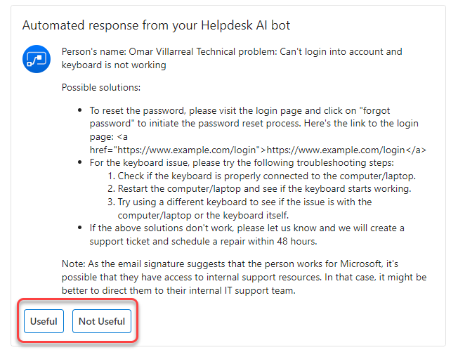

