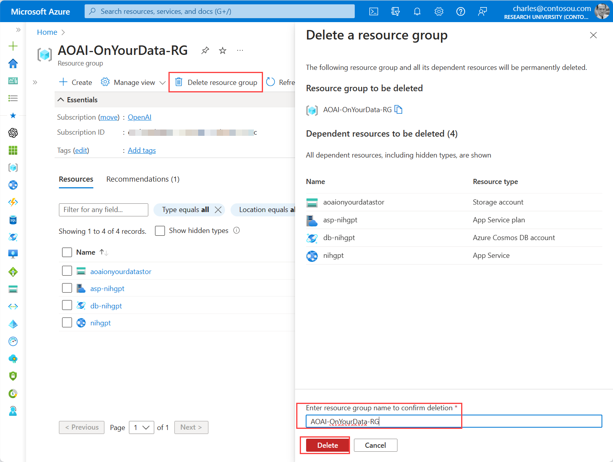

# Clean up: Azure OpenAI On Your Data Workshop

The services that we deployed in the workshop all have their own charges. Some services, such as Azure OpenAI, only have charges when you consume the service while other services, such as Azure Cognitive Search, have a persistent charge. 

If you have completed the workshop and no longer wish to have it persist in your Azure environment, you must delete the resources.

- [Option 1: Delete the Resource Group](#option-1)
- [Option 2: Delete Individual Resources](#option-2)

## Option 1: 
### Delete the Resource Group

Per the instructions in the lab, all resources for the Azure OpenAI On Your Data workshop should have been deployed in a centralized Resource Group called *AOAI-OnYourData-RG*. The fastest way to cleanup the environment and avoid subsequent charges is to delete the entire resource group. 

---

**Warning:** The lab suggested the name *AOAI-OnYourData-RG*; however, it is possible a different name was used. Please ensure your are deleting the correct resource group. **Deleting resource groups is permanent and cannot be reversed**

---

1. From the Azure Portal, search for *AOAI-OnYourData-RG* in the **Global Search Bar** and select **AOAI-OnYourData-RG** under *Resource Groups*.

    

1. From the *AOAI-OnYourData-RG* page click the **Delete reosource group** link. It will ask you to confirm you'd like to delete the resource group by entering in the name of the resource group in the text field and clicking the **Delete** button.

    

Once the resource group is deleted, all charges will stop.

## Option 2: 
### Delete individual resources
Rather than deleting the entire resource group, you can optionally delete the individual resources.

---

**Warning:** **Deleting resources is permanent and cannot be reversed**

---

1. From the Azure Portal, search for *AOAI-OnYourData-RG* in the **Global Search Bar** and select **AOAI-OnYourData-RG** under *Resource Groups*.

    

1. Select all resources you'd like to no longer be charged for and click the *Delete* option under the elipses on the far right. It will ask you to confirm you'd like to delete the resources by entering in the word "Delete"in the text field and clicking the **Delete** button.

    Resources related to this lab are:
    - Storage Account
    - App Service Plan
    - App Service
    - Azure Cosmos DB Account
    - Azure Cognitive Search

    