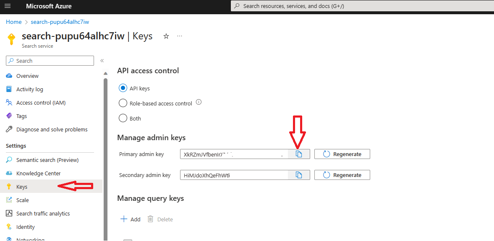

# Retrieve API Keys and Url

## View Function App Url

* Navigate to Function Apps

    (control + click) to open new window
    [Function Apps](https://portal.azure.com/#view/HubsExtension/BrowseResource/resourceType/Microsoft.Web%2Fsites/kind/functionapp)

* Click on the function app that you have provisioned and navigate to Funtions on the blade as shown below

    

* Click on Orchestrator-func-app and then click on Get Function Url on the blade as shown below

    

 ## View Azure Cognitive Search Url and Keys

* Open the search service that you have provisioned and copy the url

  Search Url is in the form :  https://<your search service name>.search.windows.net

   

* For search service key, click on the 'Keys' on the left ribbon

   

 ## View Azure Form Recognizer Url and Keys

Open the Azure Form Recognizer service that you have provisioned.

* For Azure Form Recognizer service keys and Endpoint, click on the 'Keys and Endpoint' on the left ribbon

   

## View Azure Open AI Endpoint and Key

* Navigate to [Azure Open AI Studio](https://oai.azure.com/portal)

* Click on the the Gear icon on Top right corner.

    

* Navigate to Resource Tab and copy the endpoint and key in a notepad.

    
