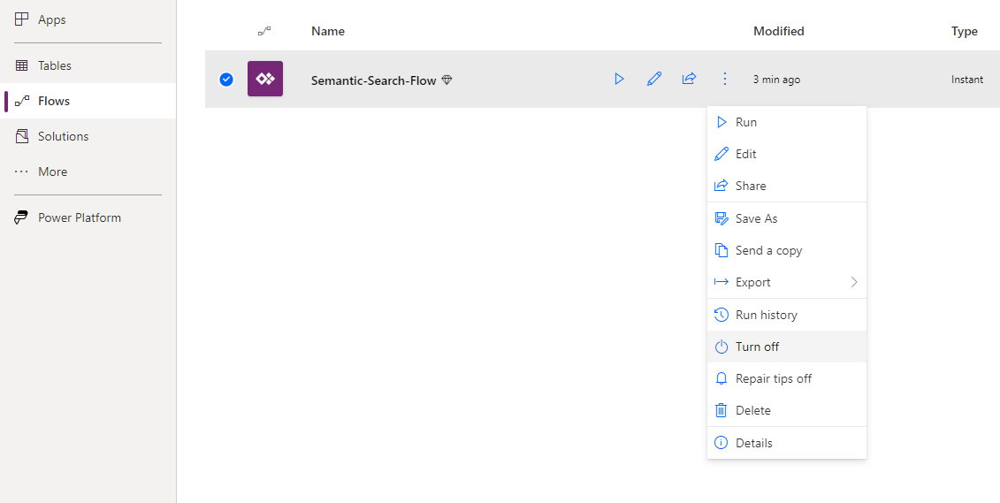

# PowerApp

From the powerapp folder, download Semantic-Search-App-Template_20230303012916.zip powerapp package. This has a powerapp and powerautomate template app pre-built.
Navigate to https://make.powerapps.com/ and click on Apps on the left navigation. 

From the top nav bar, click Import Canvas App and upload the Semantic-Search-App-Template_20230303012916.zip file from this git repo path. 

Click on Import to import the package into powerapps environment. 

This will import the Power App canvas app and Semantic-Search Power Automate Flow into the workspace. 

In the Flows Pane, PowerAutomate Flow needs to be enabled. At this point, the powerapp can be run as is. It connects to a pre-built Azure Function App. 

Edit the Power Automate Flow and update Azure Function Url. Optionaly num_search_result query parameter can be altered.

