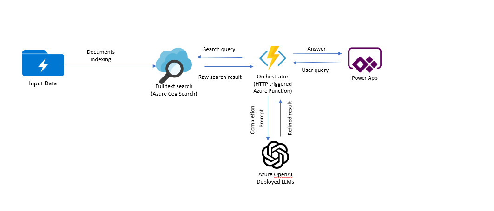

# Using Azure OpenAI on custom dataset
### Scenario summary:
This scenario allows use cases to use Open AI as an intelligent agent to answer questions from end users or assist them using knowledge of a proprietary corpus and domain.
Applications can be: 
- Giving direct answer to questions about specific product, service and process based on a knowledge corpus that can be updated frequently. This is an alternative to classic search where the result are just documents with relevant information to the question. Think of this as Bing Chat on proprietary data.
- Giving recommendation & assistance: based on information that can be implicitly gathered about the user, formulate useful content for the user's purpose. For example, a travel website may utilize users' personal information, past posts and transaction history to personalize recommendations when users need to be helped with creating next trip idea/itinerary

Regardless of the application scenario, the solution flow is:
- Step 1 prepare the context information: context information can be retrieved from proprietary knowledge corpus and other systems based on the user's query and user's information. The retrieval mechanism can be a semantic search engine to retrieve right content for unstructured data corpus or SQL query in case of structured dataset.
- Step 2 fomulate prompt to Open AI: from the context and depending on the goal of user, formulate GPT prompt to get the final response to end user. For example, if it's knowlege retrieval vs. recommendation

This implementation scenario focuses on building a knowledge retrieval chatbot application on top of unstructured data corpus but the same design can be used for recommendation & generative scenarios.

### Architecture Diagram

From the user's query, the solution uses two-stage information retrieval to retrieve the content that best matches the user query. 
In stage 1, full text search in Azure Cognitive Search is used to retrieve a number of relevant documents. In stage 2, these documents are then used by orchestrator service to form a prompt and sent to OpenAI deployment endpoint of LLM. The OpenAI service returns result which is then sent to Power App client application.
### Deployment

This scenario can be deployed in 2 different ways depending on your preference. 

### 1. Fully automated script. 

In this approach, a single script is run to create Azure Resources, configure the Azure Function App and create the search index. No manual configuration is required. This has the least number of prerequisites and can be run from Azure Cloud Shell. 
Once the automated script is run, the power app can be configured as the next step. 

To proceed with this approach, please click here. [Automated Script](Automated.md)

### 2. Semi automated script. 

In this approach, the steps are broken into 3 key steps with a few manual steps.
- In the first step, provision Azure Resourcs using Azure Portal UI.
- In the second step, the search-index is configured and executed to create the search index.
- The search index can be also be created using Azure Portal UI.
- powerapp can be configured as the next step. 

To proceed with this approach, please click here. [Semi-Automated Script](SemiAutomated.md)

