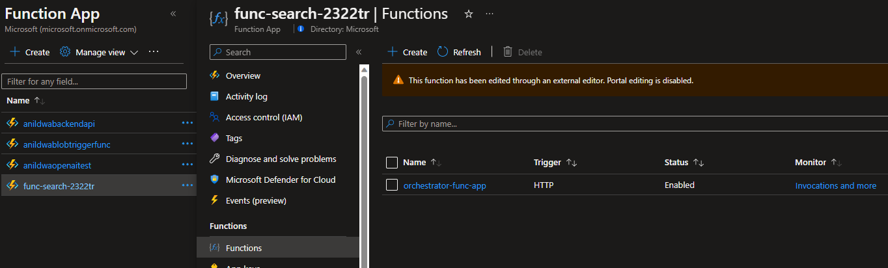
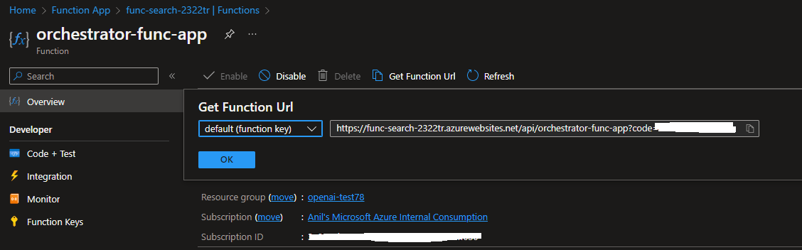
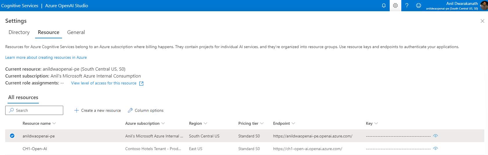

# Retrieve API Keys and Url

## View Function App Url

* Navigate to Function Apps
    
    (control + click) to open new window
    [Function Apps](https://portal.azure.com/#view/HubsExtension/BrowseResource/resourceType/Microsoft.Web%2Fsites/kind/functionapp)

* Click on the function app that you have provisioned and navigate to Funtions on the blade as shown below
    
    

* Click on Orchestrator-func-app and then click on Get Function Url on the blade as shown below

    
        
 ## View Azure Cognitive Search Url and Keys

    Search Url 

    https://<your search service name>.search.windows.net
    
    #In Azure Cloud Shell in Bash mode
    az search admin-key show -g $RESOURCE_GROUP_NAME --service-name $search_service_name  | jq -r .primaryKey

 ## View Azure Form Recognizer Url and Keys

    AFR Endpoint
    https://<Azure Region>.api.cognitive.microsoft.com/

    #In Azure Cloud Shell in Bash mode
    az cognitiveservices account keys list --name $afr_service_name   --resource-group $RESOURCE_GROUP_NAME | jq -r .key1

## View Azure Open AI Endpoint and Key

* Navigate to [Azure Open AI Studio](https://oai.azure.com/portal)

* Click on the the Gear icon on Top right corner and navigate to Resource Tab.

    
