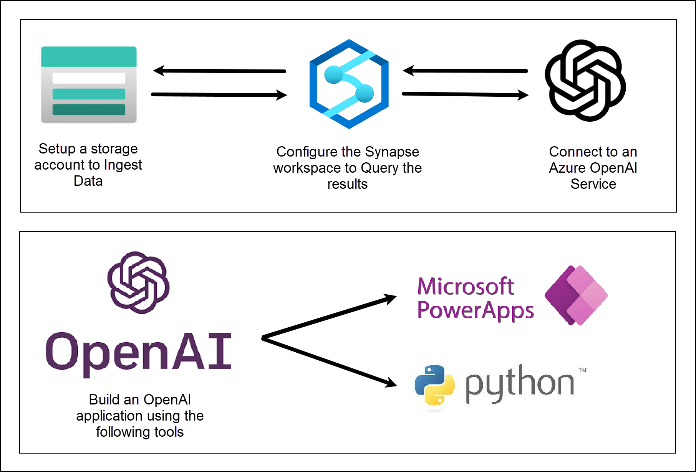
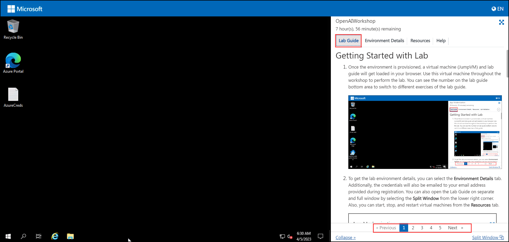
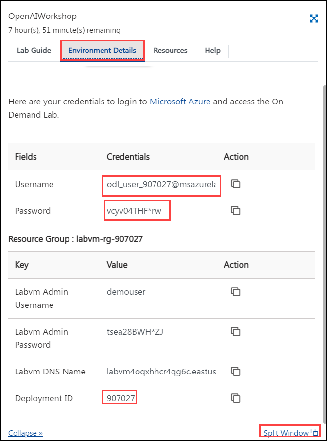
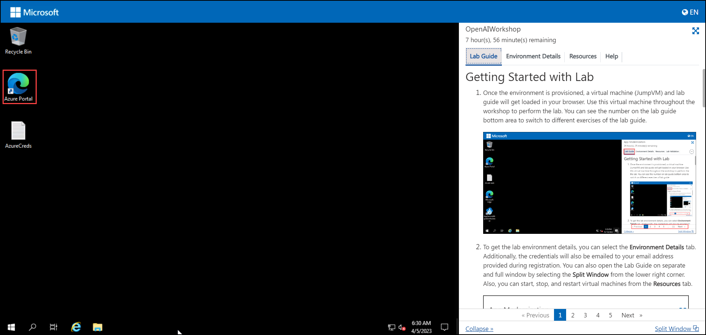

# Use Azure Open AI like a Pro to build powerful AI Applications

### Overall Estimated Duration: 480 minutes

## Overview

These hands-on labs provide comprehensive training on integrating OpenAI capabilities into various applications and environments. They cover building pipelines in Azure Synapse for batch data processing and intelligent operations, creating applications with Power Apps and Python that leverage OpenAI's APIs for tasks like natural language processing and data analysis, and exploring advanced topics such as prompt engineering and model fine-tuning using Azure OpenAI Studio. The read-only sections offer theoretical insights into advanced concepts, fine-tuning techniques, hyperparameters in Azure OpenAI Service, and a glossary for understanding key terms and concepts. Together, these labs aim to equip participants with practical skills and theoretical knowledge necessary to effectively utilize OpenAI technologies across different platforms and applications.

The lab will include the following exercises: 

1. **Build an Open AI Pipeline to Ingest Batch Data, Perform Intelligent Operations, and Analyze in Synapse:** Develop a pipeline to integrate OpenAI for batch data ingestion, intelligent operations, and analysis within Azure Synapse.
   
1. **Build an Open AI application with Power App:** Create an application using Power Apps that integrates OpenAI capabilities for tasks like natural language understanding or data processing.
   
1. **Build an Open AI application with Python:** Build applications using Python to leverage OpenAI's APIs for tasks such as language generation, sentiment analysis, or recommendation systems.

1. **Introduction to Prompt Engineering & Azure OpenAI Studio:** Learn techniques for crafting effective prompts and utilize Azure OpenAI Studio for developing and deploying AI models.

1. **Advanced Concepts (Read-Only):** Explore advanced theoretical knowledge and practical applications related to OpenAI technologies and their implementations.

1. **Fine Tuning (Read-Only):** Understand and practice fine-tuning OpenAI models to improve performance on specific tasks or datasets.

1. **Basic Overview of Azure OpenAI Service Hyperparameters (Read-Only):** Gain foundational understanding of hyperparameters in Azure OpenAI Service and their impact on model training and performance.

1. **Glossary (Read-Only):** Access definitions and explanations of key terms and concepts essential for understanding OpenAI and Azure OpenAI Service.

## Objective

Focus on implementing OpenAI technologies across Azure Synapse for batch data processing and advanced analytics, Power Apps and Python for interactive applications and automation, prompt engineering with Azure OpenAI Studio, exploring advanced AI concepts, fine-tuning models, understanding hyperparameters in Azure OpenAI Service, and accessing a glossary for key AI terminologies. Participants gain practical skills and theoretical knowledge essential for leveraging OpenAI effectively in diverse applications and environments.

- Develop an Azure Synapse pipeline to process batch data with OpenAI for advanced operations and analytics.
- Create a Power App integrating OpenAI for enhanced user interactions and automated tasks like language understanding.
- Develop Python applications utilizing OpenAI APIs for tasks such as text generation and data analysis.
- Learn prompt engineering techniques and use Azure OpenAI Studio for AI model development.

## Prerequisites

Participants should have: 

- Proficiency in Python programming language, including libraries like Pandas for data manipulation and Flask for web application development.
- Experience with Microsoft Power Apps or similar low-code platforms for application development and integrating APIs.
- Basic understanding of machine learning concepts such as model training, deployment workflows, and RESTful APIs.
- Understanding of AI concepts such as natural language processing, model fine-tuning, and hyperparameter optimization.

## Architecture

The architecture for this lab involves several key components:

- **Storage Account:** Provides a secure and scalable cloud storage solution for storing data objects, such as files, blobs, and unstructured data.
- **Synapse Workspace:** Azure Synapse Analytics is an integrated analytics service that combines big data and data warehousing capabilities. The workspace allows for seamless collaboration between data engineers, data scientists, and analysts.
- **Azure Open AI Service:** Provides access to OpenAI's powerful AI models through Azure, enabling integration into applications for natural language processing, text generation, and more.
- **Microsoft Power Apps:** A low-code platform that allows users to build custom business applications without extensive coding knowledge.
- **Prompt Engineering:** Involves crafting specific prompts or queries to elicit desired responses from AI models, influencing the output and behavior of AI systems.

## Architecture Diagram

## Getting Started with Lab

1. Once the environment is provisioned, a virtual machine (JumpVM) and lab guide will get loaded in your browser. Use this virtual machine throughout the workshop to perform the lab. You can see the number on the lab guide bottom area to switch to different exercises of the lab guide.

   

1. To get the lab environment details, you can select the **Environment Details** tab. Additionally, the credentials will also be emailed to your email address provided during registration. You can also open the Lab Guide on a separate and full window by selecting the **Split Window** from the lower right corner. Also, you can start, stop, and restart virtual machines from the **Resources** tab.

   
 
    > You will see the SUFFIX value on the **Environment Details** tab, use it wherever you see SUFFIX or Deployment ID in lab steps.

## Login to Azure Portal

1. In the JumpVM, click on the Azure portal shortcut of the Microsoft Edge browser from the desktop.

   

1. In the Welcome to Microsoft Edge page, select **Start without your data**, and on the help for importing Google browsing data page select **Continue without this data** button and proceed to select **Confirm and start browsing** on the next page.
   
1. On the **Sign in to Microsoft Azure** tab you will see a login screen, enter the following email/username and then click on **Next**. 
   * Email/Username: <inject key="AzureAdUserEmail"></inject>
   
     
     
1. Now enter the following password and click on **Sign in**.
   * Password: <inject key="AzureAdUserPassword"></inject>
   
     
     
1. If you see the pop-up **Stay Signed in?**, click No

1. If you see the pop-up **You have free Azure Advisor recommendations!**, close the window to continue the lab.

1. If a **Welcome to Microsoft Azure** popup window appears, click **Cancel** to skip the tour.
   
1. Now you will see the Azure Portal Dashboard, click on **Resource groups** from the Navigate panel to see the resource groups.

    
   
1. Confirm you have resource groups present as shown in the below screenshot. The last six digits in the resource group name are unique for every user.

    
   
1. Now, click on Next from the lower right corner to move to the next page.

This hands-on lab aims to empower participants in leveraging OpenAI technologies within Azure environments, spanning data ingestion, application development, prompt engineering, model optimization, and theoretical AI concepts for comprehensive learning and application.

### Happy Learning!!
