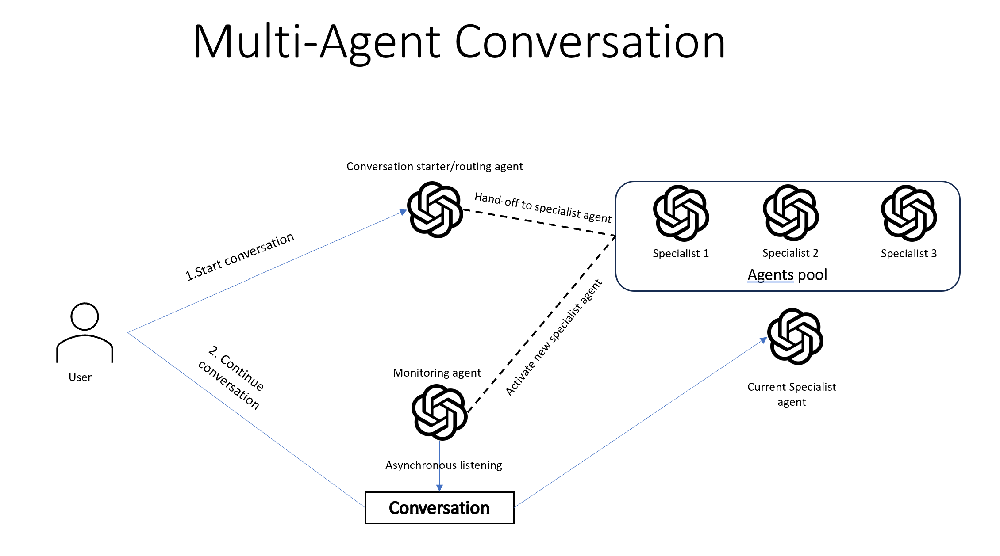

# Overview
This solution demonstrate the design of multi-agent flow where multiple agents working together to address diverse needs from customers. Each agent has its own skillset, designed with its own prompt and tools.
The routing agent starts the conversation and based on user's intent, assigning one of the specialist agent to support the conversation.
Then while the conversation happens between a specialist agent and the customer, a monitoring agent asynchronously listen to the conversation and detect if the conversation needs to be handed over to another specialist agent.

# Installation 
## Open AI setup
Create an Azure OpenAI deployment in an Azure subscription with a GPT-35-Turbo deployment .
## Run the application locally
1. Clone the repo (e.g. ```git clone https://github.com/microsoft/OpenAIWorkshop.git``` or download). Then navigate to ```cd scenarios/incubations/copilot```
2. Create a `secrets.env` file in the root of streamlit folder
    AZURE_OPENAI_ENDPOINT="YOUR_OPEN_AI_ENDPOINT"
    AZURE_OPENAI_API_KEY="OPEN_AI_KEY"

3. Create a python environment with version from 3.7 and 3.10
    - [Python 3+](https://www.python.org/downloads/)
        - **Important**: Python and the pip package manager must be in the path in Windows for the setup scripts to work.
        - **Important**: Ensure you can run `python --version` from console. On Ubuntu, you might need to run `sudo apt install python-is-python3` to link `python` to `python3`. 
4. Import the requirements.txt `pip install -r requirements.txt`
5. To run the application from the command line: `streamlit run copilot.py`
## Deploy the application to Azure 
##To be added


