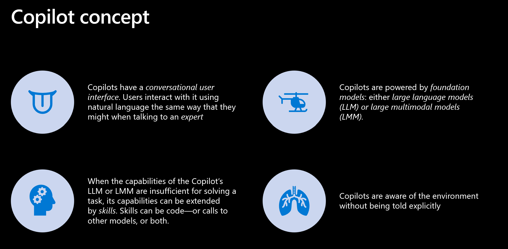
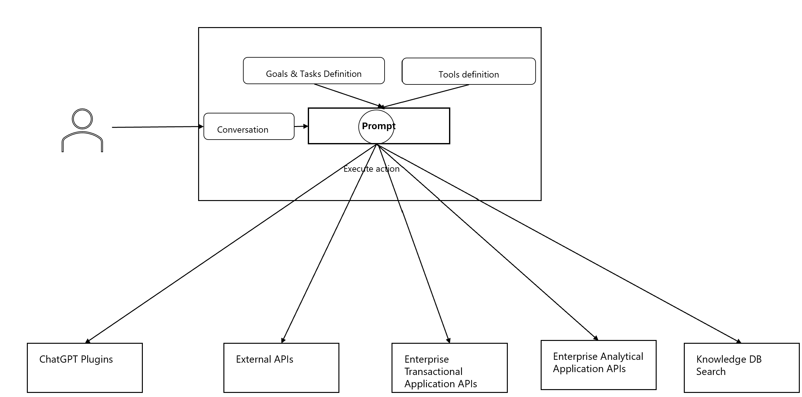
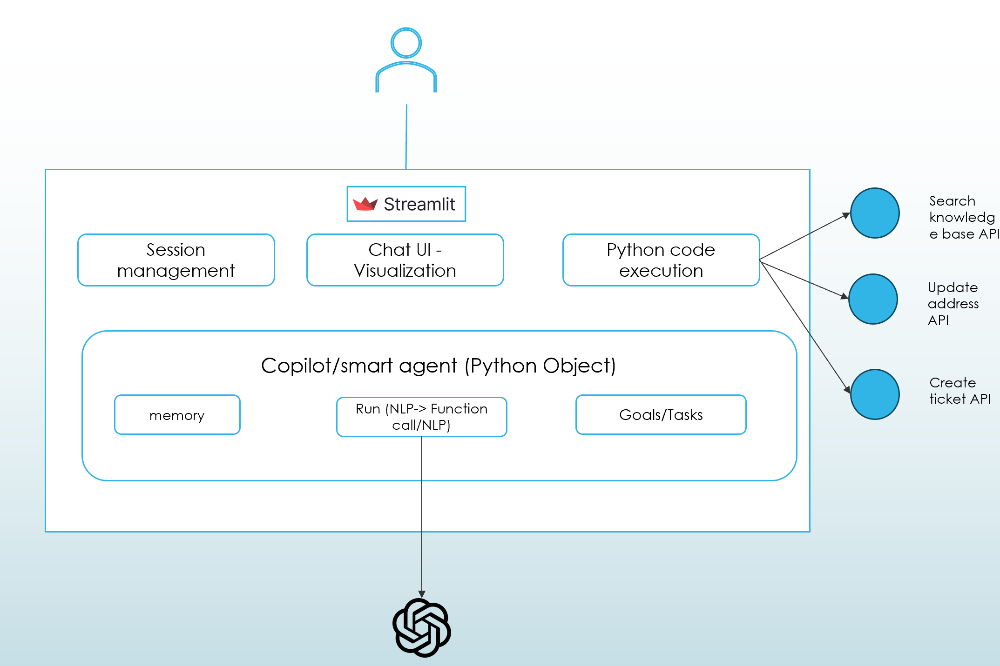
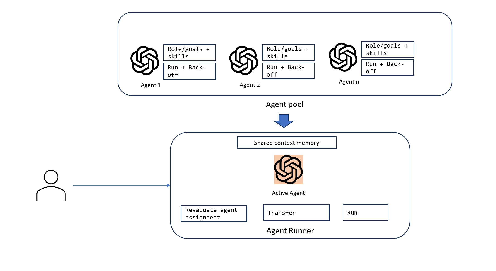

# Scenario Overview




# Developing Copilot Solution

### 1. Copilot Solution Model

In a copilot solution, the natural language input (prompt) can result in a output of API call syntax or code that can be executed against an API, a tool or an application platform that perform an intended business transaction.

On top of this, copilot can perform multiple interactions with user or with other systems to achieve certain goal. For example, a shopping copilot may interact with the user to help them make a purchase decision by recommending products then execute order creation at the end.



### 2. Understand function calling capability in GPT

Developers can now describe functions to gpt-4-0613 and gpt-3.5-turbo-0613, and have the model intelligently choose to output a JSON object containing arguments to call those functions. This is a new way to more reliably connect GPT's capabilities with external tools and APIs.
These models have been fine-tuned to both detect when a function needs to be called (depending on the user’s input) and to respond with JSON that adheres to the function signature. Function calling allows developers to more reliably get structured data back from the model. 

Follow this example to understand how function calling works

https://github.com/Azure-Samples/openai/blob/main/Basic_Samples/Functions/working_with_functions.ipynb

### 3. Build your own HR/Payroll copilot
Having understood how function calling works, it's time to build an end to end HR/Payroll copilot solution. 

####  Functional Flow
This is a demo of Copilot Concept for HR/Payroll. The Copilot helps employees answer questions and update personal information.

Copilot will first validate the identity of the employee before answering any questions or updating any information. Use ids such as 1234 or 5678 to test the demo.

Example questions to ask:

- When will I receive W2 form?
- What are deducted from my paycheck?

These questions are answered by the Copilot by searching a knowledge base and providing the answer.

Copilot also can help update information.

- For address update, the Copilot will update the information in the system.
- For other information update requests, the Copilot will log a ticket to the HR team to update the information.

#### Technical design



Application Platform:

- The solution is built on top of streamlit application platform. Streamlit allows easy creation of  interactive Python application with ability to render rich & responsive UI such as Chat UI and Python data visualization.

Smart Agent:At the heart of the solution is the python object Smart_Agent.  The agent has following components:
- Goals/Tasks: Smart_Agent is given a persona and instructions to follow to achieve the goals of helping answer HR/Payroll question and update employee's personal information. This is done using instructions specified to the system message.
- NLP interacation & tool execution: For the abilility to use multiple tools and functions to accomplish business tasks, function calling capability of 0613 version is utilized to intelligently select the right function (validate identity/search knowlege base/update address/create ticket) based on the agent's judgement of what need to be done. The agent is also able to engage with users following the instruction/goals defined in the system message.
- Memory: The agent maintain a memomory of the conversation history. The memory is backed by Streamlit's session state.
- LLM: The agent is linked to a 0613 GPT-4 model to power its intelligence.

### 4. Multi-Agent Copilot



When scope for automation spans across multiple functional domains, like human, agent may perform better when it can specialize in a single area.

So instead of stuffing a single agent with multiple capabilities, we can employ multiple agents model, each specializing in a single domain. These agents are managed and coordinated by a manager agent (agent runner).
This is called multi-agent copilot model.

The agent runner is responsible to promote the right agent from the agent pool to be the active agent to interact with user.
It also is responsible to transfer relavant contextfrom agent to agent to ensure continuity.
In this model, the agent runner relies on the specialist agent's cue to back-off from conversation to start the transfer.
Each specialist agent has to implement a skill to send a notification (back-off method) when it thinks its skillset cannot handle the user's request.

On the other hand, the decision on exactly which agent should be selected to take over the conversation is still with agent runner.
When receiving such request, agent runner will revaluate the from the input by the requesting agent to decide on which agent to select for the job. This skill also relies on a LLM. 

Agent runner runs each specialist agent's run method.

There can be some persistent context that should be available across agent's sessions. This is implemented as the persistent memory at agent runner.

Each specialist agent depending on the requirement for skill, can be powered by a gpt-35-turbo or gpt-4.

Multi-agent solution has same application platform (streamlit) as the single HR Copilot. 
#### Function flow

This is a demo of Multi-Agent Copilot concept. The Copilot helps employees answer questions and update information.
There are 3 agents in the Copilot: HR, IT and Generalist. Each agent has a different persona and skillset.
Depending on the needs of the user, the Copilot will assign the right agent to answer the question.

1. Generalist copilot help validate the user and answer general questions that are not related to HR and IT. Use ids such as 1234 or 5678 to test the demo. When the conversation enters any of the HR or IT area, generalist agent will request to transfer to the right specialist agent.

2. For HR Copilot, the agent will answer questions about HR and Payroll and update personal information.

Example questions to ask:

- When will I receive W2 form?
- What are deducted from my paycheck?

These questions are answered by the Copilot by searching a knowledge base and providing the answer.

Copilot also can help update information.

- For address update, the Copilot will update the information in the system.
- For other information update requests, the Copilot will log a ticket to the HR team to update the information.


2. For IT copilot, it helps answer questions about IT

# Installation 
## Open AI setup
Create an Azure OpenAI deployment in an Azure subscription with a GPT-4-0603 deployment .
## Run the application locally
1. Clone the repo (e.g. ```git clone https://github.com/microsoft/OpenAIWorkshop.git``` or download). Then navigate to ```cd scenarios/incubations/copilot```
2. Create a `secrets.env` file in the root of streamlit folder
    AZURE_OPENAI_ENDPOINT="YOUR_OPEN_AI_ENDPOINT"
    AZURE_OPENAI_API_KEY="OPEN_AI_KEY"

3. Create a python environment with version from 3.7 and 3.10
    - [Python 3+](https://www.python.org/downloads/)
        - **Important**: Python and the pip package manager must be in the path in Windows for the setup scripts to work.
        - **Important**: Ensure you can run `python --version` from console. On Ubuntu, you might need to run `sudo apt install python-is-python3` to link `python` to `python3`. 
4. Import the requirements.txt `pip install -r requirements.txt`
5. To run the HR/Payroll copilot from the command line: `streamlit run hr_copilot.py`
5. To run the multi-agent copilot from the command line: `streamlit run multi_agent_copilot.py`

## Deploy the application to Azure 
##To be added


