# Exercise 1: Getting Started with Azure OpenAI

In this exercise, you will create a deployment and model in Azure OpenAI studio which you will be using in further exercises.
   
## Task 1: Deploy Azure OpenAI Model.

1. In the **Azure portal**, search for **OpenAI** and select **Azure OpenAI**.

   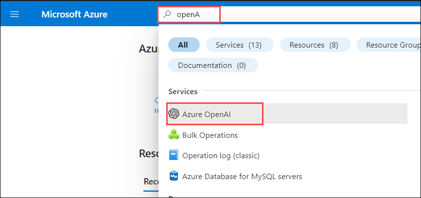

1. On **Cognitive Services | Azure OpenAI** blade, select **openai-<inject key="DeploymentID" enableCopy="false"/>**

   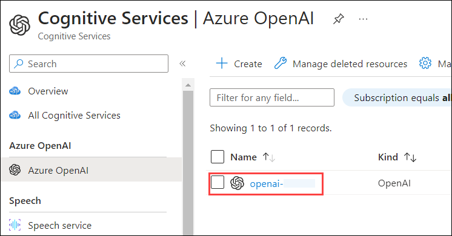

1. In the Azure OpenAI resource pane, click on **Go to Azure OpenAI Studio** it will navaigate to **Azure AI Studio**.

   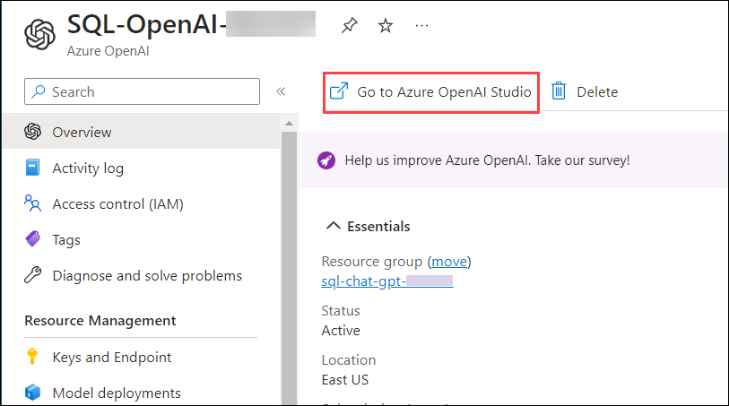

1. In the **Azure AI Studio**, select **Deployments (1)** under Management and click on **+ Create new deployment (2)**. 

   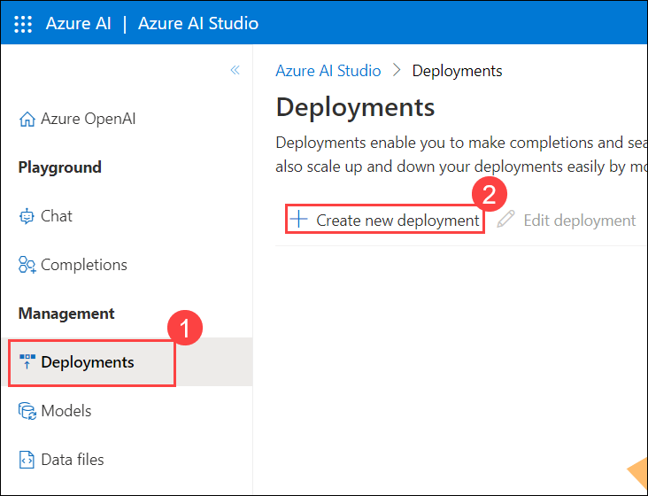

1. On the Deploy model pop-up, from the drop-down select **text-davinci-003 (1)** for Select a Model, enter deployment name as **demomodel (2)** then click on **Create (3)**. Copy OpenAI Model name into the text file for later use.

   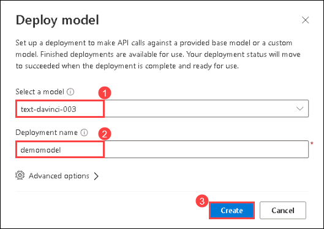

1. Click on **+ Create new deployment**, On the Deploy model pop-up, from the drop-down select **gpt-35-turbo (1)** for Select a Model, enter deployment name as **gptmodel (2)** then click on **Create (3)**. Copy OpenAI Model name into the text file for later use.

   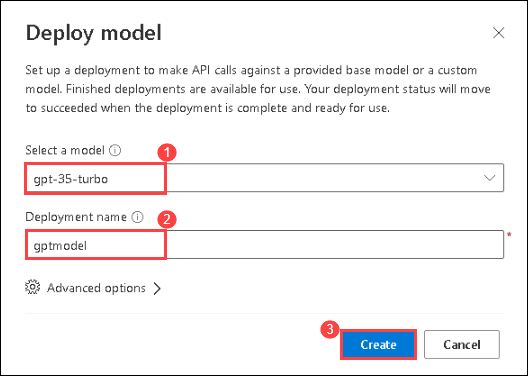

1. Once the models are deployed, click on **demomodel** from the **Deployments** page.

   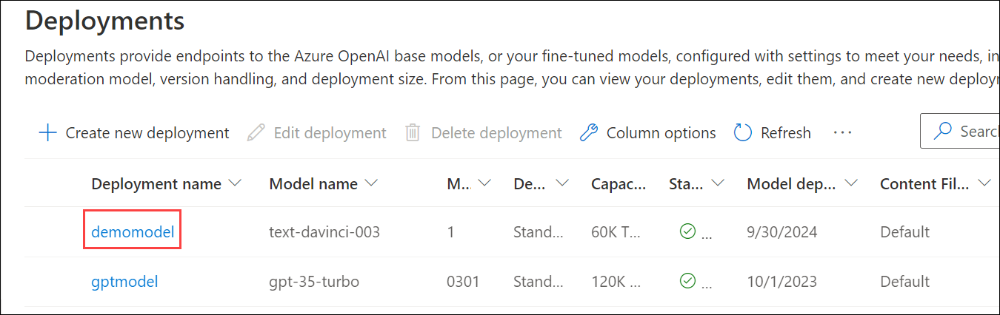

1. Next, click on **Edit deployment**.

   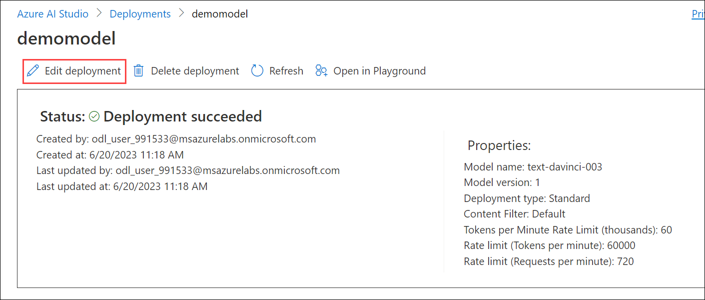

1. On the **Edit deployment** pop-up, expand **Advanced options (1)** and scale-down the **Tokens per Minute Rate Limit (thousands) (2)** to **10k** and click **Save and close (3)**.

   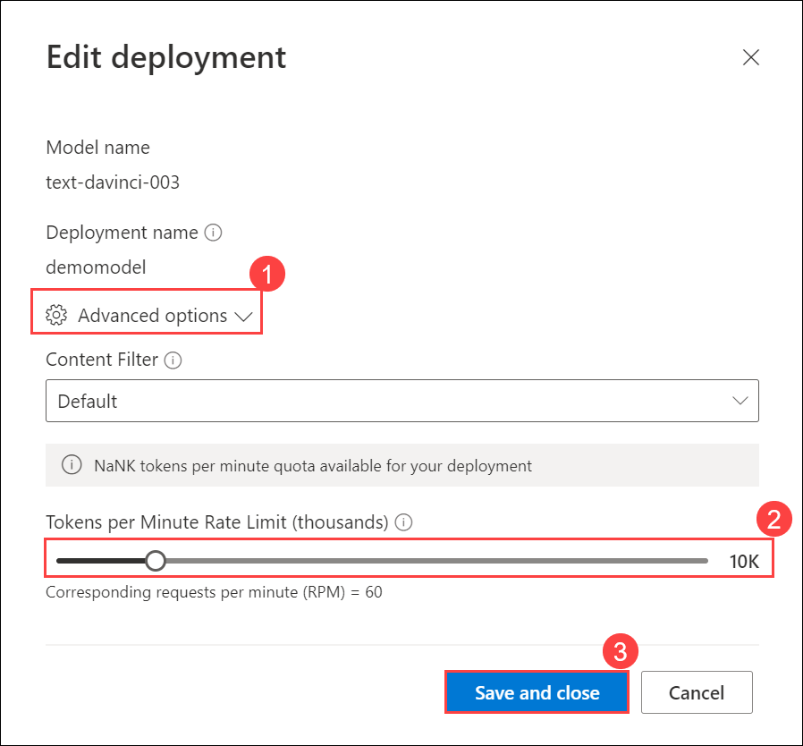

1. Navigate back to **Deployments** page, Select **gptmodel** and click on **Edit deployment**.

   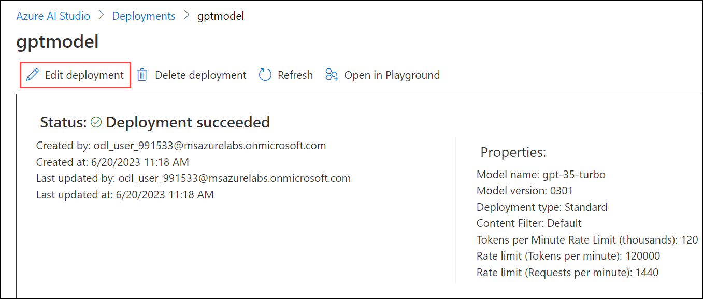

1. On the **Edit deployment** pop-up, expand **Advanced options (1)** and scale-down the **Tokens per Minute Rate Limit (thousands) (2)** to **10k** and click **Save and close (3)**.

   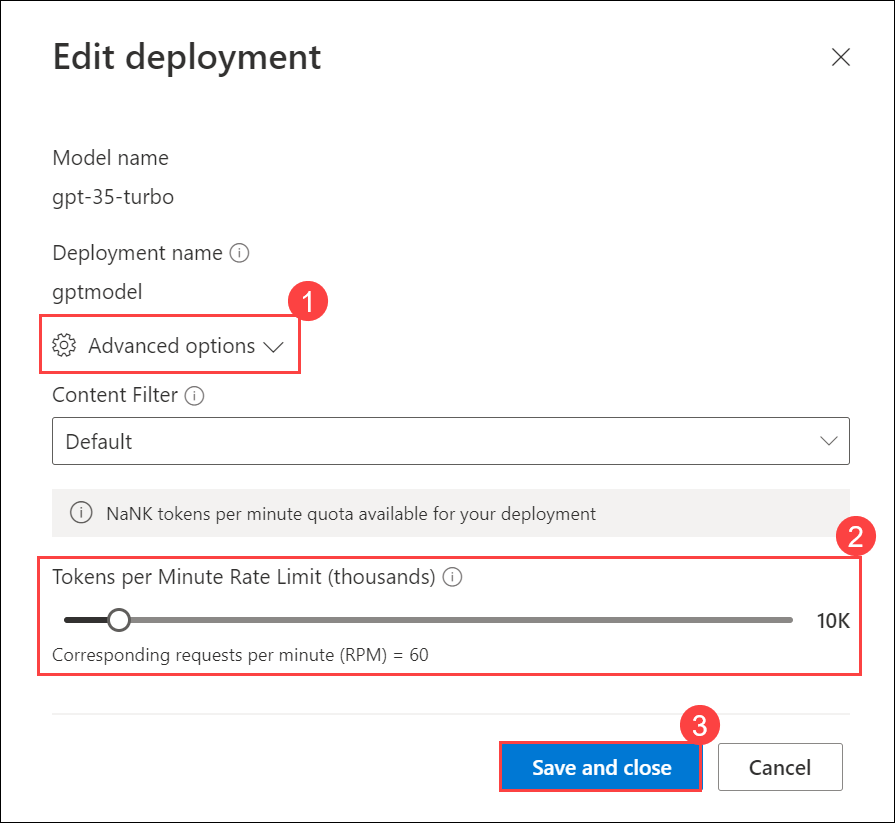

1. Naviagte back to [Azure portal](http://portal.azure.com/), search and select **Azure OpenAI**, from the **Cognitive Services | Azure OpenAI pane**, select the **OpenAI-<inject key="Deployment ID" enableCopy="false"/>**.

1. On **openai-<inject key="DeploymentID" enableCopy="false"/>** blade, select **Keys and Endpoint (1)** under **Resource Management**. Copy **Key 1 (2)** and the **Endpoint (3)** by clicking on copy to clipboard paste it in a text editor such as notepad for later use. 

   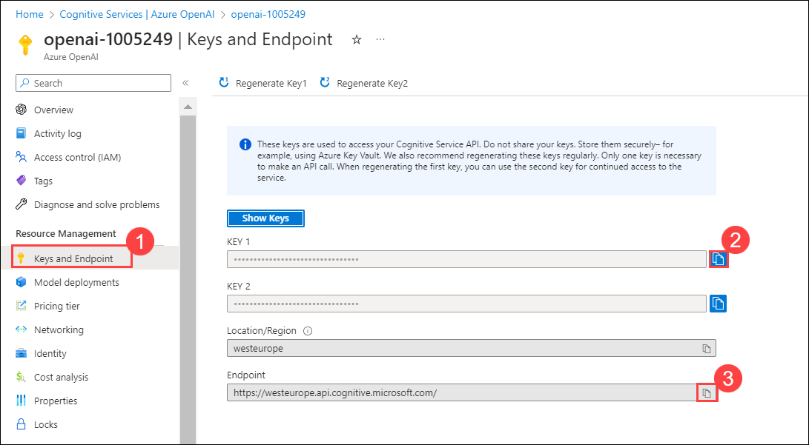

