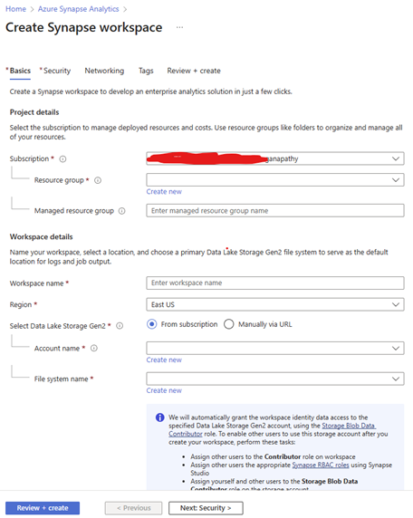
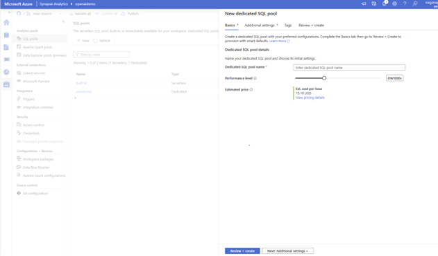
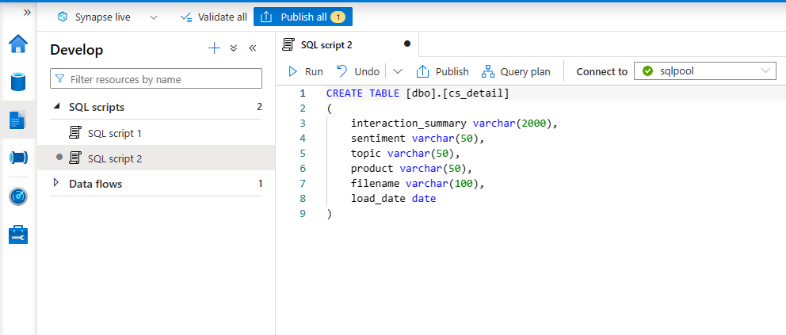
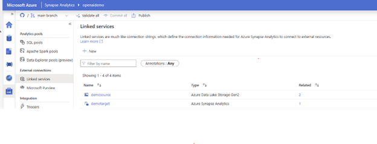
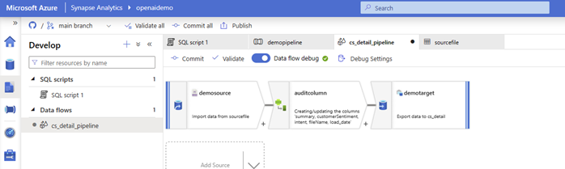
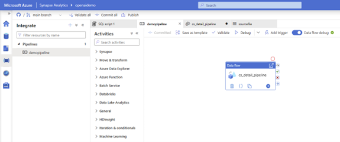
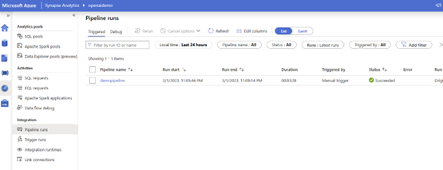

# Build Open AI pipeline to ingest batch data, perform intelligent operations and insert into Synapse
### Summary

This scenario allows uses OpenAI to summarize and analyze customer service call logs for the ficticious company, Contoso. The data is ingested into a blob storage account, and then processed by an Azure Function. The Azure Function will return the customer sentiment, product offering the conversation was about, the topic of the call, as well as a summary of the call. These results are written into a separate desginated location in the Blob Storage. From there, Synapse Analytics is utilized to pull in the newly cleansed data to create a table that can be queried in order to derive further insights. 

### Architecture Diagram


Call logs are uploaded to a designated location in Blob Storage. This upload will trigger the Azure Function which utilzies the [Azure OpenAI Service](https://azure.microsoft.com/en-us/products/cognitive-services/openai-service/) for summarization, sentiment analysis, product offering the conversation was about, the topic of the call, as well as a summary of the call. These results are written into a separate desginated location in the Blob Storage. From there, Synapse Analytics is utilized to pull in the newly cleansed data to create a table that can be queried in order to derive further insights. 

### Deployment

## Step 1. Blob storage and Azure Function app deployment
[](https://portal.azure.com/#create/Microsoft.Template/uri/https%3A%2F%2Fraw.githubusercontent.com%2Fmicrosoft%2FOpenAIWorkshop%2Fnicole-dev%2Fscenarios%2Fopenai_batch_pipeline%2Fdeploy%2Fazuredeploy.json)

**Please Note:** Azure Open AI must be provisioned with one of the models being deployed. 

**OPENAI_API_KEY** and **OPENAI_RESOURCE_ENDPOINT** can be found by naviagting to Azure OpenAI service in the Azure portal 


**OPENAI_MODEL_NAME** can be found in the Azure OpenAI studio under the deplyment section


## Step 2. Ingest Data to Storage created in step 1

a. Launch Azure Cloud Shell


b. In the Cloud Shell run below commands:

```bash 
    wget https://repo.anaconda.com/miniconda/Miniconda3-py39_23.1.0-1-Linux-x86_64.sh 
```

```bash 
    sh Miniconda3-py39_23.1.0-1-Linux-x86_64.sh 
```

Accept the agreement and install on the default path:


**Please Note:** If it asks to run conda init, type yes to confirm. 

```bash 
    export PATH=~/miniconda3/bin:$PATH
```

```bash 
    git clone https://github.com/microsoft/OpenAIWorkshop.git
    cd OpenAIWorkshop/scenarios/openai_batch_pipeline/document_generation
    conda create -n document-creation
    conda activate document-generation
    pip install -r reqs.txt
```

```bash 
    python upload_docs.py --conn_string "<CONNECTION_STRING>"
```
**Please Note:** CONNECTION_STRING can be found by navigating to storage account  created in Step 1 in the Azure portal. 


## Step 3. Set up Synapse Workspace
- Create a Synapse workspace, provide the details and click 'Review + Create'

    

    - Under SQL pools –> click New and create new dedicated SQL pool. This will take few minutes.

    

 - After the SQL Pool is created, create the target table by running the following query:
    ```bash 
        CREATE TABLE [dbo].[cs_detail]
    (
    interaction_summary varchar(8000),
    sentiment varchar(500),
    topic varchar(500),
    product varchar(500),
    filename varchar(500)
    )
    ```
    

    - Create linked services for source and target. For this case you need to create one for the json files in data lake and other for Synapse SQL DB.

    

 - Create a dataflow to ingest the data from datalake into Synapse SQL. Provide the connection details (linked services created in the above step) for source and sink. 

    

    - Create a pipeline to trigger the ingestion.

    

    - Trigger the run and query the target table after successful completion of the pipeline.

    


## Step 4. Test

Now that the data is in the target table it is available for usage by running SQL queries against it, or connecting PowerBI and creating visualizations. The Azure Function is running as well, so try uploading some of the transcript files to the generated_documents folder in your container and see how the function processes it and creates a new file in the cleansed_documents file.

