# Exercise 2: Build an Open AI Pipeline to Ingest Batch Data, Perform Intelligent Operations, and Analyze in Synapse
# Summary

This scenario allows uses OpenAI to summarize and analyze customer service call logs for the ficticious company, Contoso. The data is ingested into a blob storage account, and then processed by an Azure Function. The Azure Function will return the customer sentiment, product offering the conversation was about, the topic of the call, as well as a summary of the call. These results are written into a separate desginated location in the Blob Storage. From there, Synapse Analytics is utilized to pull in the newly cleansed data to create a table that can be queried in order to derive further insights. 
---

---
# Table of Contents
- [Build an Open AI Pipeline to Ingest Batch Data, Perform Intelligent Operations, and Analyze in Synapse](#build-an-open-ai-pipeline-to-ingest-batch-data-perform-intelligent-operations-and-analyze-in-synapse)
- [Summary](#summary)
- [Table of Contents](#table-of-contents)
- [Architecture Diagram](#architecture-diagram)
- [Deployment](#deployment)
    - [Step 1. Ingest Data to Storage created in step 1](## Step 1: Ingest Data to Storage account)
    - [Step 2. Set up Synapse Workspace](#step-3-set-up-synapse-workspace)
        - [a. Launch Azure Cloud Shell](#a-launch-azure-cloud-shell)
        - [b. In the Cloud Shell run below commands:](#b-in-the-cloud-shell-run-below-commands)
        - [c. Create Target SQL Table](#c-create-target-sql-table)
        - [d. Create Source and Target Linked Services](#d-create-source-and-target-linked-services)
        - [e. Create Synapse Data Flow](#e-create-synapse-data-flow)
        - [f. Create Synapse Pipeline](#f-create-synapse-pipeline)
        - [g. Trigger Synapse Pipeline](#g-trigger-synapse-pipeline)
    - [Step 3. Query Results in Our SQL Table](#step-4-query-results-in-our-sql-table)


# Architecture Diagram

  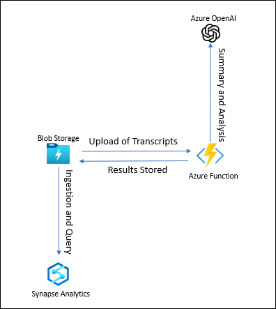

Call logs are uploaded to a designated location in Blob Storage. This upload will trigger the Azure Function which utilzies the [Azure OpenAI Service](https://azure.microsoft.com/en-us/products/cognitive-services/openai-service/) for summarization, sentiment analysis, product offering the conversation was about, the topic of the call, as well as a summary of the call. These results are written into a separate desginated location in the Blob Storage. From there, Synapse Analytics is utilized to pull in the newly cleansed data to create a table that can be queried in order to derive further insights. 

## Task 1: Ingest Data to Storage account

### A. Launch Azure Cloud Shell

1. In the **Azure portal**, open the Azure Cloud Shell by clicking on the cloud shell icon in the top menu bar.

    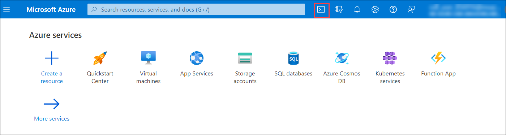

1. After launching the Azure Cloud Shell, select the *Bash** option.

    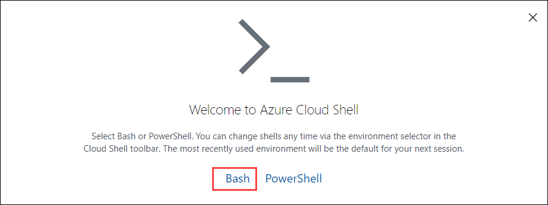
    
1. Now on you have no storage mounted dialog box click on **Show advanced settings**.

   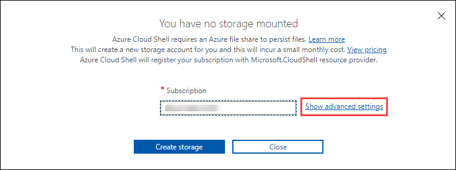
   
1. Follow the below-mentioned instructions and click on **Create Storage (3)**.

    - Storage account : Enter **openai<inject key="DeploymentID" enableCopy="false"/> (1)**
    - File Share : Enter **blob (2)**

    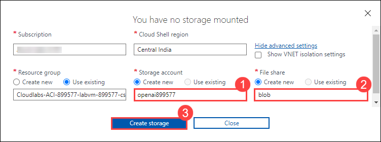

1.  Once the storage account is created, you will be pormpted with the powershell window as shown in the below screenshot.
    
    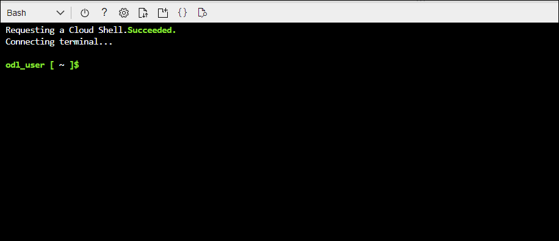
        

### B. Upload files to storage account:

 1. Run the following commands in the cloudshell to download and install the miniconda.

     ```bash 
     wget https://repo.anaconda.com/miniconda/Miniconda3-py39_23.1.0-1-Linux-x86_64.sh 
     ```

     ```bash 
     sh Miniconda3-py39_23.1.0-1-Linux-x86_64.sh 
     ```
    > **Note:** The following commands are issued in Bash; please ensure you are using **Bash** in the Cloud Shell.

1. Accept the agreement and enter **yes** to install on the default path:

   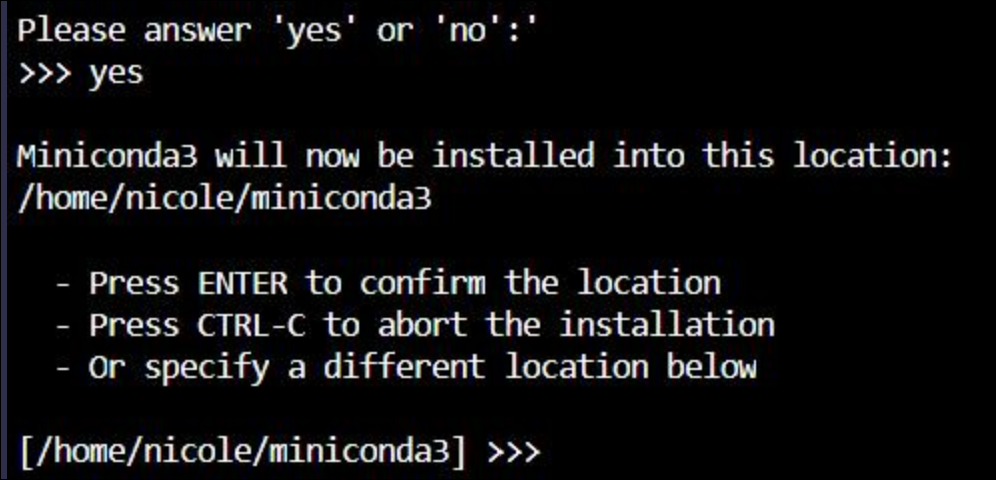

1. Run the following command to store the miniconda installed path to the variable.

    ```bash 
    export PATH=~/miniconda3/bin:$PATH
    ```
1. Run the below commands to create and activate the conda environment in cloudshell.

    ```bash 
    git clone https://github.com/microsoft/OpenAIWorkshop.git
    cd OpenAIWorkshop/scenarios/openai_batch_pipeline/document_generation
    conda create -n document-creation
    conda activate document-creation
    pip install -r reqs.txt
    ```
1. In the [Azure portal](https://portal.azure.com), navigate to your Storage Account with suffix `functions` resource by selecting the **openai-<inject key="DeploymentID" enableCopy="false"/>** resource group, and selecting the Storage Account from the list of resources.

    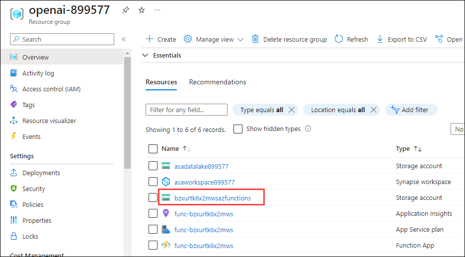
    
1. Switch to the **Access keys (1)** Blade and select **Show (2)** that is next to the Connection String value. Select the copy button for the first **connection string (3)**. Paste the value into a text editor, such as Notepad.exe, for later reference.

   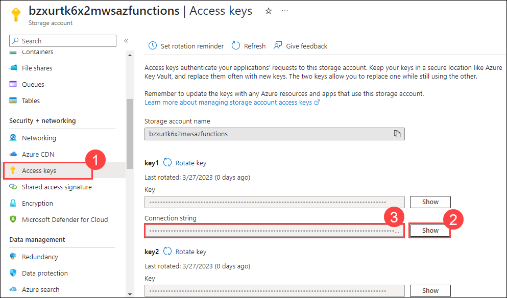

1. Go back to the cloudshell bash session and run the below command to upload the json files to the storage account and will take a few minutes to complete.

    ```bash 
    python upload_docs.py --conn_string "<CONNECTION_STRING>"
    ```

   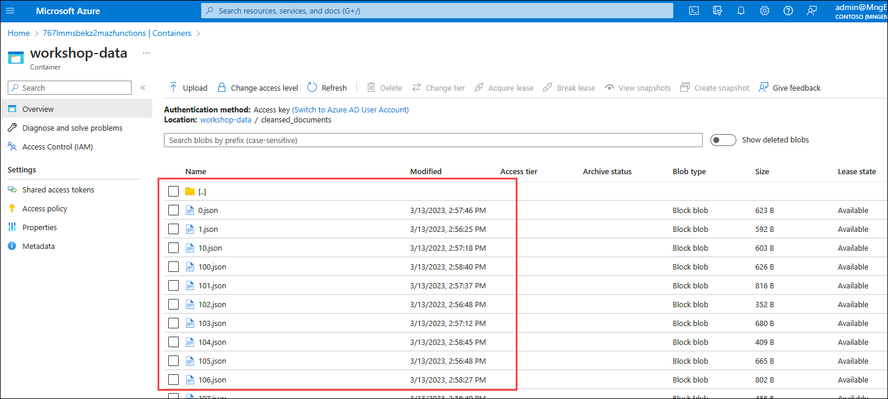
   
1. Once you have successfully uploaded the json files to the storage account, you can navigate to the storage account in the Azure portal and verify that the files have been uploaded.

   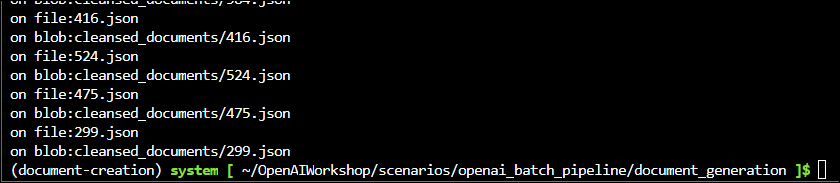
---

## Task 2: Set up Synapse Workspace

### **A. Create the Synapse SQL Pool**

1.  Go to <https://portal.azure.com> and sign in with your organizational account. In the search box at the top of the portal, search for your workspace
    and click on the Synapse workspace (not the SQL Server) which appears under the Resources section.

     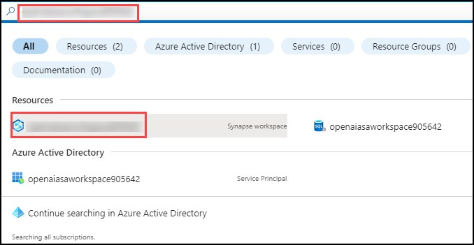

1.  On the **Overview** blade under **Getting started** section, click **Open** to open Synapse Studio.
     
    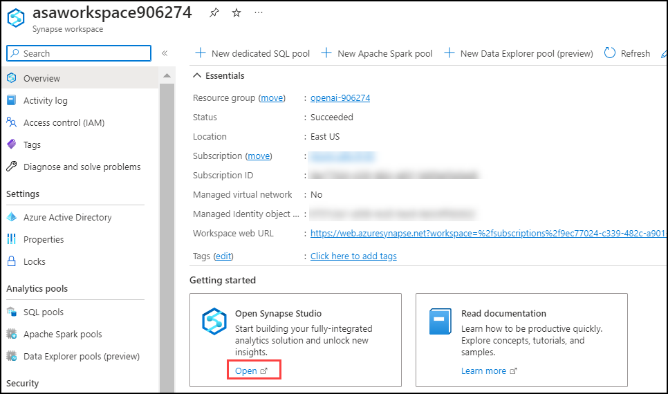
    
1. Once in the Synapse Studio is launched, on the left-hand side, click on the **Manage (1)** Option. At the top of the newly opened menu bar, under the **Analytics pools** section, click **SQL pools (2)**. Then click **New (3)** in the top-left.

   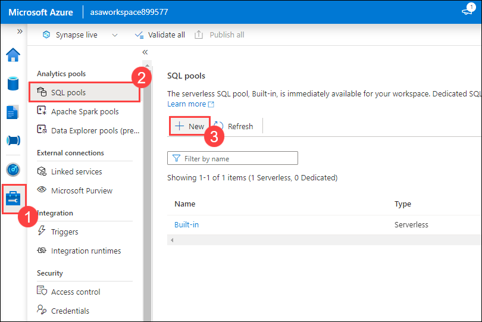

1. Provide a name for the Synapse SQL Pool as **openaipool** **(1)**. Accept all the defaults and click on **Review + Create (2)**.

   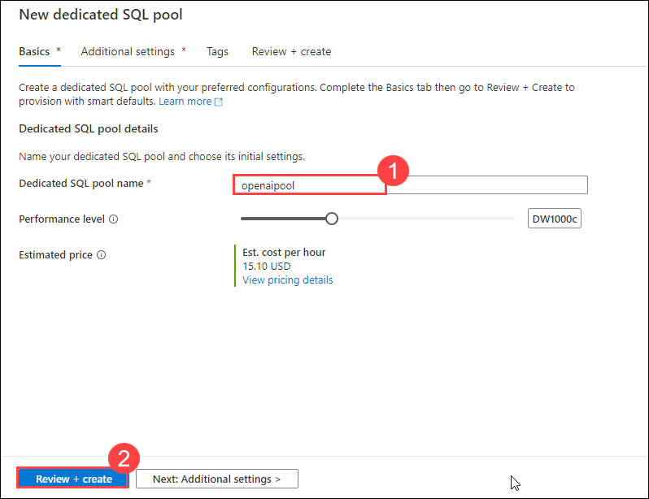

1. It may take a moment for your SQL Pool to initialize. Once it is completed you will see that the status of the pool is **Online**.

   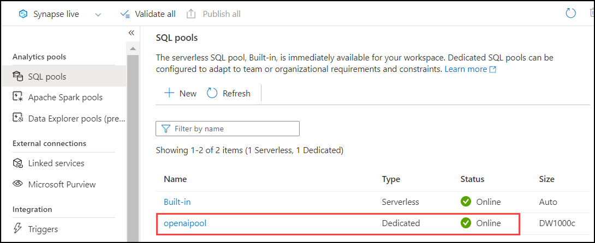

### **B. Create Target SQL Table**

1. Once the SQL Pool has been created, click into the **Develop (1)** section of the Synapse Studio, click the "**+ (2)**" sign in the top-left, and select **SQL script (3)**. This will open a new window with a SQL script editor. 

   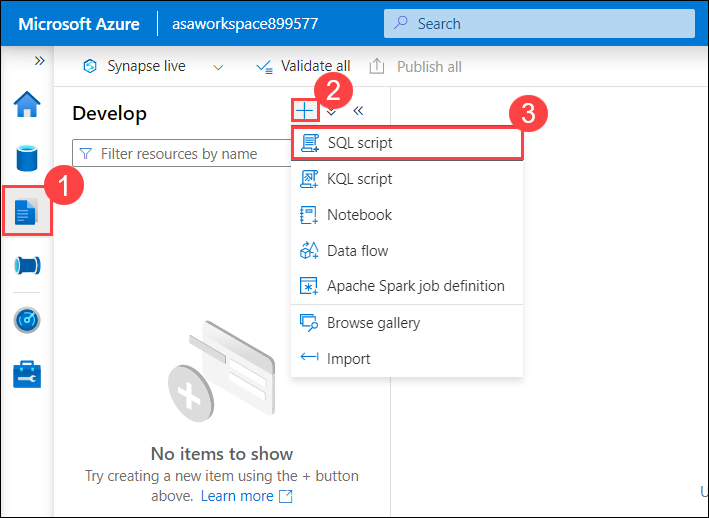

1. Copy and paste the following script into the editor **(1)** then change the **Connect to** value by selecting **openaipool (2)** from the drop-down and for **Use database** ensure that **openaipool (3)** is selected  and click the **Run (4)** button in the top-left, as shown in the picture below. Finish this step by pressing **Publish all (5)** just above the **Run** button to publish our work thus far.

    ```SQL 
    CREATE TABLE [dbo].[cs_detail]
    (
    interaction_summary varchar(8000),
    sentiment varchar(500),
    topic varchar(500),
    product varchar(500),
    filename varchar(500)
    )
    ```
    
    
    
1. Next click on Publish to publish the **SQL Script**.

    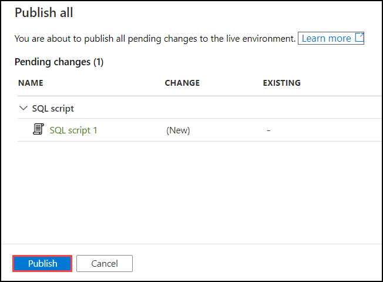

### **C. Create Source and Target Linked Services**

We'll next need to create two linked services: One for our Source (the JSON files in the Data Lake) and another for the Synapse SQL Database that houses the table we created in the previous step.

1. Click back into the **Manage (1)** section of the Synapse Studio, and click the **Linked services (2)** option under the **External connections** section. Then click **New (3)** in the top-left.

   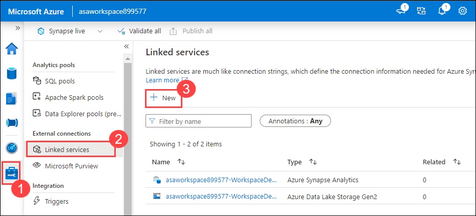
   
1. Start by creating the Linked Services for the source of our data, the JSON files housed in the ADLS Gen2 storage we created with our initial template. In the search bar that opens after you click **New**, search for **blob (1)** and select **Azure Blob Storage (2)** as depicted below and click on **Continue (3)**

   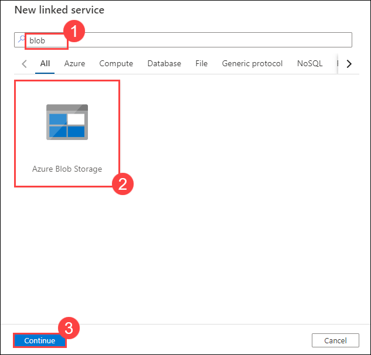

1. Provide the name for your Linked Service as **openailinkedservice (1)**. Change the **Authentication type** to **System Assigned Managed Identity (2)**. Then select the **subcription (3)** you have been working in, finally selecting the Storage account with the suffix **functions (4)** which you created in the initial template and loaded the JSON files into then click on **Test connection (5)**. Once the connection is successful, click the **Create (6)** button in blue on the bottom left of the New linked service window.

   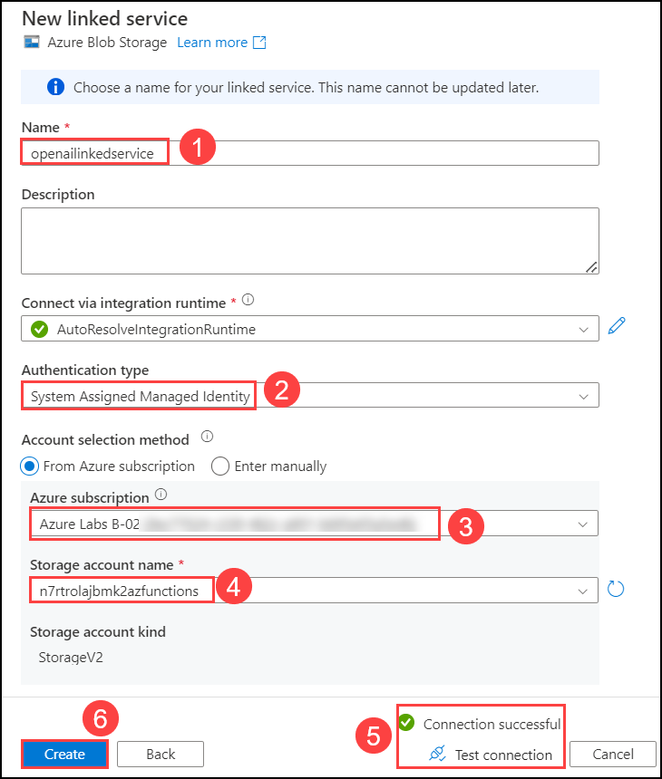

1. Search for **Synapse (1)**, select **Azure Synapse Analytics (2)** and click on **Continue (3)**.

   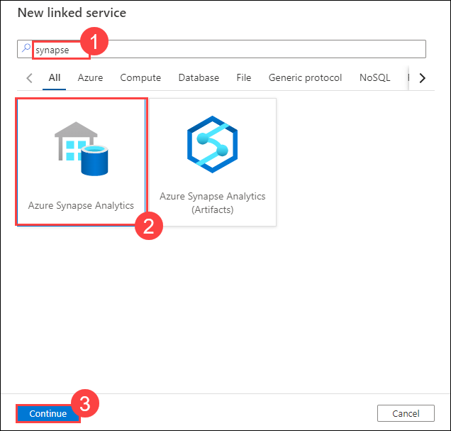

1. In the *New linked service* window that opens, fill in a name for your target linked service as **synapselinkedservice** **(1)**. Select the **Azure subcription (2)** in which you have been working and where you created your Synapse SQL Pool. Select the **Server name (3)** and **Database name (4)** and in which created the target table above. Be certain to change the **Authentication type** to **System Assigned Managed Identity (5)** then click on **Test connection (6)** and click  **Create (7)**.

   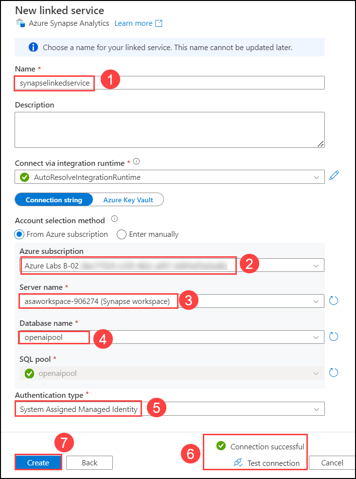

1. Once you have created the two Linked Services, be certain to press the **Publish all** button at the top to publish our work and finalize the creation of the linked services and click **Publish**.

   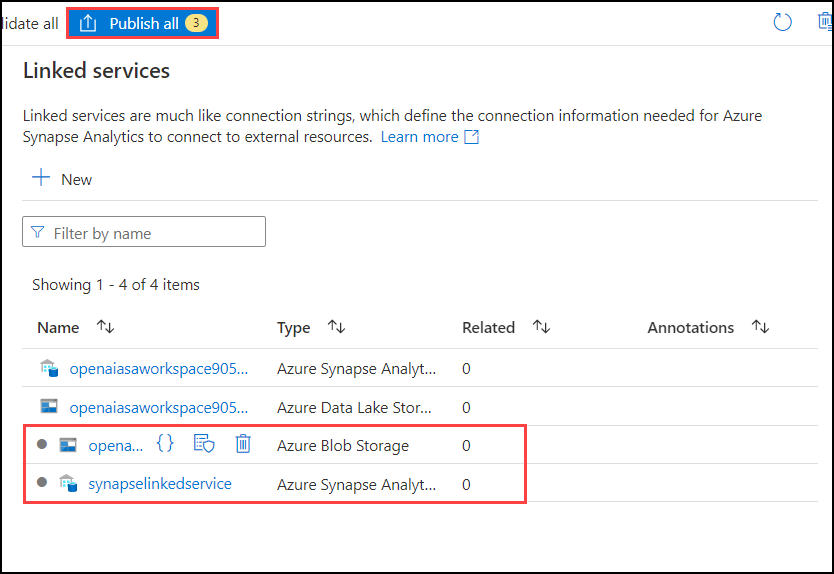
   
### **D. Create Synapse Data Flow**

While still within the Synapse Studio, we will now need to create a **Data flow** to ingest our JSON data and write it to our SQL Database. For the purposes of this workshop, this will be a very simple data flow that ingests the data, renames some columns, and writes it back out to the target table. 

1. First, we'll want to go back to the **Develop (1)** tab, select **+ (2)**, and then **Data flow (3)**

   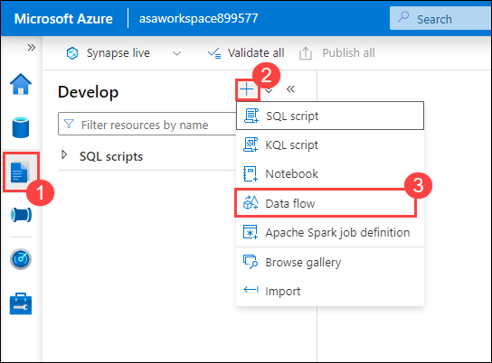
   
2. Once the data flow editor opens, click **Add Source**. A new window will open at the bottom of the screen, select **New** on the **Dataset** row while leaving the other options as default:

   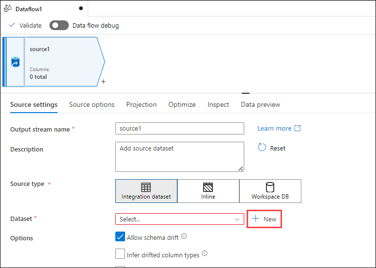

3. A new window should open on the right side of your screen. Next, search  for **Azure Blob Storage (1)** select **Azure Blob Storage (2)** , and then press **Continue (3)**. 
   
   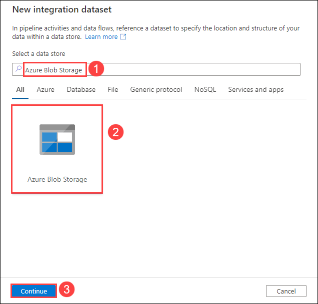

4. Next, select the **JSON (1)** option as our incoming data is in JSON format and click **Continue (2)**.

   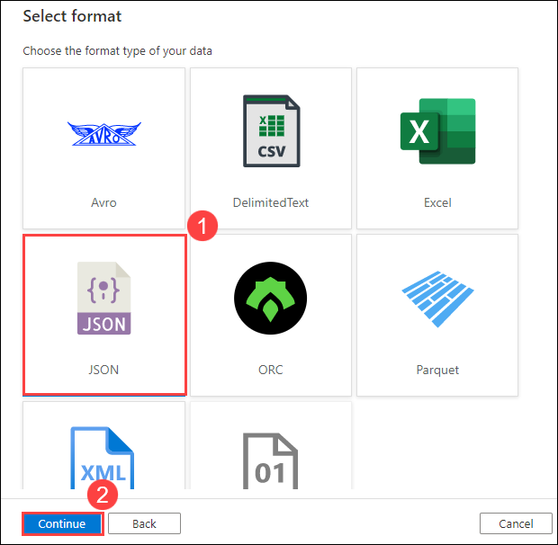

4. Select the Linked Service with the name **openailinkedservice (1)** we just set up in the steps above. You will need to select the proper **File path** to select the Directory where our JSON files are stored. It should be something to the effect of **workshop-data / cleansed_documents (2)**. Click the **OK** button to close the window

   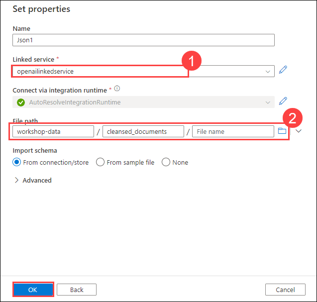
   
5. Next, we'll need to move to the **Source options (1)** panel and drop-down the **JSON settings (2)** options. We need to change the **Document form** option to the **Array of documents (3)** setting. This allows our flow to read each .json file as a separate entry into our database:

   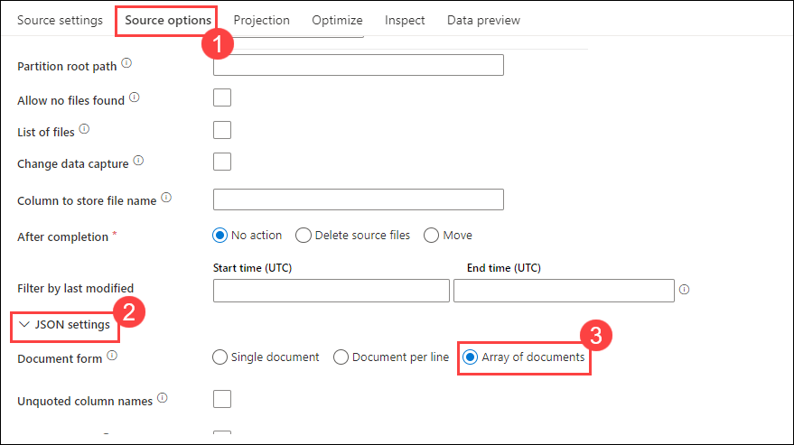

6. Enable the *data flow debug* session, then head to the **Data preview** tab and run a preview to check your work thus far:

    >**Note:** It will take a minute or two for the **data flow debug** session to get enabled.
    
    
   
7. Next we can add in our **Select** tile and do our minor alteration before writing the data out to the Synapse SQL table. To begin, click the small **+ (1)** sign next to our ingestion tile, and choose the **Select (2)** option:

   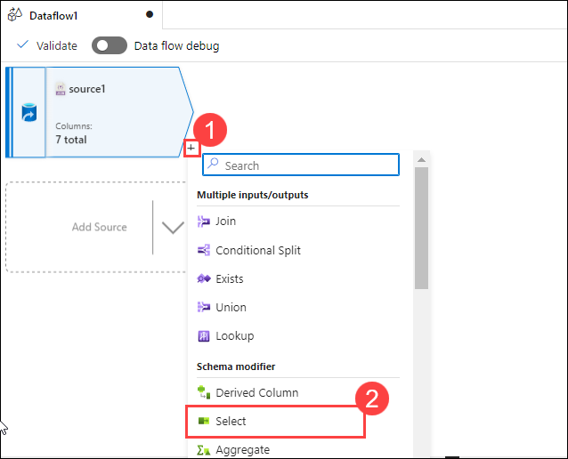

8. We can leave all the settings as default. Next we'll add in our **Sink** tile. This is the step that will write our data out to our Synapse SQL database. Click on the small **+ (1)** sign next to our **Select (2)** tile. Scroll all the way to the bottom of the options menu and select the Sink option:

   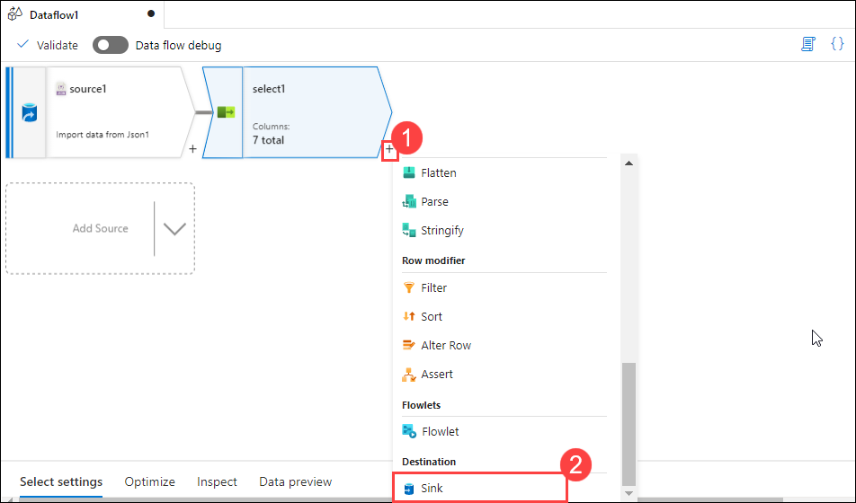

9. Once the **Sink (1)** tile opens, choose **Inline (2)** for the *Sink type*. Then select **Azure Synapse Analytics (3)** for the *Inline dataset type* and for the  **Linked service** select **synapselinkedservice (4)** that was created in the previous step. Ensure to run **Test connection (5)** for the linked service.

   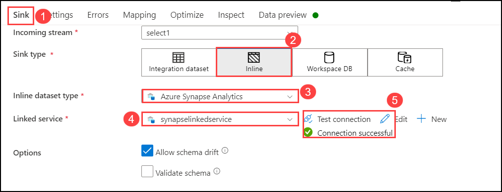

10. We will then need to head over to the **Settings** tab and adjust the **Scehma name** and **Table name**. If you utilized the script provided earlier to make the target table, the Schema name is **dbo** and the Table name is **cs_detail**.

    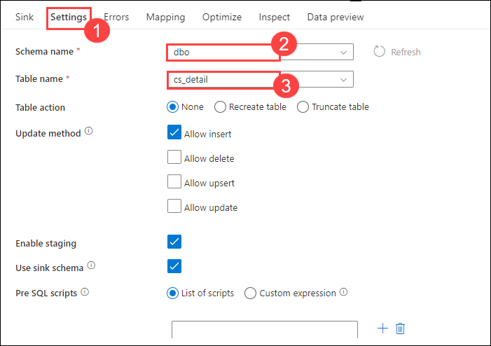

11. Before we finish our work in the data flow, we should preview our data, previewing our data reveals we only have 3 columns when we are expecting a total of 5. We have lost our Summary and Sentiment columns.

    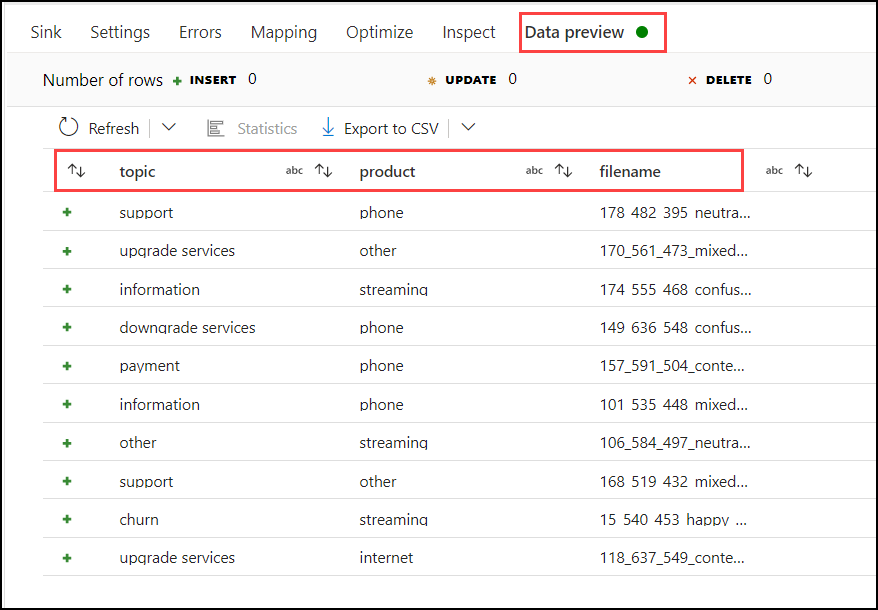

12.  To correct this, let's use our **Select (1)** tile to change the names as following to get the expected output values:

     - **Summary**: `Interaction_summary` **(2)**
     - **CustomerSentiment**: `Sentiment` **(3)**

     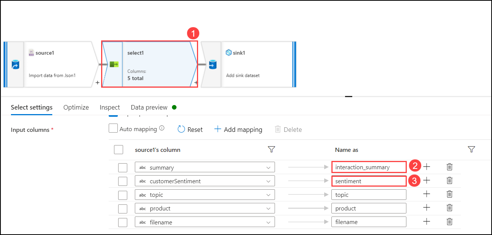
    
13. If we return to our **Sink (1)** tile and under **Data preview (2)** click **Refresh (3)**, we will now see our expected 5 columns of output.

    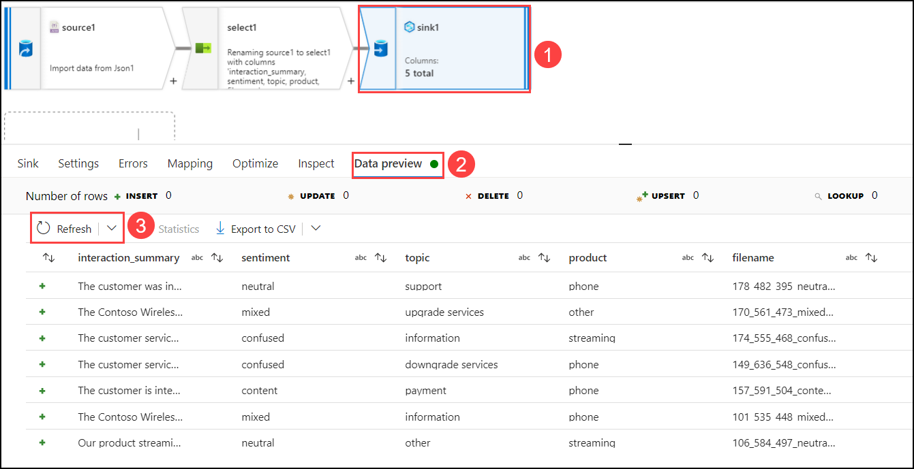

14. Once you have reviewed the data and are satisfied that all columns are mapped successfully (you should have 5 columns total, all showing data in a string format), we can press **Publish all** at the top to save our current configuration. A window will open at the right side of the screen - press the blue **Publish** button at the bottom left of it to save your changes.

    

15. Your completed and saved Data flow will look similar to the following:

    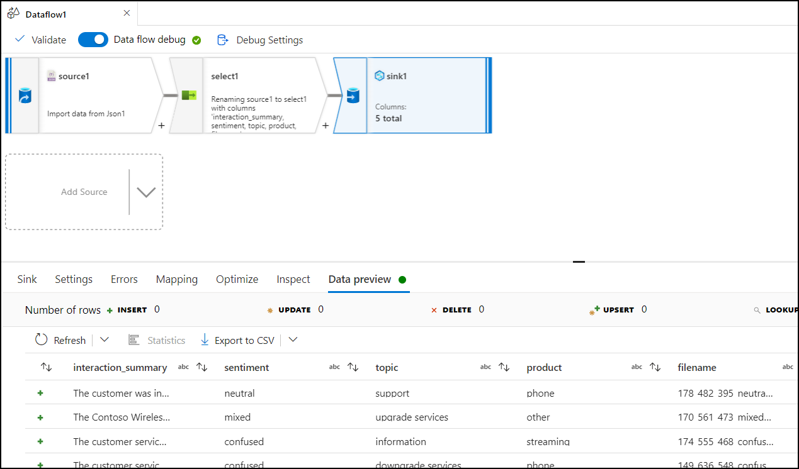

### **E. Create Synapse Pipeline**

1. Once we have created our **Data flow** we will need to set up a **Pipeline** to house it. To create a **Pipeline**, navigate to the left-hand menu bar and choose the **Integrate (1)** option. Then click the **+ (2)** at the top of the Integrate menu to **Add a new resource** and choose **Pipeline (3)**.

   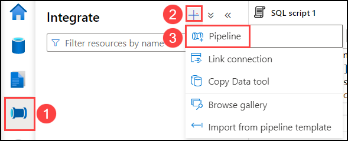

2. Next, we need to add a **Data flow** to our Pipeline. With your new **Pipeline tab (1)** open, go to the **Activities** section and search for `data` **(2)** and select **Data flow (3)** activity and **drag-and-drop (4)** it into your Pipeline.

   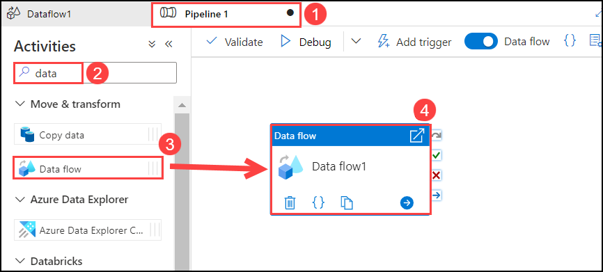

3. Under the **Settings (1)** tab of the **Data flow**, select the **Data flow (2)** drop-down menu and select the name of the data flow you created in the previous step. 
Then expand the **Staging (3)** section at the bottom of the settings and utilize the drop-down menu for the **Staging linked service**. Choose the linked service you created **openailinkedservice (4)** ensure to **Test connection (5)**. Next, set a **Staging storage folder** at the very bottom enter `workshop-data/Staging` **(6)**.

   

4. Then click **Publish all** to publish your changes and save your progress.

### **F. Trigger Synapse Pipeline**

1. Once you have successfully published your work, we need to trigger our pipeline. To do this, just below the tabs at the top of the Studio, there is a *lightning bolt* icon that says **Add trigger (1)**. Click to add trigger and select **Trigger now (2)** to begin a pipeline run.

    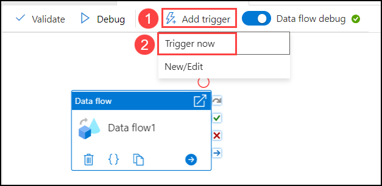
    
2. To look at the pipeline run, navigate to the left-hand side of the screen and choose the **Monitor (1)**  option. Then select the **Pipeline runs (2)** option in the **Integration** section. You will then see the pipeline run that you have triggered under **Triggered (3)** section as **pipeline-1 (4)**. This particular pipeline should take approximately 4 minutes (if you are using the uploaded data for the workshop).

   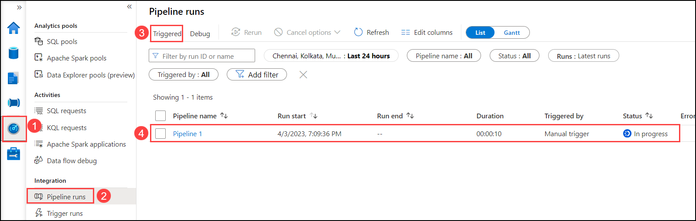

---

## Task 3. Query Results in Our SQL Table

1. Ensure that your pipeline run status has **Succeded**.

    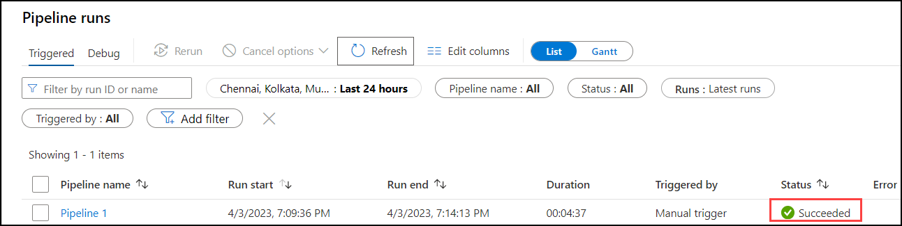

2. Now that the data is in the target table it is available for usage by running SQL queries against it, or connecting PowerBI and creating visualizations. The Azure Function is running as well, so try uploading some of the transcript files to the generated_documents folder in your container and see how the function processes it and creates a new file in the cleansed_documents file.

3. To query the new data, navigate to the menu on the left-hand side, choose **Develop (1)**. Click on the exisiting **SQL Script (2)** and replace the content with the **SQL Code (3)** below. Then select **Run (4)**. 

     ```sql 
    SELECT sentiment, count(*) as "Sum of Sentiment"
    FROM [dbo].[cs_detail]
    GROUP BY sentiment
    ORDER BY count(*) desc     
     ```

   - Your query results, if you are using the files uploaded as part of this repository or the workshop, you should see similar **Results (5)** to below.

  
   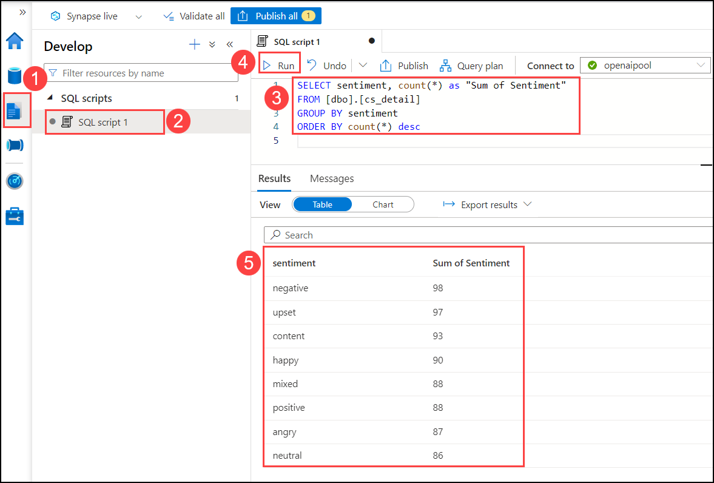

[Back to the Top](#Summary)
---
