# Exercise 1: Build an Open AI Pipeline to Ingest Batch Data, Perform Intelligent Operations, and Analyze in Synapse

### Estimated Duration: 90 minutes

This lab aims to demonstrate how to integrate OpenAI capabilities into Azure Synapse Analytics for processing batch data, performing intelligent operations like natural language processing or predictive analytics, and analyzing the results efficiently within the Synapse environment.

## Lab Objectives

You will be able to complete the following tasks:

- Task 1: Ingest Data to Storage account
- Task 2: Set up Synapse Workspace
- Task 3: Query Results in Our SQL Table

# Architecture Diagram

   

Call logs are uploaded to a designated location in blob storage. This upload will trigger the Azure Function, which utilizes the [Azure OpenAI Service](https://azure.microsoft.com/en-us/products/cognitive-services/openai-service/) for summarization, sentiment analysis, the product offering the conversation was about, the topic of the call, as well as a summary of the call. These results are written in a separate designated location in the blob storage. From there, Synapse Analytics is utilized to pull in the newly cleansed data to create a table that can be queried to derive further insights. 

## Task 1: Ingest Data to Storage account

### A. Launch Azure Cloud Shell

1. In the [Azure portal](https://portal.azure.com?azure-portal=true), select the **[>_]** (*Cloud Shell*) button at the top of the page to the right of the search box. A Cloud Shell pane will open at the bottom of the portal.

    

2. The first time you open the Cloud Shell, you may be prompted to choose the type of shell you want to use (*Bash* or *PowerShell*). Select **Bash**. If you don't see this option, skip the step.

3. Within the Getting Started pane, select **Mount storage account (1)**, select your **Storage account subscription (2)** from the dropdown and click **Apply (3)**.

   .png)

4. Within the **Mount storage account** pane, select **Select existing storage account (1)** and click **Next (2)**.

   .png)

5. Within the **Advanced settings** pane, enter the following details:

    - **Subscription**: Default- Choose the only existing subscription assigned for this lab (1).
    - **Resource group**: Select **Use existing** **(2)**
      - openai-<inject key="DeploymentID" enableCopy="false"></inject>
    - **Storage account**: Select **Use existing** **(3)**
      - openaistorage<inject key="DeploymentID" enableCopy="false"></inject>
    - **File share**: Create a new file share **(4)**

      .png)

1. Enter the file share name as **blob (1)**, and click on **Select (2)**.

    .png)

1.  Once the storage account is created, you will be prompted with the Bash window, as shown in the below screenshot.
    
    

### B. Upload files to a storage account:

1. Run the following commands in the cloud shell to download and install Miniconda.

     ```bash 
     wget https://repo.anaconda.com/miniconda/Miniconda3-py39_23.1.0-1-Linux-x86_64.sh 
     ```

     ```bash 
     sh Miniconda3-py39_23.1.0-1-Linux-x86_64.sh 
     ```
    
    > **Note:** The following commands are issued in Bash; please ensure you are using **Bash** in the Cloud Shell.

1. Press `Enter` to continue with the installation process.
    
      > **Note:** Press the down arrow key to read or skip the license agreement.

      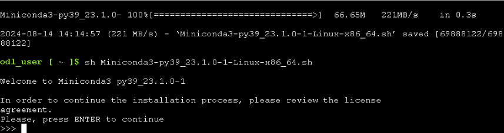

1. Type **yes** and hit **enter** to accept the agreement, and then hit enter to install on the default path.

   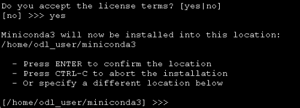

1. Type **yes** and hit **enter** to initialize the conda environment.

    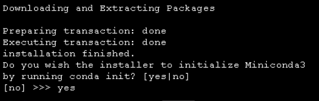

1. Run the following command to store the miniconda installed path to the variable.

    ```bash 
    export PATH=~/miniconda3/bin:$PATH
    ```
1. Run the below commands one by one to create and activate the conda environment in Cloudshell.

    ```bash 
    git clone https://github.com/microsoft/OpenAIWorkshop.git
    cd OpenAIWorkshop/scenarios/openai_batch_pipeline/document_generation
    conda create -n document-creation
    conda activate document-creation
    pip install --upgrade pip
    pip install -r reqs.txt
    ```
    > **Note**: if you received **"Conda: command not found"** error, please close the CloudShell session and open a new session to continue.
    
1. Type **y** and hit enter to proceed.

1. In the [Azure portal](https://portal.azure.com), navigate to your Storage Account with the suffix `functions` resource by selecting the **openai-<inject key="DeploymentID" enableCopy="false"/>** resource group and selecting the Storage Account from the list of resources.

    
    
1. Switch to the **Access keys (1)** blade and select **Show (2)**, which is next to the Connection String value. Select the copy button for the first **connection string (3)**. Paste the value into a text editor, such as Notepad.exe, for later reference.

   

1. Go back to the cloud shell bash session and run the below command to upload the JSON files to the storage account by replacing the <CONNECTION_STRING> you copied in the previous step. This will take a few minutes to complete.

    ```bash 
    python upload_docs.py --conn_string "<CONNECTION_STRING>"
    ```

   

   > **Note**: Execute "cd OpenAIWorkshop scenarios/openai_batch_pipeline/document_generation" if you are not inside OpenAIWorkshop/scenarios/openai_batch_pipeline/document_generation directory.
   
1. Once you have successfully uploaded the JSON files to the storage account, navigate to **Containers (1)**, click on **workshop-data (2)** and select **cleansed-documents (3)** folder and verify that the files have been uploaded.
   
   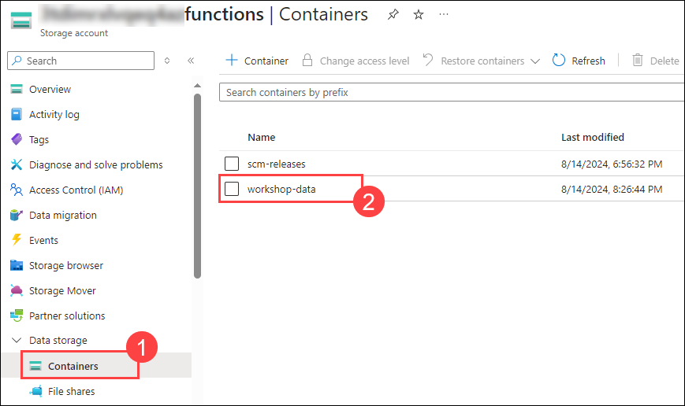

   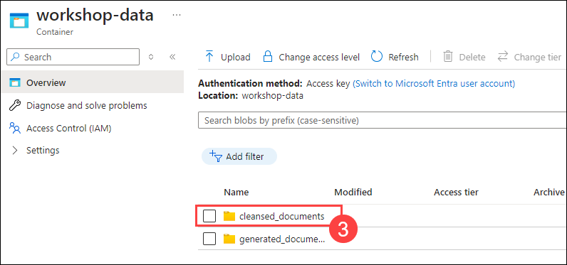

## Task 2: Set up Synapse Workspace

### **A. Create Target SQL Table**

1. In the [Azure portal](https://portal.azure.com), navigate to **asaworkspace<inject key="DeploymentID" enableCopy="false"/>** synapse workspace from **openai-<inject key="DeploymentID" enableCopy="false"/>** resource group. From the **Overview** tab, click on **Open** to launch the Synapse workspace.

    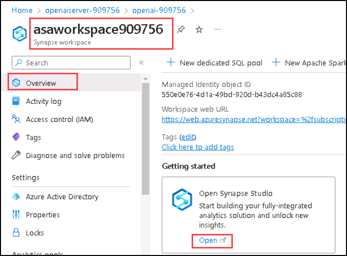

1. Click into the **Develop (1)** section of the Synapse Studio, click the **+ (2)** sign in the top left, and select **SQL script (3)**. This will open a new window with a SQL script editor. 

   

1. Copy and paste the following script into the editor **(1)**, then change the **Connect to** value by selecting **openaisql (2)** from the drop-down, and for **Use database**, ensure that **openaisql (3)** is selected, and click the **Run (4)** button in the top-left corner, as shown in the picture below. Finish this step by pressing **Publish all (5)** just above the **Run** button to publish our work thus far.

    ```SQL 
    CREATE TABLE [dbo].[cs_detail]
    (
    interaction_summary varchar(8000),
    sentiment varchar(500),
    topic varchar(500),
    product varchar(500),
    filename varchar(500)
    )
    ```
    
    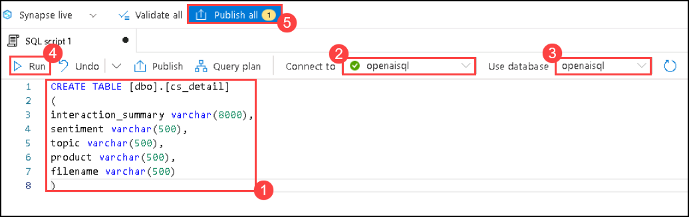
    
1. Next, click on **Publish** to publish the SQL script.

    

### **B. Create Source and Target Linked Services**

We'll next need to create two linked services: one for our source (the JSON files in the Data Lake) and another for the Synapse SQL Database that houses the table we created in the previous step.

1. Click back into the **Manage (1)** section of the Synapse Studio and click the **Linked services (2)** option under the **External connections** section. Then click **+ New (3)** in the top-left.

   
   
1. Start by creating the linked services for the source of our data, the JSON files housed in the ADLS Gen2 storage we created with our initial template. In the search bar that opens after you click New, search for **blob (1)**, select **Azure Blob Storage (2)** as depicted below, and click on **Continue (3)**.

   

1. Provide the name for your linked service as **openailinkedservice (1)**. Change the **Authentication type** to **Account key (2)**. Then select the **subscription (3)** you have been working in, and finally select the storage account with the suffix **functions (4)** that you created in the initial template and loaded the JSON files into then click on **Test connection (5)**. Once the connection is successful, click the **Create (6)** button in blue on the bottom left of the New linked service window.

   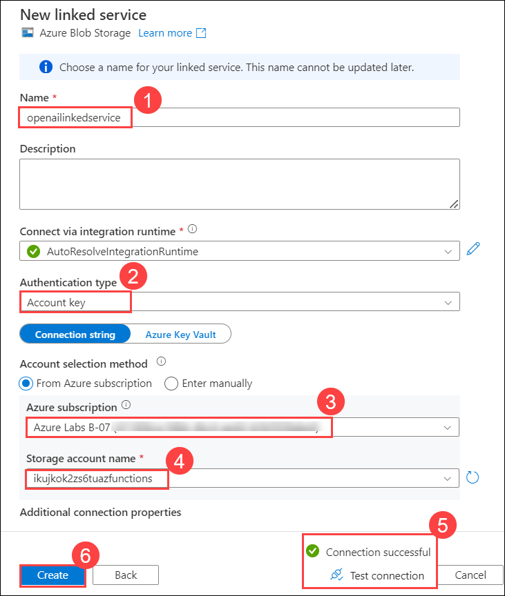

1.  Click **+ New** in the top-left. Search for **Synapse (1)**, select **Azure Synapse Analytics (2)**, and click on **Continue (3)**.

     

1. In the *New linked service* window that opens, fill in a name for your target linked service as **synapselinkedservice** **(1)**. Select the **Azure subscription (2)** for which you have been working. Select the **asaworkspace<inject key="DeploymentID" enableCopy="false"/> (3)** for **Server name** and **openaisql (4)** as the **Database name**. Be certain to change the **Authentication type** to **System Assigned Managed Identity (5)**, then scroll down and click on **Test connection (6)** and click **Create (7)**.

    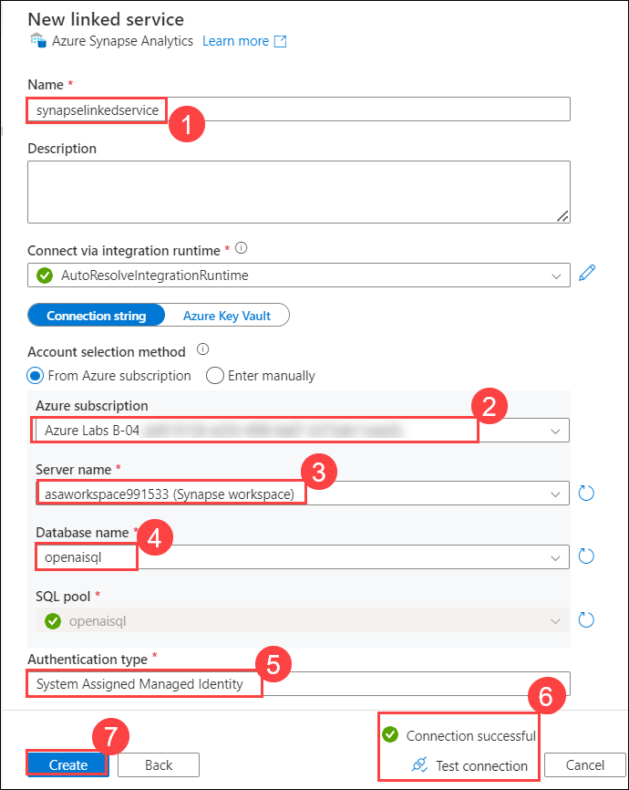

1. Once you have created the two linked services, be certain to press the **Publish all** button at the top to publish our work. Finalize the creation of the linked services and click **Publish**.

   
   
### **C. Create Synapse Data Flow**

While still within the Synapse Studio, we will now need to create a **Data flow** to ingest our JSON data and write it to our SQL database. For this workshop, this will be a very simple data flow that ingests the data, renames some columns, and writes it back out to the target table.

1. First, we'll want to go back to the **Develop (1)** tab, select **+ (2)**, and then **Data flow (3)**.

   
   
1. Once the data flow editor opens, click **Add Source**. A new window will open at the bottom of the screen. Select **+ New** on the **Dataset** row while leaving the other options as default.

   

1. A new window should open on the right side of your screen. Next, search for **Azure Blob Storage (1)**, select **Azure Blob Storage (2)**, and then click on **Continue (3)**.
   
   

1. Next, select the **JSON (1)** option as our incoming data is in JSON format and click **Continue (2)**.

   

1. Select the Linked Service with the name **openailinkedservice (1)** we just set up in the steps above. You will need to select the proper **File path** to select the directory where our JSON files are stored. It should be something to the effect of **workshop-data / cleansed_documents (2)**. Click on the **OK** button to close the window.

   
   
1. Next, we'll need to move to the **Source options (1)** panel and drop down the **JSON settings (2)** options. We need to change the **Document form** option to the **Array of documents (3)** setting. This allows our flow to read each .JSON file as a separate entry into our database.

      

1. Enable the toggle **data flow debug** session located at the top menu bar adjacent to the validate button, and click on **OK** on the *Turn on data flow debug* pop-up window.

    >**Note:** It will take a minute or two for the **data flow debug** session to get enabled.

1. Now head to the **Data preview** tab and run a preview to check your work thus far.
    
    

    >**Note**: If you're unable to view data under the Data Preview tab, please click on the Refresh button repeatedly until the data appears.
   
1. Next, we can add in our **Select** tile and do our minor alterations before writing the data out to the Synapse SQL table. To begin, click the small **+ (1)** sign next to our ingestion tile and choose the **Select (2)** option.

   

1. We can leave all the settings as defaults. Next, we'll add in our **Sink** tile. This is the step that will write our data out to our Synapse SQL database. Click on the small **+ (1)** sign next to our **Select** tile. Scroll all the way to the bottom of the options menu and select the **Sink (2)** option.

   

1. Once the **Sink (1)** tile opens, choose **Inline (2)** for the *Sink type*. Then select **Azure Synapse Analytics (3)** for the *Inline dataset type*, and for the **Linked service**, select **Synapselinkedservice (4)**, which was created in the previous step. Ensure to run **Test connection (5)** for the linked service.

   

   > **Note**: If the test connection takes more than 3–4 minutes, follow the below steps.

   - Click on **Edit**.

     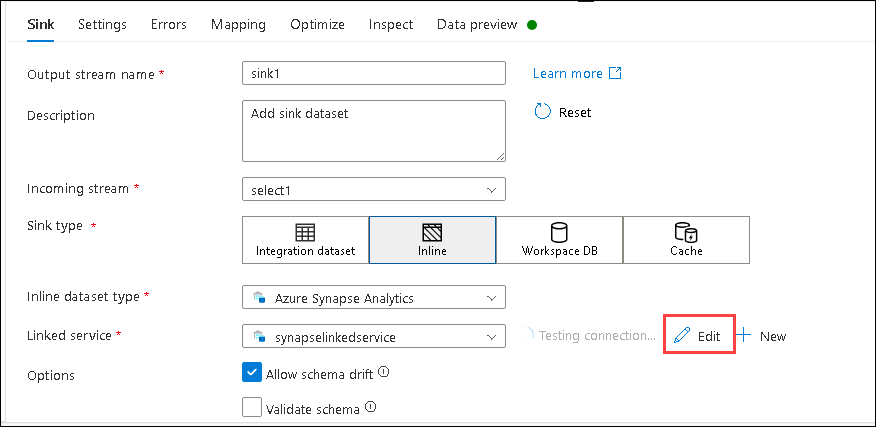    

   - In the Edit linked service window that opens, select the Azure selection method as **From Azure subscription** **(1)**. Select the **Azure subscription (2)** for which you have been working. Select the **asaworkspace<inject key="DeploymentID" enableCopy="false"/> (3)** for **Server name** and **openaisql (4)** as the **Database name**, and then click on **Test connection (5)** and click **Save (6)**.

     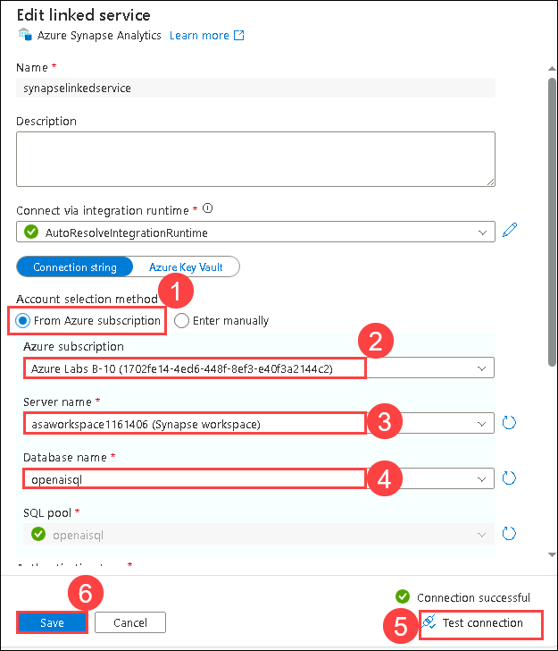

1. We will then need to head over to the **Settings (1)** tab and adjust the **Schema name** and **Table name**. If you utilized the script provided earlier to make the target table, the Schema name is **dbo (1)** and the Table name is **cs_detail (2)**.

    

1. Before we finish our work on the data flow, we should preview our data. Previewing our data reveals we only have 3 columns when we are expecting a total of 5. We have lost our Summary and Sentiment columns.

    

1. To correct this, let's use our **Select (1)** tile to change the names as follows to get the expected output values:

     - **Summary**: `interaction_summary` **(2)**
     - **CustomerSentiment**: `sentiment` **(3)**

        
    
1. If we return to our **Sink (1)** tile and under **Data preview (2)** click **Refresh (3)**, we will now see our expected 5 columns of output.

    

1. Once you have reviewed the data and are satisfied that all columns are mapped successfully (you should have 5 columns total, all showing data in a string format), we can press **Publish all** at the top to save our current configuration. A window will open on the right side of the screen; press the blue **Publish** button at the bottom left of it to save your changes.

    

1. Your completed and saved Data flow will look like the following:

    

### **D. Create Synapse Pipeline**

1. Once we have created our **Data flow**, we will need to set up a **Pipeline** to house it. To create a **Pipeline**, navigate to the left-hand menu bar and choose the **Integrate (1)** option. Then click the **+ (2)** at the top of the Integrate menu to **Add a new resource** and choose **Pipeline (3)**.

   

2. Next, we need to add a **Data flow** to our Pipeline. With your new **Pipeline tab (1)** open, go to the **Activities** section and search for `data` **(2)** and select **Data flow (3)** activity and **drag-and-drop (4)** it into your Pipeline.

   

3. Under the **Settings (1)** tab of the **Data flow**, select the **Data flow (2)** drop-down menu and select the name of the data flow you created in the previous step. 
Then expand the **Staging (3)** section at the bottom of the settings and utilize the drop-down menu for the **Staging linked service**. Choose the linked service you created **openailinkedservice (4)** to ensure the **Test connection (5)**. Next, set a **Staging storage folder** at the very bottom and enter **workshop-data/Staging** **(6)**.

   

4. Then click **Publish all** to publish your changes and save your progress.

### **E. Trigger Synapse Pipeline**

1. Once you have successfully published your work, we need to trigger our pipeline. To do this, just below the tabs at the top of the studio, there is a *lightning bolt* icon that says **Add trigger (1)**. Click to add a trigger and select **Trigger now (2)** to begin a pipeline run then when the window opens up click on **OK**.

    
    
2. To look at the pipeline run, navigate to the left-hand side of the screen and choose the **Monitor (1)** option. Then select the **Pipeline runs (2)** option in the **Integration** section. You will then see the pipeline run that you have triggered under the **Triggered (3)** section as **pipeline 1 (4)**. This pipeline should take approximately 4 minutes (if you are using the uploaded data for the workshop).

   

## Task 3: Query Results in Our SQL Table

1. Ensure that your pipeline run status has **Succeeded**.

    

2. Now that the data is in the target table, it is available for usage by running SQL queries against it or connecting PowerBI and creating visualizations. The Azure Function is running as well, so try uploading some of the transcript files to the generated_documents folder in your container and see how the function processes it and creates a new file in the cleansed_documents file.

3. To query the new data, navigate to the menu on the left-hand side, and choose **Develop (1)**. Click on the existing **SQL Script (2)** and replace the content with the **SQL Code (3)** below. Then select **openaisql (4)** pool **Run (5)**. 

     ```SQL 
    SELECT sentiment, count(*) as "Sum of Sentiment"
    FROM [dbo].[cs_detail]
    GROUP BY sentiment
    ORDER BY count(*) desc     
     ```

   - Your query results, if you are using the files uploaded as part of this repository or the workshop, you should see similar **Results (6)** to those below.

      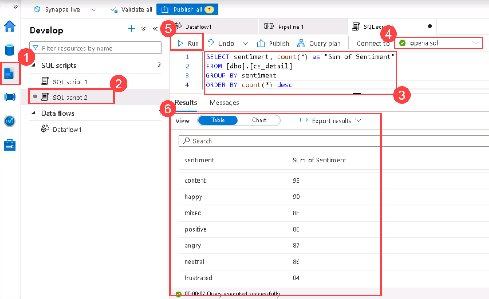

## Summary

This scenario allows the use of OpenAI to summarize and analyze customer service call logs for the fictitious company, Contoso. The data is ingested into a blob storage account and then processed by an Azure function. The Azure Function will return the customer sentiment, the product offering the conversation was about, the topic of the call, as well as a summary of the call. These results are written in a separate, designated location in the blob storage. From there, Synapse Analytics is utilized to pull in the newly cleansed data to create a table that can be queried to derive further insights.

### You have successfully completed the lab
