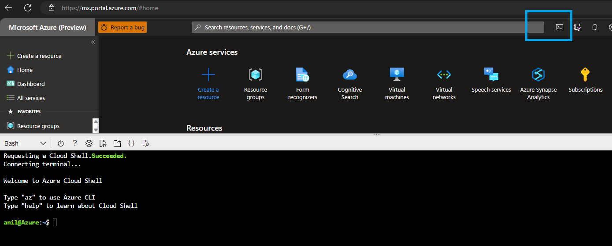

# Automated Script

* Contributor permission is required in the Azure subscription.
* Microsoft.Search Resource provider needs to be registered in the Azure Subscription. 
* Run "az account set -s {subscription-id}" to make sure the resource group name provided is in the intended subscription with contributor permission.
* Azure Cloud Shell is recommended as it comes with preinstalled dependencies. 
* Azure Open AI already provisioned and text-davinci-003 model is deployed. Other deployments can also be used, the configs below needs to be updated accordingly.  
* If local laptop is used, additional prerequisites such as Python 3.9, pip, conda(optional), Azure Func Tools, Bash shell, Az CLI needs to be installed or required. 

## Deployment

This approach runs a fully automated script to create Azure Resources, configure the Azure Function App and create the search index. There is no manual configuration required. This has the least number of prerequisites and can be run from Azure Cloud Shell. 
Once the automated script is run, the power app can be configured as the next step. 

## Steps

### Step 1
Launch [Azure Portal](https://portal.azure.com)(control+click) and open Azure Cloud Shell from the top right area. Switch to Bash.

In the Cloud Shell, in Bash mode type:

    git clone https://github.com/microsoft/OpenAIWorkshop.git

    cd OpenAIWorkshop/scenarios/openai_on_custom_dataset/deploy/

    chmod +x deploy.sh
    
    # funcapp_name needs to be less than 14 characters
    ./deploy.sh <Resource Group Name> <Region> <Azure Open AI Endpoint> <Azure Open AI Key> <Azure Open AI Model Deployment Name> <funcapp_name>

    For e.g 
    ./deploy.sh openai-workshop-test2 westus  https://anildwaopenai2.openai.azure.com/ <Azure Open AI Key Redacted> text-davinci-003-deployment instance114

### Step 2
Proceed with creating PowerApp. Use the pre-built Powerapp in powerapp/Semantic-Search-App-Template_20230303012916.zip and import the package.

[Create PowerApp](PowerApp.md)