# Exercise 3: Using Azure OpenAI on custom dataset
### Scenario summary:
This scenario allows use cases to use Open AI as an intelligent agent to answer questions from end users or assist them using knowledge of a proprietary corpus and domain.
Applications can be: 
- Giving a direct answer to questions about specific products, services and processes based on a knowledge corpus that can be updated frequently. This is an alternative to classic search where the result just documents with relevant information to the question. Think of this as Bing Chat on proprietary data.
- Giving recommendations & assistance: based on information that can be implicitly gathered about the user, formulate useful content for the user's purpose. For example, a travel website may utilize users' personal information, past posts, and transaction history to personalize recommendations when users need to be helped with creating next trip idea/itinerary.

Regardless of the application scenario, the solution flow is:
- Step 1 Prepare the context information: context information can be retrieved from proprietary knowledge corpus and other systems based on the user's query and user's information. The retrieval mechanism can be a semantic search engine to retrieve right content for an unstructured data corpus or SQL query in case of the structured dataset.
- Step 2 Formulate prompt to Open AI: from the context and depending on the goal of user, formulate GPT prompt to get the final response to the end user. For example, if it's knowledge retrieval vs recommendation

This implementation scenario focuses on building a knowledge retrieval chatbot application on top of an unstructured data corpus, but the same design can be used for the recommendation & generative scenarios.

### Architecture Diagram

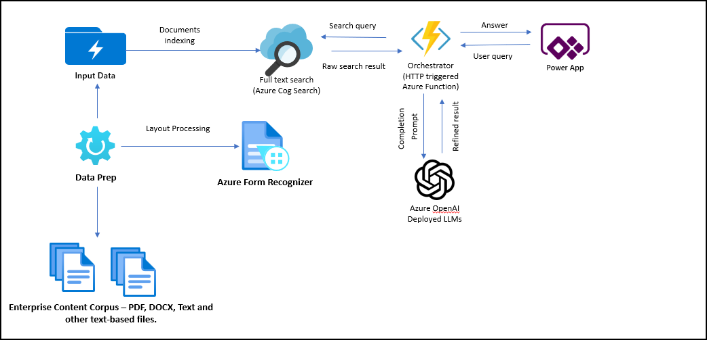

From the user's query, the solution uses two-stage information retrieval to retrieve the content that best matches the user query. 
In stage 1, full-text search in Azure Cognitive Search is used to retrieve several relevant documents. In stage 2, the search result is applied with a pre-trained NLP model and embedding search to further narrow down the most relevant content. The content is used by the orchestrator service to form a prompt for the OpenAI deployment of LLM. The OpenAI service returns the result which is then sent to the Power App client application.

# Task 1: Setup Azure Cognitive Search and prepare data.
   As part of data preperation step, to work in Open AI, the documents are chunked into smaller units(20 lines) and stored as individual documents in the search index. The chunking steps can be achieved with a python script below. To make it easy for the labs, the sample document has already been chunked and provided in the repo.
   
1. Login to Azure portal if you are not already logged in.

1. Navigate to **openaicustom-<inject key="DeploymentID" enableCopy="false"/>** resource group and select search service with the name **search-<inject key="DeploymentID" enableCopy="false"/>**.

1. Now select the **Sementic Search** option from the left side menu and make sure that **Free Plan** is selected
   
    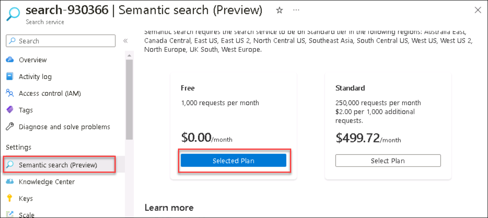
   
1. Now, navigate to 'C:\labfile\OpenAIWorkshop-main\scenarios\openai_on_custom_dataset\ingest' in windows explore and you will see a file names as secerts.env, Make sure the valus is updated as expected. However we have already updated the values for you.


1. Now you need to open the CMD and run the below command to change to directory to the ingest folder.

       ```
       cd C:\labfile\OpenAIWorkshop\scenarios\openai_on_custom_dataset\ingest
       ```

1. Once you are in the ingest directory, run the below command to start the ingestion process. Please make sure to have to correct value in secrets.env file below running the below command. The search indexer chunks a sample pdf document(500 pages) which is downloaded from azure docs and chunks each page into 20 lines. Each chunk is created as a new seach doc in the index. The pdf document processing is achieved using Azure Form Recognizer service.

     ```
     python search-indexer.py
     ```
     
     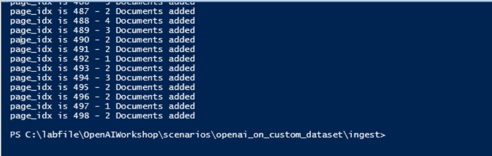
  The above script will ingest the data into the services and you will be able to continue with the lab from here. 
  
# Task 2: Import PowerApp and try out the App.


1. In the [Azure portal](https://portal.azure.com), navigate to the **func-search-<inject key="DeploymentID" enableCopy="false"/>** function app from the **openaicustom-<inject key="DeploymentID" enableCopy="false"/>** resource group.

   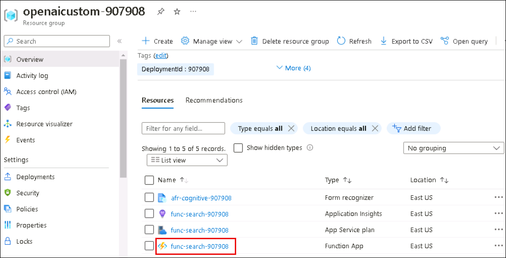

2. From the **Function app** go to **Functions (1)** on the left menu and select **orchestrator-func-app (2)**.

   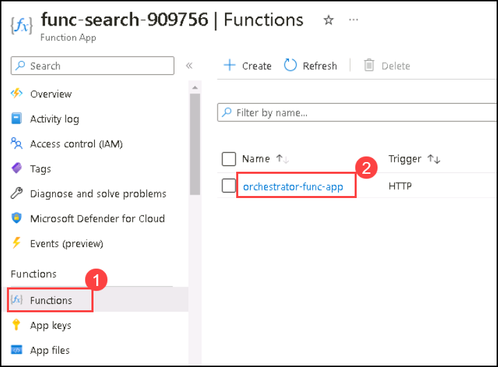
   
3. On the **orchestrator-func-app** function click on **Get Function Url (1)**, from the drop-down menu select **default (function key) (2)** then **Copy (3)** the URL. Click **OK (4)**. Paste the URL in a text editor such as _Notepad_ for later use.

    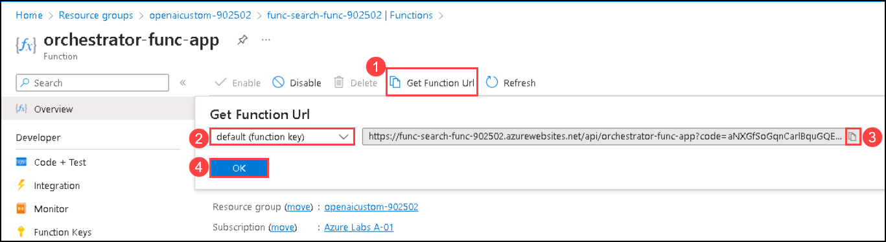

4. Navigate to https://make.powerapps.com/. On **Welcome to Power Apps** select your **Country/Region (1)** click **Get Started (2)**. 

   
    
5. Select **Apps (1)** on the left navigation and click **Import Canvas App (2)**. 

    

6. On the **Import package** page click on **Upload**.

    
    
7. Navigate to `C:\labfile\OpenAIWorkshop-main\scenarios\openai_on_custom_dataset\powerapp` and select `Semantic-Search-App-Template_20230303012916.zip` folder then click **Open**.

   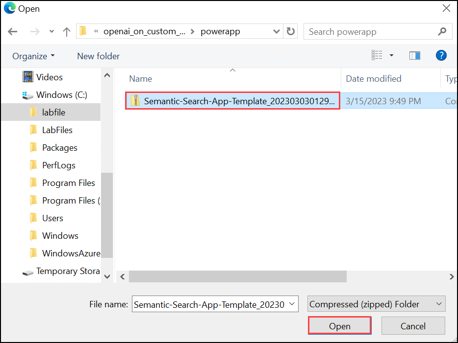
   
8. Click on **Import** to import the package into the powerapps environment.

    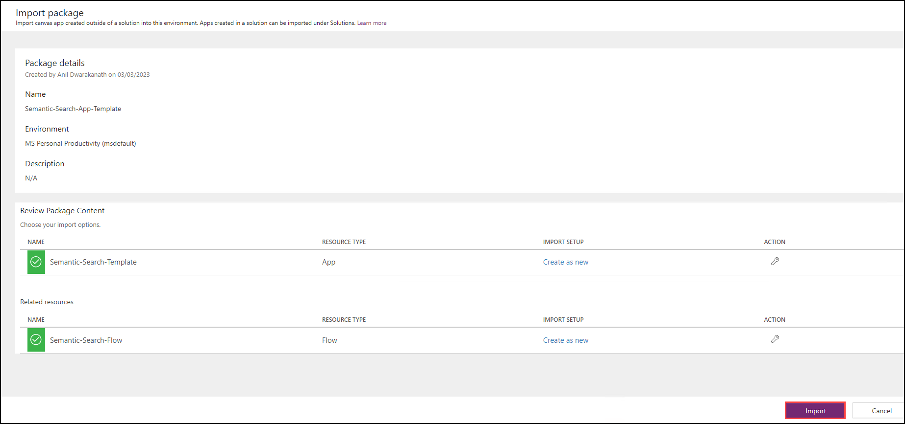

9. Once the import is completed, click on **Apps (1)** then click on **... (2)** next to **Semantic-Search-Template** and click on **Edit (3)**.

    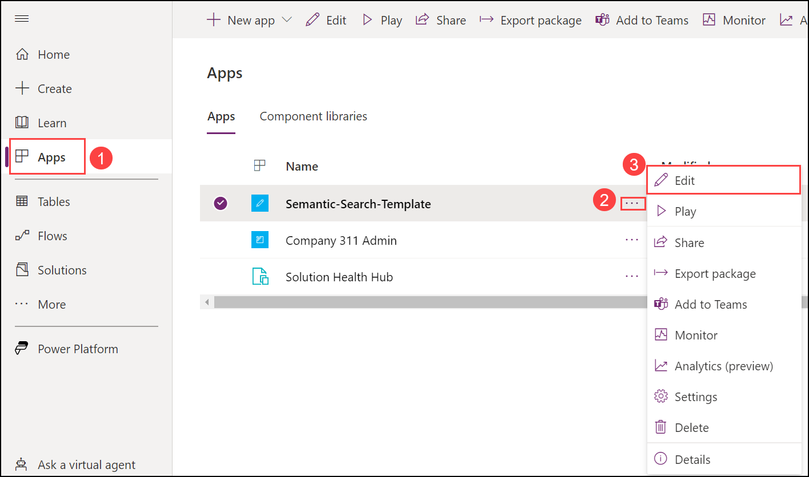
     

10. Click on **Power Automate (1)** this will import the **_Power App_** canvas and **Semantic-Search-Flow (2)** **_Power Automate Flow_** into the workspace. 

    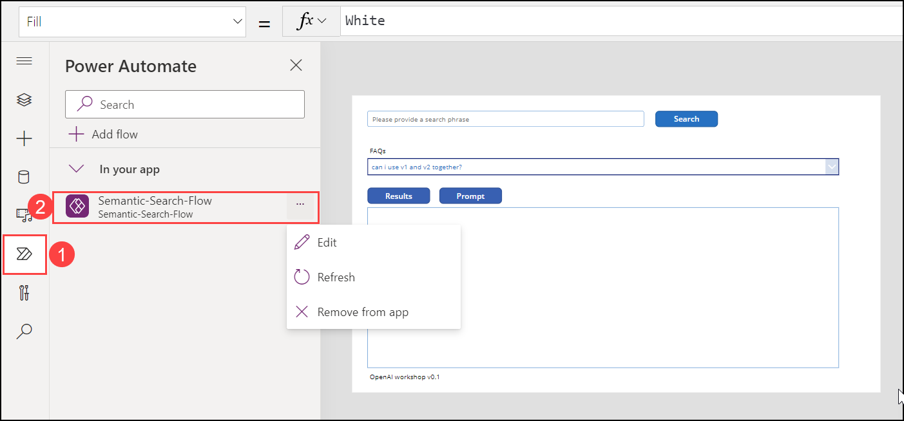

11. To navigate back click on **Back (1)**, if you get a option to leave or Don't leave, click on **leave**.


12.  On the **Flows (1)** Pane, select **Semantic-Search-Flow (2)** then click on `...` **(3)** and **Turn on (4)** your flow.

      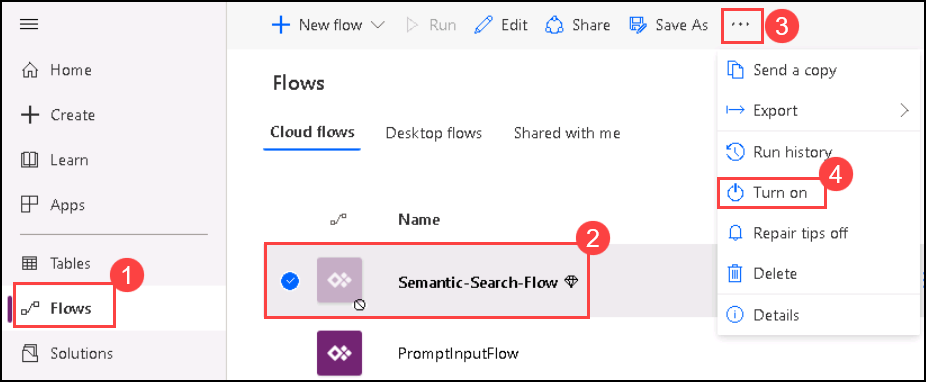

13. Next, click on **Edit** for **Semantic-Search-Flow**. PowerAutomate Flow needs to be enabled. At this point, the powerapp can be run as is. It connects to a pre-built Azure Function App. 

    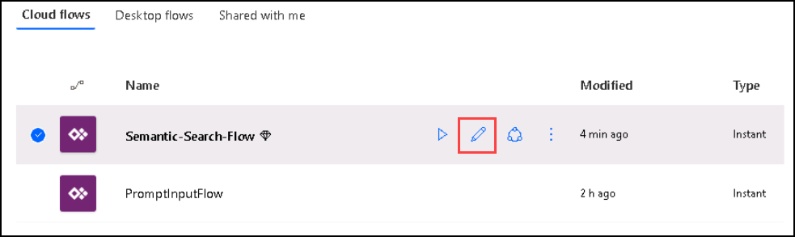

14. Edit the Power Automate Flow and update **Azure Function Url (1)** with the URL you copied earlier and append `&num_search_result=5` at the end. Your URL should look like the following. Click **Save (2)**.

    ```
    https://func-search-XXXXX.azurewebsites.net/api/orchestrator-func-app?code=aNXGfSoGqnCarlBquGQE4pNgO1n9ZmqheCd0SZPzAFCOAzFugFsV8g==&num_search_result=5
    ```
    
    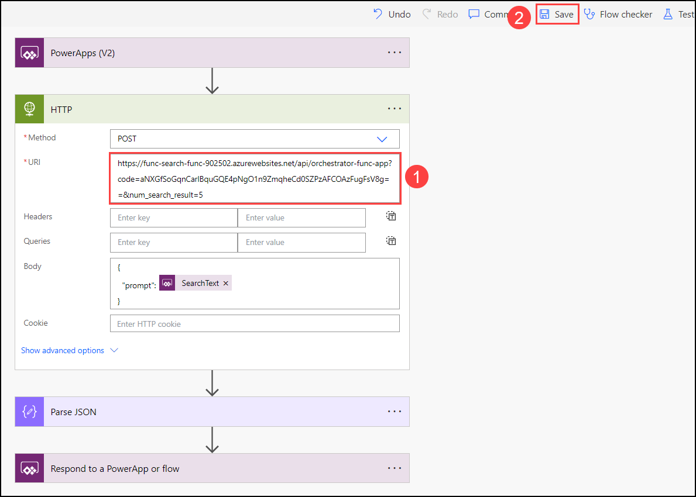

15. Next, click on **Apps** and select **Semantic-Search-Template** to naviagte to the app.

    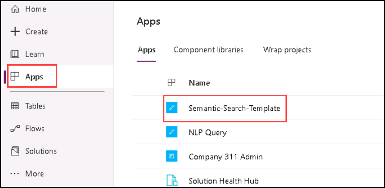
 
16. On the app enter any phrase and hit search to view the result.
   
      - For example here we are searching for `What is AML stands for?`. 
   
    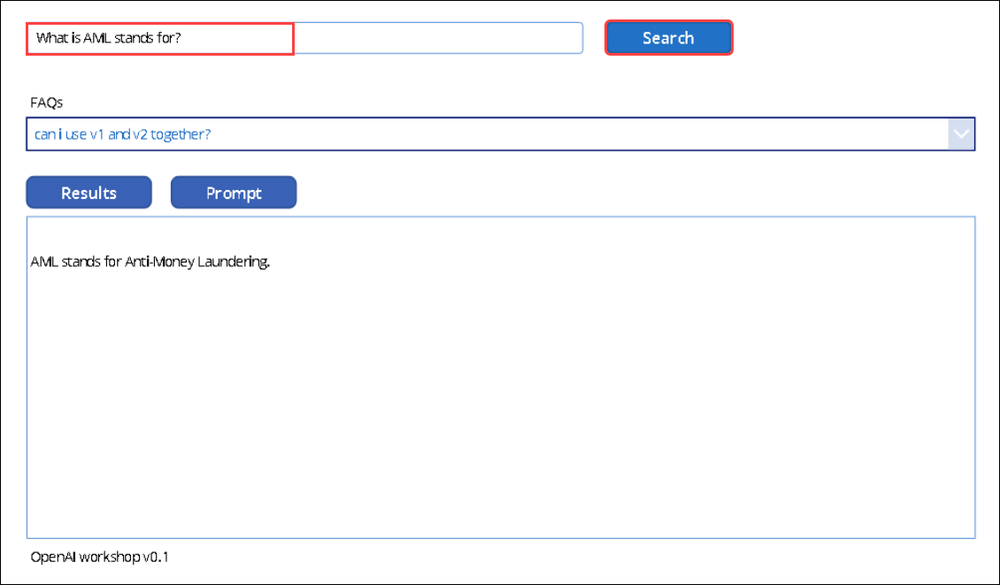
