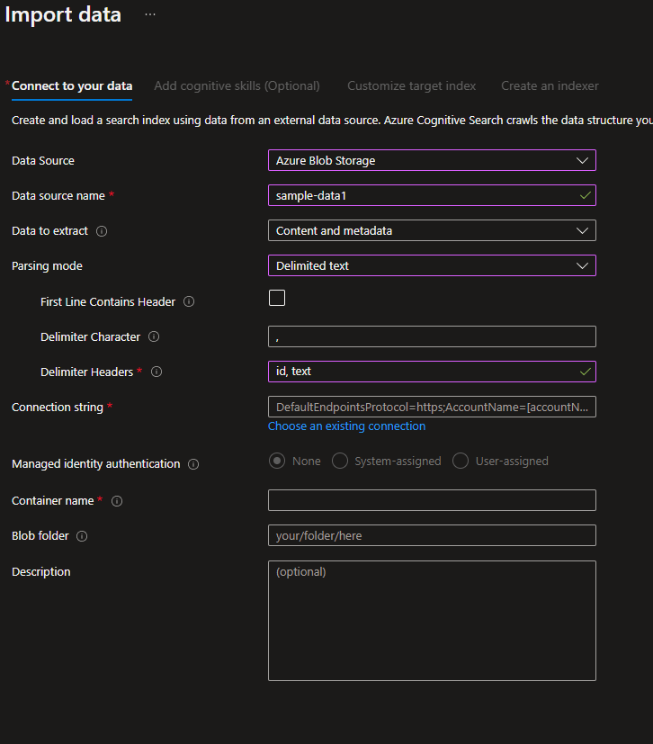

# Semi Automated Script

### Prerequisites

* Contributor permission is required in the Azure subscription.
* Microsoft.Search Resource provider needs to be registered in the Azure Subscription. 
* [PostMan Client Installed](https://www.postman.com/downloads/) for testing Azure Functions. Azure portal can also be used to test Azure Function App.  
* Azure Cloud Shell is recommended as it comes with preinstalled dependencies. 
* Azure Open AI already provisioned and text-davinci-003 model is deployed. The model deployment name is required in the Azure Deployment step below. South Central US is recommended region for deploying Azure Open AI. 
* Conda is recommended if local laptops are used as pip install might interfere with existing python deployment.

## 1. Azure services deployment

Deploy Azure Resources namely - Azure Function App to host facade for OpenAI and Search APIs, Azure Search Service and a Azure Form Recognizer resource.

Here are the SKUs that are needed for the Azure Resources:

- Azure Function App - Consumption Plan
- Azure Cognitive Search - Standard (To support semantic search)
- Azure Forms Recognizer - Standard (To support analyzing 500 page document)
- Azure Storage - general purpose V1 (Needed for Azure Function App and uploading sample documents)

The Azure Function App also deploys the function code needed for powerapps automate flow. 

(control+click) to launch in new tab.

 

## 2. Setup Azure Cognitive Search and prepare data

As part of data preperation step, to work in Open AI, the documents are chunked into smaller units(20 lines) and stored as individual documents in the search index. The chunking steps can be achieved with a python script below. 
To make it easy for the labs, the sample document has already been chunked and provided in the repo. 

* Enable Semantic Search on Azure Portal. Navigate to Semantic Search blade and select Free plan. 
    
    

*   Create Search Index, Sematic Configuration and Index a few documents using automated script. The script can be run multiple times without any side effects.
    Run the below commands from cmd prompt to conifgure python environment. Conda is optional if running in Azure Cloud Shell or if an isolated python environment is needed. 

        
        git clone https://github.com/microsoft/OpenAIWorkshop.git
        
        cd OpenAIWorkshop/scenarios/openai_on_custom_dataset
        
        # conda steps are optional
        conda create -n openaiworkshop python=3.9 
        conda activate openaiworkshop
        
        pip install -r ./orchestrator/requirements.txt

*   Update Azure Search, Open AI endpoints, AFR Endpoint and API Keys in the secrets.env. 
    Rename secrets.rename to secrets.env. (This is recommended to prevent secrets from leaking into external environments.)
    The secrets.env should be placed in the ingest folder along side the python script file search-indexer.py.
    The endpoints below needs to have the trailing '/' at end for the search-indexer to run correctly.

        cd ingest
        # open secrets.env using code editor such as nano or code
        # When using code, you can type control+s to save the file and control+q to quit the editor
        code secrets.env

        # when using nano, type control+x+y to save the file and close editor
        nano secrets.env

        

    Add the below entries with correct values to secrets.env. Please refer to [this doc](ShowKeysandSecrets.md) to retrieve API Keys and Urls.

        AZSEARCH_EP="https://<YOUR Search Service Name>.search.windows.net/"
        AZSEARCH_KEY="<YOUR Search Service API Key>"
        AFR_ENDPOINT="<YOUR Azure Form Recognizer Service API EndPoint>"
        AFR_API_KEY="<YOUR Azure Form Recognizer API Key>"
        INDEX_NAME="azure-ml-docs"

*   The document processing, chunking, indexing can all be scripted using any preferred language. 
    This repo uses Python. Run the below script to create search index, add semantic configuration and populate few sample documents from Azure doc. 
    The search indexer chunks a sample pdf document(500 pages) which is downloaded from azure docs and chunks each page into 20 lines. Each chunk is created as a new seach doc in the index. The pdf document processing is achieved using Azure Form Recognizer service. 
    
        cd ./scenarios/openai_on_custom_dataset/ingest
        python search-indexer.py
        

###   Optional Manual Approach. 
If you prefer to not use the python/automated approach above, the below steps can be followed without automation script. 
To configure Azure Search, please follow the steps below.

- In the storage container, that is created as part of the template in step 1, create a blob container. 
- Extract the data files in the .scenarios/data/data-files.zip folder and update this folder to the blob container using Azure Portal UI.   The data-files.zip contains the Azure ML sample pdf document chunked as individual files per page.  
- Import data in Azure Search as shown below. Choose the blob container and provide the blob-folder name in to continue. 

    
- In the Customize Target Index, use id as the Azure Document Key and mark text as the Searchable Field. 
- This should index the chunked sample

 

## 3. Test Azure Function App service deployment

Please refer to [this doc](ShowKeysandSecrets.md) to retrieve Function App Url and code.

* Launch Postman and test the Azure Function to make sure it is returning results. The num_search_result query parameter can be altered to limit the search results. Notice the query parameter num_search_result in the screen shot below. num_search_result is a mandatory query parameter.

    

* Test the Function App using CLI

        #Bash
        cd OpenAIWorkshop/scenarios/openai_on_custom_dataset/deploy
        curl -X POST 'https://<Your Function App Name>.azurewebsites.net/api/orchestrator-func-app?code=<Your Function App Code>&num_search_result=5' -d '@test_prompt.json'

        #Powershell
        cd OpenAIWorkshop/scenarios/openai_on_custom_dataset/deploy
        (curl -Method POST 'https://<Your Function App Name>.azurewebsites.net/api/orchestrator-func-app?code=<Your Function App Code>&num_search_result=5' -Body '@test_prompt.json').Content

## 4. Deploy client Power App

Proceed with creating PowerApp. Use the pre-built Powerapp in powerapp/Semantic-Search-App-Template_20230303012916.zip and import the package.

[Create PowerApp](PowerApp.md)

## 5. Test

Click on the play button on the top right corner in the PowerApps Portal to launch PowerApp.
Select an  FAQ from dropdown and click Search. This is should bring up the answers powered by Open AI GPT-3 Models. 
Feel free to make changes to the PowerApps UI to add your own functionality and UI layout. You can explore expanding PowerAutomate flow to connect to other APIs to provide useful reference links to augment the response returned from OpenAI.