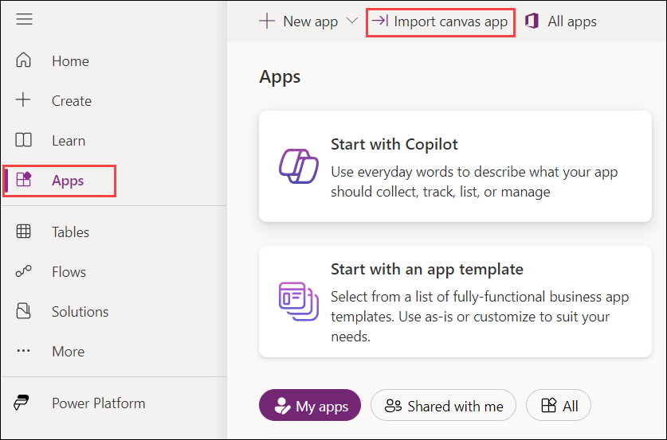
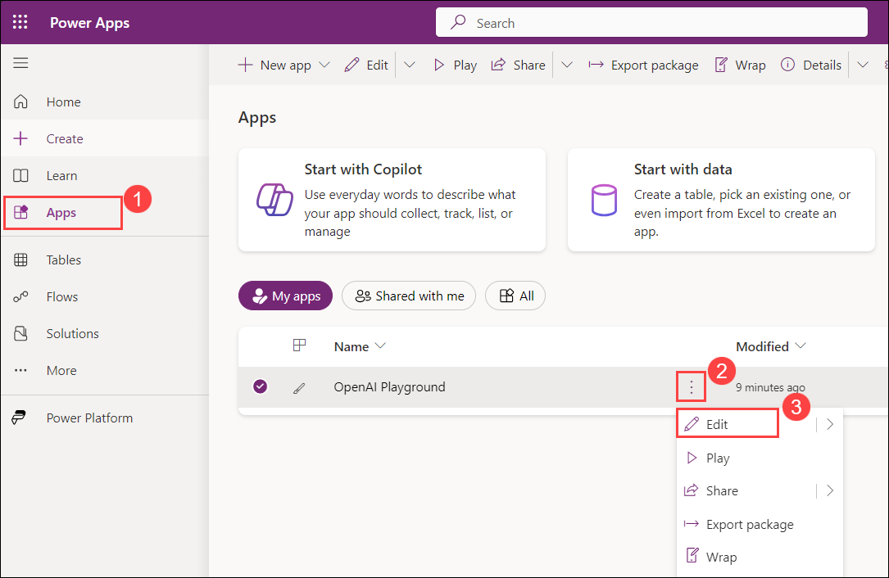
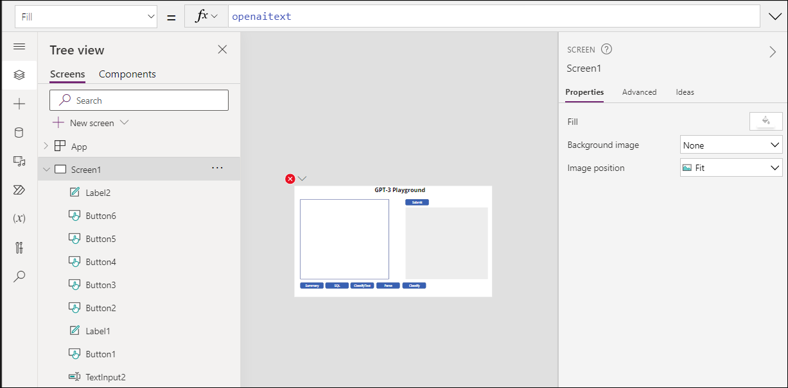
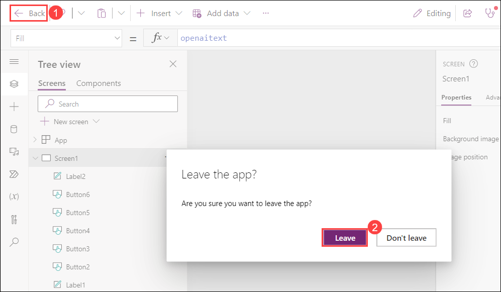
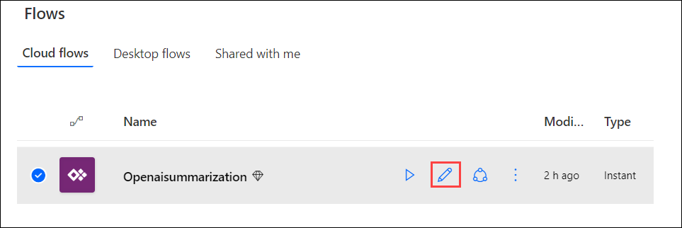
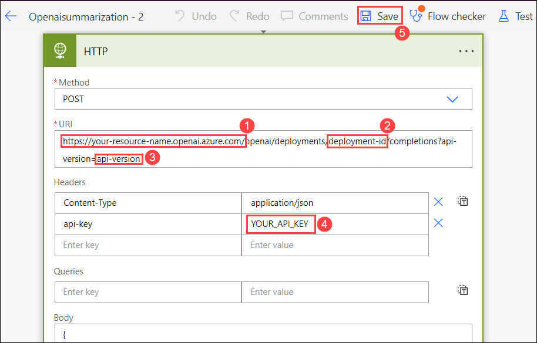
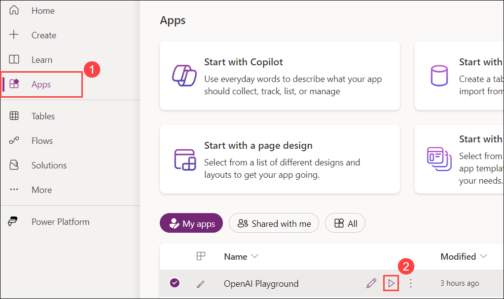
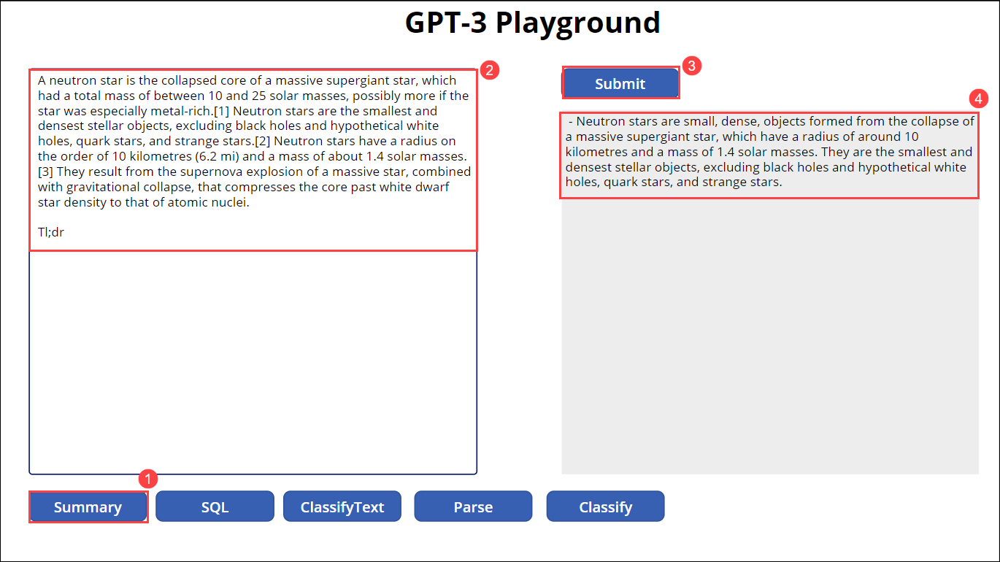

# Exercise 3: Build Open AI application with Power App 

In this exercise, you will learn how to integrate OpenAI with PowerApps. This exercise is all about combining the simplicity of PowerApp's low-code platform with the advanced capabilities of OpenAI. You'll see firsthand how these technologies can come together to create powerful applications.

1. Navigate to https://make.powerapps.com/. On the Welcome to power Apps window from **Choose your country/region** drop down select your country, and then click on **Get started**.
  
2. In the  **Contact Information** window give a random nine-digit number for **Phone number** and click on **Submit** . 

   
    
3. Select **Apps (1)** on the left navigation and click **Import Canvas App (2)**. 

    

4. On the **Import package** page click on **Upload**.

    

5. Navigate to `C:\labfile\OpenAIWorkshop-main\OpenAIWorkshop-main\scenarios\powerapp_and_python\powerapp` select the **OpenAI-Playground_20230302010547.zip (1)** folder  and click on **Open (2)**.

     

6. Once the zip file is uploaded, in the **Review Package Content** for **OpenAI Playground** click on the setup icon under **Actions**. 

     

7. In the **Import setup** pane select **Create as new (1)** from the drop-down for **Setup** and click on **Save (2)**.

      

8.  Repeat Steps 5 and 6 for **Openaisummarization**.

9. Next click on **Import** to import the package into the PowerApps environment.  

   

10. Once the import is completed, click on **Apps (1)**, then click on `...` **(2)** next to **OpenAI Playground** and click on **Edit (3)**.

      

   >**Note**: If you're unable to see the **OpenAI Playground** option, please wait for 5 minutes, and in the meantime, try refreshing the page.

   >**Note**: When prompted with **Welcome to Power Apps Studio** click on **Skip**.

11. You will observe that it has imported the Power App canvas app and the Power Automate Flow into the workspace.

      

12. To navigate back click on **Back (1)** then click **Leave (2)**.

      

13. Next, on the **Flows (1)** tab, select **Openaisummarization (2)** then click on `...` **(3)** and **Turn on (4)** your flow.

      

    >**Note**: When **Welcome to Power Automate** is prompted click on **Get started**.

14. Click on **Edit (2)** for **Openaisummarization**.

      

15. Edit the Power Automate Flow HTTP step by update the **https://your-resource-name.openai.azure.com/** with **<inject key="OpenAIEndpoint" enableCopy="true"/>** **(1)**, **deployment-id** with **<inject key="openaimodulename" enableCopy="true"/>** **(2)**, **api-version** with **2023-09-15-preview** **(3)**, **YOUR_API_KEY** with **<inject key="OpenAIKey" enableCopy="true"/>** **(4)**, and click on **Save** **(5)**.

      
   
16. From the **Apps (1)** page click on the **OpenAI Playground** app to run the app by clicing on **Play (2)** button.

     

17. If you get a popup asking to start a free trial, click on **Star a Free Trial**, then on **You need a Power Apps license to use this app** window select **Start a 30-day trail**. choose your country from the drop down menu and click on **Start my trial** button wait for 2-3 minutes It might take to start the trial

18. In the **Canvas**, click on **Summary** **(1)** button and verify the **auto-filled text** **(2)**. Then click on **Submit** **(3)** button to get the desired **Summary** **(4)**. 

     

    > **Note**: You can try the other available options in the portal i.e, **SQL**, **ClassifyText**, **Parse**, and **Classify**.

    
**Summary:** In this exercise, You had looked into integrating PowerApps with OpenAI. You discovered how to combine the sophisticated OpenAI capabilities with PowerApp's low-code platform. 
