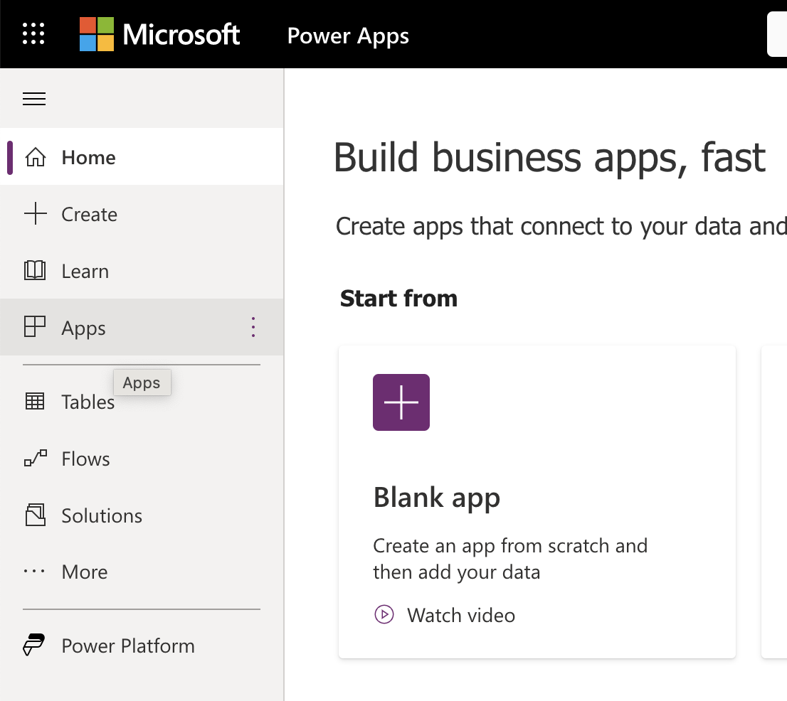
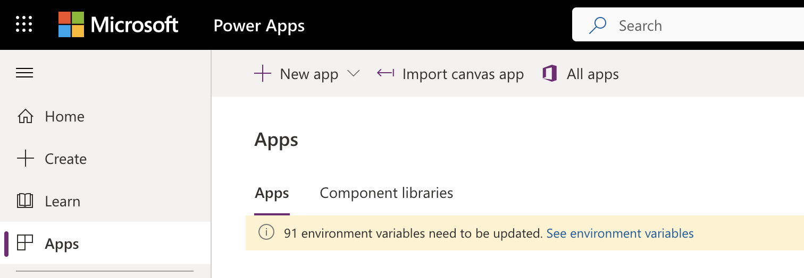
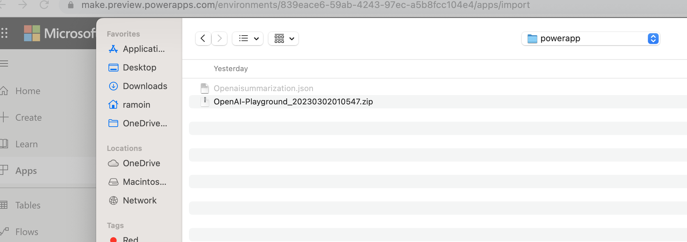
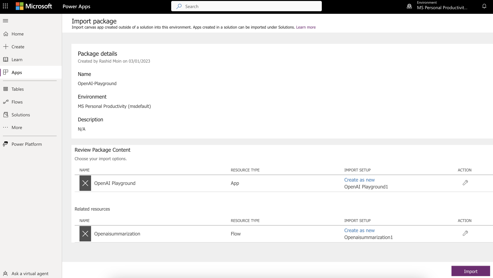
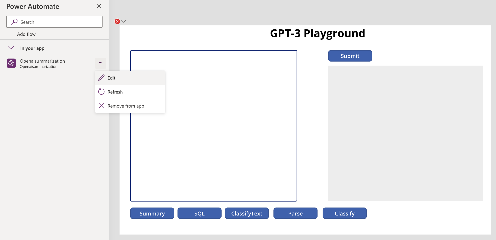
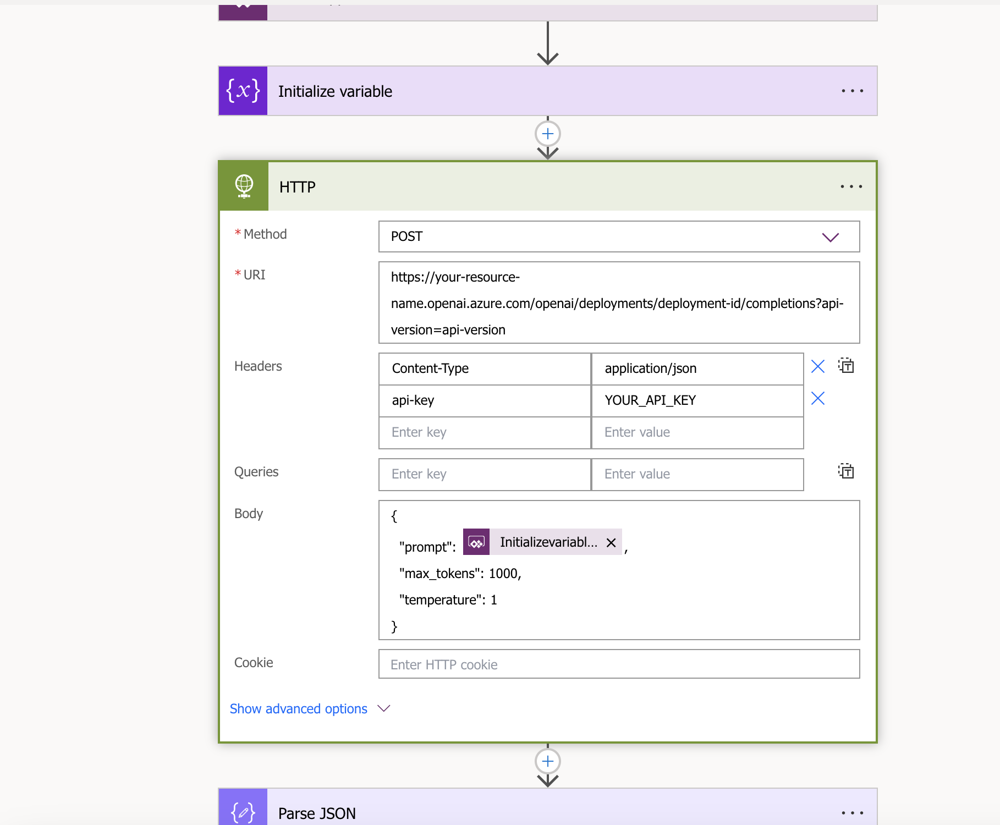

# Build Open AI application with Power App and Python

## Scenario summary:
This scenario allows use cases to use Open AI from Power App and as well from Python application via OpenAI Python SDK. 

## POWER APP

### Step 1. Deploy client Power App

- Navigate to https://make.powerapps.com/ and click on Apps on the left navigation. 

  

- From the top nav bar, click Import Canvas App and upload the OpenAI-Playground_20230302010547.zip file from this git repo path. 

  

  

- Click on Import to import the package into powerapps environment. 

  

- This will import the Power App canvas app and Openaisummarization Power Automate Flow into the workspace. 

  

- Edit the Power Automate Flow with your own Azure OpenAI API key and endpoint.

  

### Step 2. Test

- Click on the play button on the top right corner in the PowerApps Portal to launch PowerApp. 

## PYTHON SDK

### Step 1. Install required python packages

- In your command line run "pip install -r requirements.txt" to install openai python package 

### Step 2. Open openaipython.py file

- Put your own OpenAI API key and OpenAI endpoint in this file