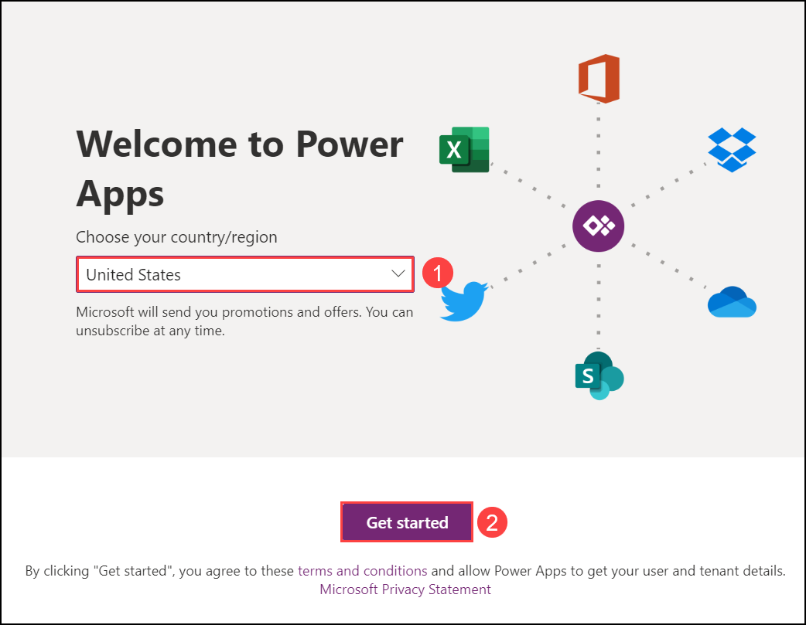
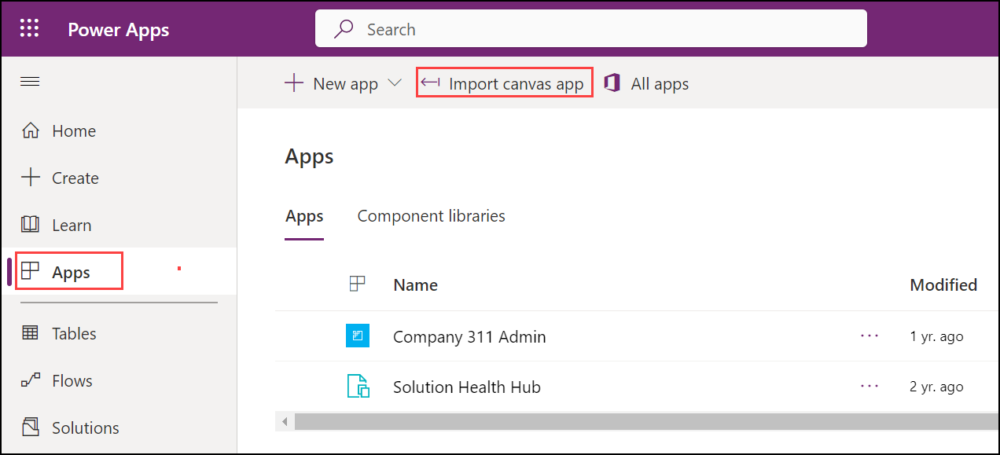
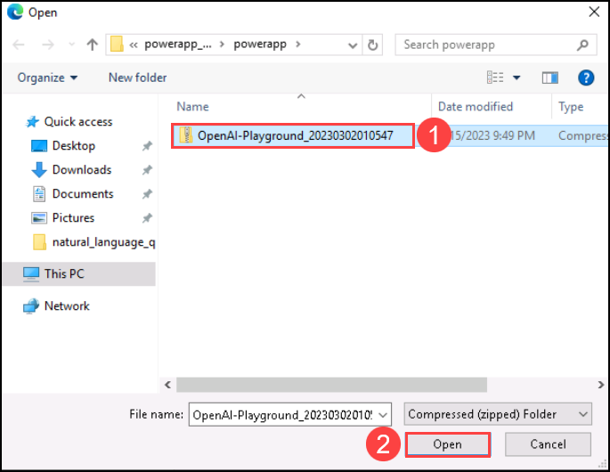
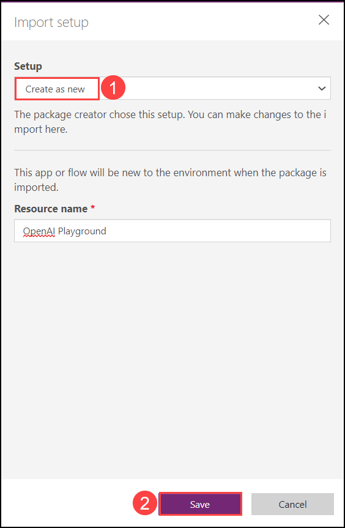
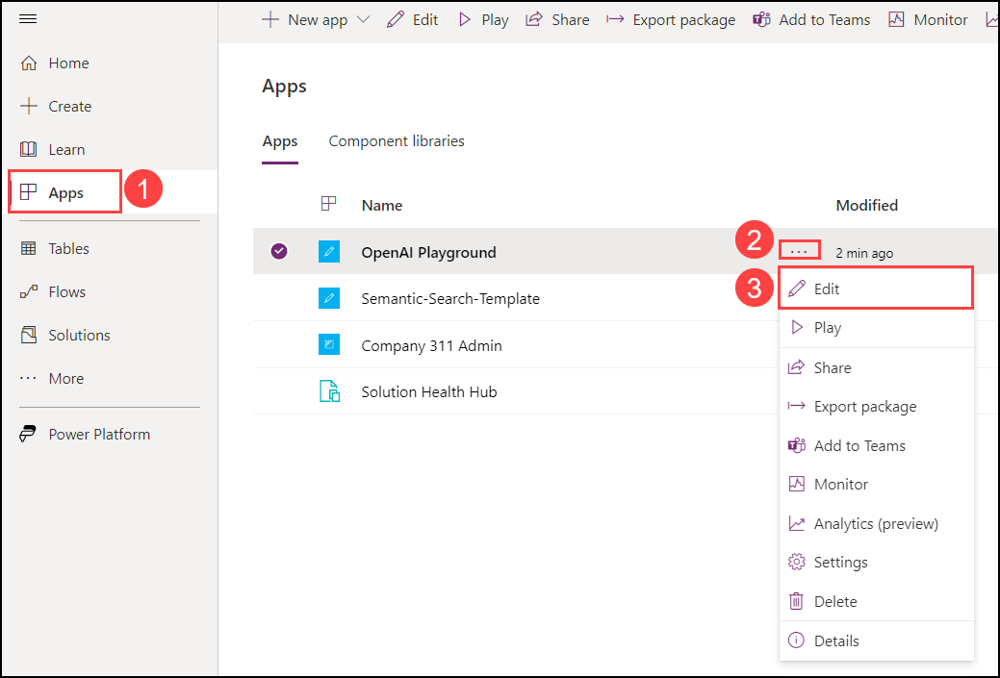
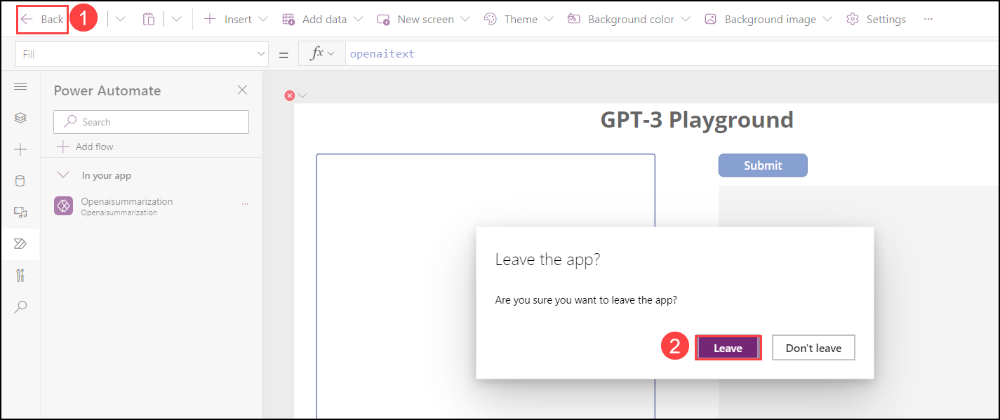
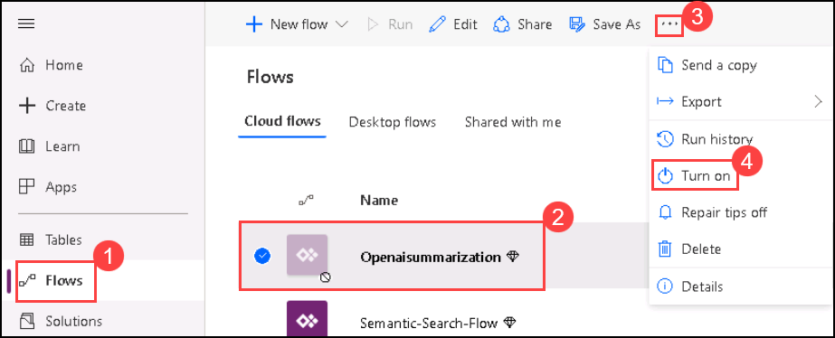
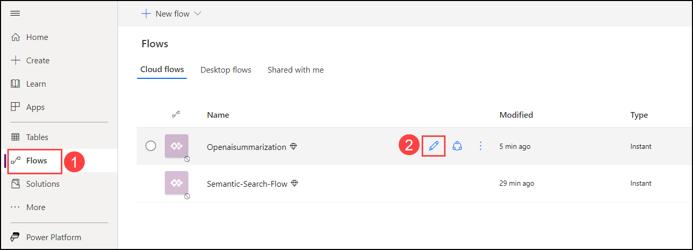
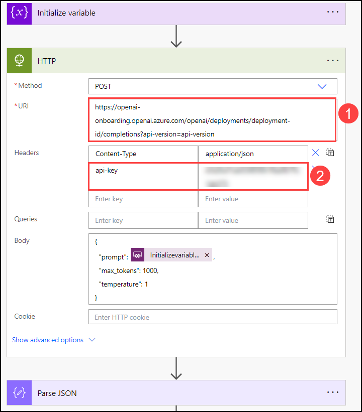

## Exercise 4a: Build Open AI application with Power App 

1. Navigate to https://make.powerapps.com/. On **Welcome to Power Apps** select your **Country/Region (1)** click **Get Started (2)**. 

   
    
3. Select **Apps (1)** on the left navigation and click **Import Canvas App (2)**. 

    

4. On the **Import package** page click on **Upload**.

    

5. Navigate to `C:\labfile\OpenAIWorkshop\scenarios\powerapp_and_python\powerapp` select the **OpenAI-Playground_20230302010547.zip (1)** folder  and click on **Open (2)**.

     

6. Once the zip file is uploaded, in the **Review Package Content** for **OpenAI Playground** click on setup icon under **Actions**. 

     

7. In the **Import setup** pane select **Create as new (1)** from the drop-down for **Setup** and click on **Save (2)**.

      

8.  Repeat Steps 6 and 7 for **Openaisummarization**.

9. Next click on **Import** to import the package into the PowerApps environment.  
     

10. Once the import is completed, click on **Apps (1)**, then click on `...` **(2)** next to **OpenAI Playground** and click on **Edit (3)**.

      

11. You will observe that it has imported the Power App canvas app and the Power Automate Flow into the workspace.

      

12. To navigate back click on **Back (1)** then click **Leave (2)**.

      

13. Next, on the **Flows (1)** tab, select **Openaisummarization (2)** then click on `...` **(3)** and **Turn on (4)** your flow.

      

14. Select **Flows (2)** and click on **Edit (2)** for **Openaisummarization**.

      

15. Edit the Power Automate Flow HTTP step by entering your own Azure OpenAI API  **Endpoint (1)** ensure to replace **deployment-id** with `demomodel` and **Key (2)** and click on **Save**.

      
   
    > **Note**: Enter the **Open AI endpoint** and **key** that you copied in **Exercise-1 Task-1 Step-8**.

16. From the **Apps (1)** page click on the **OpenAI Playground (2)** app to run the app.

     
