## Exercise 4: POWER APP

1. Enter the following link in your browser to download **OpenAI-Playground_20230302010547.zip** folder.

```
https://github.com/rcy0228/OpenAIWorkshop/raw/main/scenarios/powerapp_and_python/powerapp/OpenAI-Playground_20230302010547.zip
```

2. Navigate to https://make.powerapps.com/. On **Welcome to Power Apps** select your **Country/Region** click **Get Started**. 

   
    
3. Select **Apps** on the left navigation and click **Import Canvas App**. 

    

4. On **Import package** page click on **Upload**.

    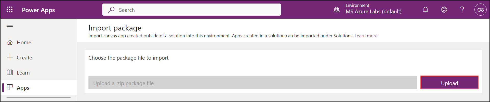

5. From the **Downloads (1)** select the **OpenAI-Playground_20230302010547.zip (2)** folder you downloaded earlier and click on **Open (3)**.

     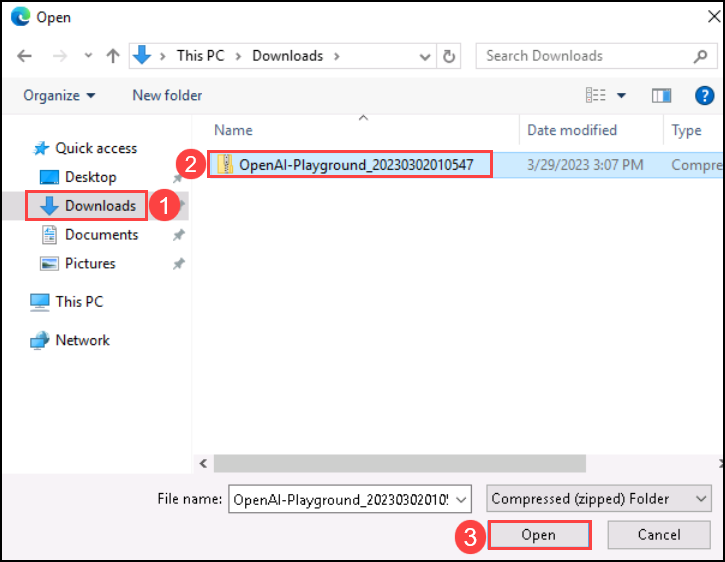

6. Once the zip file is uploaded, in the **Review Package Content** for **OpenAI Playground** click on setup icon under **Actions**. 

     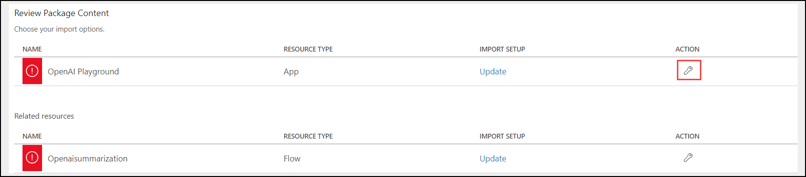

7. In the **Import setup** pane select **Create as new** from the drop-down for **Setup**, and click on **Save**.

      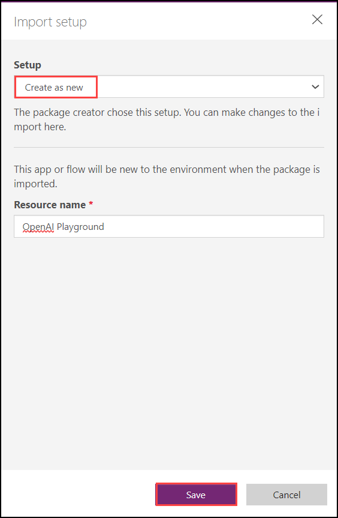

8.  Repeat Steps 6 and 7 for **Openaisummarization**.

9. Next click on **Import** to import the package into powerapps environment.  

     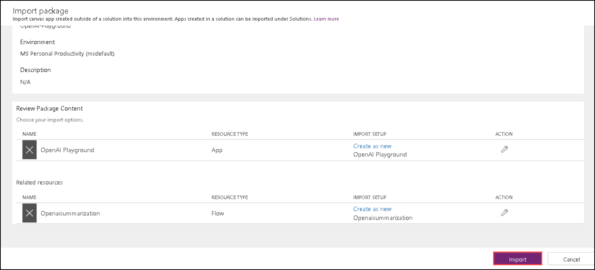

10. Once the import is completed, click on **Apps**, then click on `...` next to **OpenAI Playground** and click on **Edit**.

      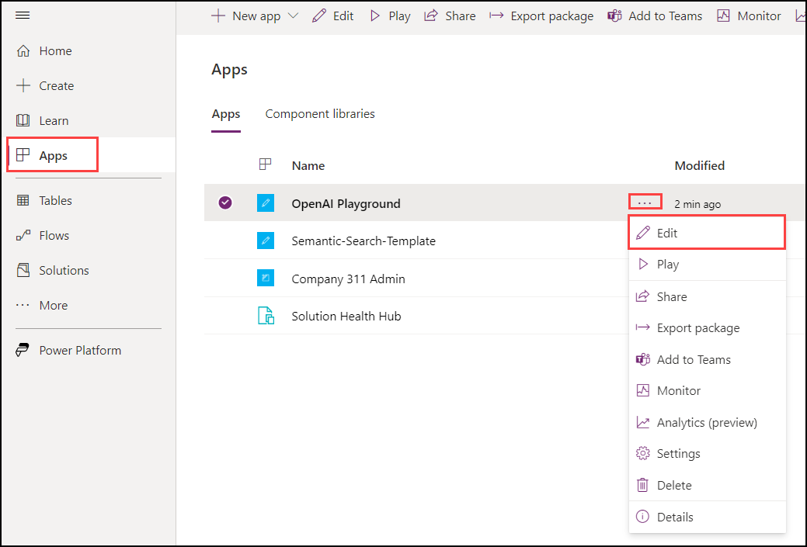

11. You will observe that it has import the Power App canvas app and the Power Automate Flow into the workspace.

      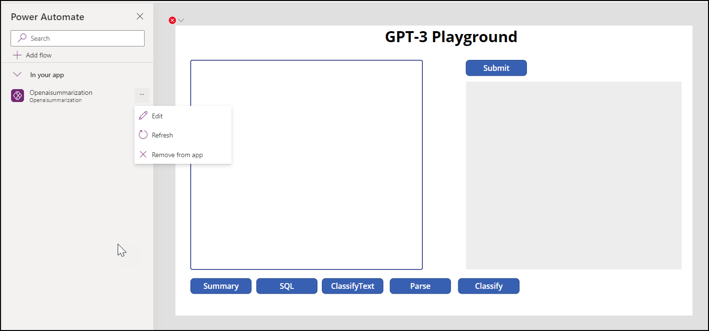

12. To navigate back click on **Back** then click **Leave**.

      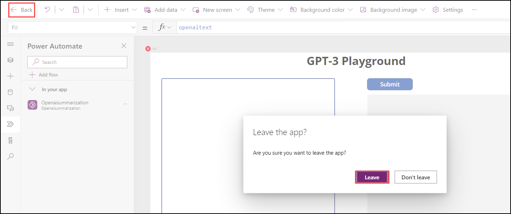

13. Next select the **Flows** Pane, click on **Edit** for **Openaisummarization**.

      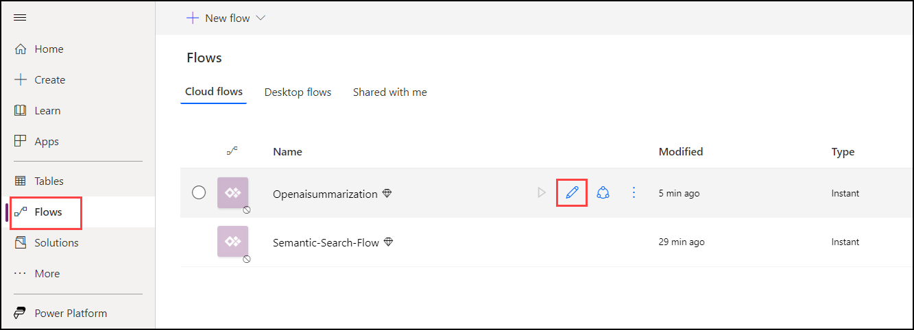

14. Edit the Power Automate Flow HTTP step by entering your own Azure OpenAI API **Key** and **Endpoint** and click on **Save**.

      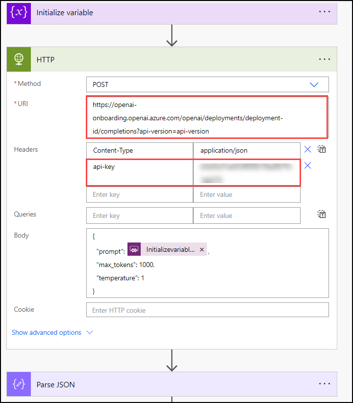

15. From the **Apps (1)** page click on the **OpenAI Playground (2)** app to run the app.

     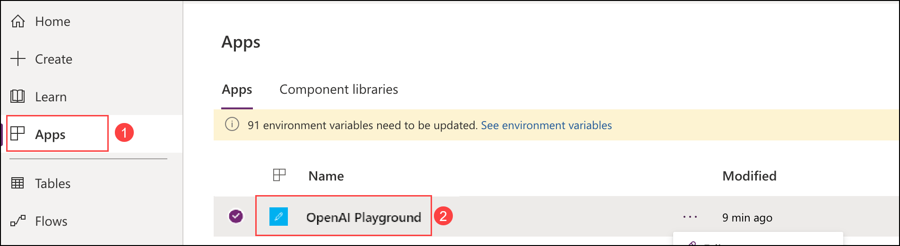
